# CSS 弹性布局

## 1. `flex-direction`设置主轴方向

### 属性值

`flex-direction`属性决定主轴的方向（即项目的排列方式）

注意：主轴和侧轴是会变化的，就看`flex-direction`设置谁为主轴，剩下就是侧轴，而我们的子元素是跟着主轴来排列的

| 属性值         | 说明                  |
| -------------- | --------------------- |
| row            | **默认值** 从左到右   |
| row-reverse    | 从右到左              |
| column         | 从上到下（Y轴为主轴） |
| column-reverse | 从下到上              |

## 2. `justify-content`设置主轴上的子元素排列方式

`jusitiy-content`属性定义了项目在主轴上的对齐方式

**注意：使用这个属性之前一定要确定号主轴是哪个**

| 属性值        | 说明                                             |
| ------------- | ------------------------------------------------ |
| flex-start    | **默认值** 从头部开始，如果主轴是X轴，则从左到右 |
| flex-end      | 从尾部开始排列                                   |
| center        | 在主轴居中对齐（如果主轴是X轴则水平居中）        |
| space-around  | 平分剩余空间                                     |
| space-between | 先两边贴平 再平分剩余空间（重要）                |

## 3. `flex-wrap`设置子元素是否换行

默认情况下，项目都排在一条线（又称“轴线”）上。`flex-wrap`属性定义，flex布局默认是不换行

| 属性值 | 说明              |
| ------ | ----------------- |
| nowarp | **默认值** 不换行 |
| wrap   | 换行              |

## 4. `align-items` 设置侧轴上的子元素排列方式（单行）

该属性是控制子项再侧轴（默认是y轴）上的排列方式 在子项为单项（单行）的时候使用

| 属性值     | 说明                     |
| ---------- | ------------------------ |
| flex-start | **默认值** 从下到上      |
| flex-end   | 从下到上                 |
| center     | 挤在一起居中（垂直居中） |
| stretch    | 拉伸                     |

## 5. `align-content`设置侧轴上的子元素的排列方式（多行）

设置子项在侧轴上的排列方式并且只能用于子项出现 换行 的情况（多行），**在单行下是没有效果的**

| 属性值        | 说明                                 |
| ------------- | ------------------------------------ |
| flex-start    | 默认值在侧轴的头部开始排列           |
| flex-end      | 在侧轴的尾部开始排列                 |
| center        | 在侧轴中间显示                       |
| space-around  | 子项在侧轴平分剩余空间               |
| space-between | 子项在侧轴先分布两头，再平分剩余空间 |
| stretch       | 设置子项元素高度平分父元素高度       |

## 6. `flex`布局子项常见属性

flex属性定义子项目分配剩余空间，用flex来表示多少份数

```
.item{
	flex:<number>;	/*default*/
}
```


# JavaScript基础

## JavaScript简介

### 1.1 JavaScript是什么

> JavaScript是一种运行在客户端(浏览器)的编程语言,实现人机交互效果
>
> mdn web docs  进行

#### 作用

- 网页特效
- 表单验证
- 数据交互
- 服务器编程(node.js)

#### JavaScript的组成

- ECMAScript:
  - 规定了js基础语法核心知识
    - 比如:变量、分支语句、循环语句、对象等等

- Web APIs：
  - DOM 操作文档，比如对页面元素进行移动、大小、添加删除等操作
  - BOM 操作浏览器，比如页面弹窗，检测窗口宽度、存储数据到浏览器等等


### 1.2 JavaScript书写位置

#### 1、内部JavaScript

> 直接写在html文件内，用script标签包住

规范 ：script标签写在</body>上面（放在HTML文件底部是原因是浏览器会按照代码在文件中的顺序加载HTML

```html
<body>
    <script>
        // 页面弹出警示框
        
    </script>
</body>
```

#### 2、外部JavaScript

>代码写在以 .js结尾的文件里，通过script标签引入到html页面中。

```html
<body>
    <script src="my.js">
    	// 中间不要写内容，默认忽略
    </script>
</body>
```

#### 3、内联JavaScript

>代码写在标签内部

```html
<body>
    <button onclick="alert('逗你玩~~~')">点我月薪过万</button>
</body>
```

1.3 JavaScript注释和结束符

### 1.注释

- 单行注释

  - 符号：//

  - 快捷键：ctrl+/

  - ```html
    <body>
        <script src="my.js">
        	// 这是单行注释噢
        </script>
    </body>
    ```

- 多行注释

  - 符号：/* */

  - 快捷键：shift+alt+a

  - ```html
    <body>
        <script src="my.js">
        	/*
        	这是多行注释噢
        	*/ 
        </script>
    </body>
    ```

### 2.JavaScript结束符

- 符号： ;
- 实际开发中，可写可不写
- 结束符要么每句都写，要么都不写（按照团队要求）


### 1.4 JavaScript输入输出语法

> 人和计算机打交道的规则约定

#### 输出语法

- 语法1：document

  - ```javascript
    documet.write('要输出的内容')
    ```

  - **作用**：向body内输出内容

  - **注意**：如果输出的内容写的时标签，也会被解析成网页元素

- 语法2：alert

  - ```javascript
    alert('要弹出的内容')
    ```

  - **作用**：页面弹出警告对话框

- 语法3：console

  - ```javascript
    console.log('控制台打印')
    ```

  - **作用**：控制台输出语法，程序员调试使用

#### 输入语法

- 语法：prompt

  - ```javascript
    prompt('请输入您的姓名：')
    ```

  - **作用**：显示一个对话框，对话框中包含一条文字信息，用来提示用户输入文字

### JavaScript代码执行顺序

- 按HTML文档流顺序执行JavaScript代码
- alert() 和 prompt()它们会跳过页面渲染先被执行


### 1.5 字面量

> 在计算机科学中，字面量（literal）是在计算机中描述 事/物
>
> 字面量是值的表示方式，而变量是存储值的容器。

#### 例如

- 1000 --> 数字字面量
- '程序员' --> 字符串字面量
- [] 数组字面量 {} 对象字面量


## 变量

> 变量是计算机存储数据的“**容器**”，变量不是数据本身

### 2.1 变量的基本使用

#### 1、声明变量

```javascript
let 变量名
```

#### 2、变量的赋值

```javascript
变量 = 数据 
```

### 3、变量的初始化

```javascript
let 变量名 = 数据
```

####  4、变量的本质

>程序在内存中申请的一块用来存放数据的小空间

#### 5、变量命名规则与规范

##### 规则：

- 不能用关键字
- 只能用下划线、字母、数字、$符，且不用以数字开头
- 严格区分大小写

##### 规范：

- 起名要有意义
- 遵循小驼峰命名法
  - 第一个单词首字母小写，后面每个单词的首字母大写

### 变量拓展

#### let 和 var的区别

var声明

- 可以先使用再声明（不合理）
- var声明过的变量可以重复声明（不合理）

#### 7、数组

> 数组（Array），将**一组数据存储再单个变量名下**的方式，数组可以存储任何类型的数据

##### 声明方式

```javascript
let 数组名 = [数据1, 数据2, 数据3, . . . ,数据n]
```

##### 数据的基本使用

```javascript
使用数组： 数组名[索引号] // 从0开始
```

## 常量

> 使用const声明的变量称为**常量**，当某个变量永远**不会改变**时，就可以使用const

### 注意

常量不允许重新赋值，声明时必须赋值

## 数据类型

### JS数据类型分类

- #### 基本数据类型
  
  - number 数字型
  - string 字符串型
  - boolean 布尔型
  - undefined 未定义型
  - null 空类型
- #### 引用数据类型
  
  - object 对象
  - function 函数
  - array 数组

### 数字类型

> 整数、小数、整数、负数，都是数字类型
>
> 注意：JavaScript是弱数据类型语言，只有赋值了之后才知道是什么类型

#### 算数运算符

+、 - 、* 、/ 、%(取模)

NaN：代表计算错误


### 字符串类型

> 通过单引号(' ')、双引号(" ")或反引号(`)包裹的数据都叫字符串

必要时使用转义符 \ 

#### 字符串拼接

运算符：+ 可以实现字符串拼接


#### 模板字符串

##### 使用场景

- 拼接字符串和变量

##### 语法

- `` (反引号)
- 内容拼接变量时使用${}包住变量

```javascript
<script>
        let age = 18
        document.write(`我今年${age}岁了`)
</script>
```

#### 布尔类型

> 只有两个固定的值true（真）、false（假）


#### 未定义类型

> 只声明变量，不赋值的情况下，变量的默认值为**undefined**


#### 空类型

>代表"无"、"空" 或 "值未知"
>
>**使用场景**：将来有个变量里面存放的是一个对象，但是对象还没创建好，可以先给个null

```javascript
console.log(undefined +1)  // = NaN
console.log(nulll +1) // = 1
```

### 类型检测

> 通过**typeof**关键字检测数据类型

#### 语法

```javascript
typeof x // (常用写法)作为运算符
typeof(x) // 函数形式
```

## 类型转换

### 隐式转换

> 某些运算符被执行时，系统内部自动将数据类型进行转换

#### 规则

- +号两边只要有一个是字符串，都会把另外一个转成字符串
- **除了+以外**的算数运算符 比如 -  *  /  等都会把数据转成数字类型

#### 小技巧

- +号作为**正号解析**可以转换成数字型

  - ```javascript
    console.log(+'123') // 此时123将转换为数字型
    ```

- **任何数据**和字符串相加的结果都是字符串

### 显示转化

> 写代码告诉系统要转换成什么数据类型

#### 语法

```javascript
Number()  // 转换为数字型
	parseInt   // 只保留整数
    parseFloat  // 可以保留小数
```

#### 练习

输入两个数，计算和，打印到弹窗中

```javascript
let num1 = Number(prompt('请输入第一个数'))
let num2 = Number(prompt('请输入第二个数'))
let sum = num1 + num2
 alert(`这两个数和为：${num1 + num2}`)
```

#### 案例

##### 渲染表格

```html
<!doctype html>
<html lang="en">
<head>
    <meta charset="UTF-8">
    <meta name="viewport"
          content="width=device-width, user-scalable=no, initial-scale=1.0, maximum-scale=1.0, minimum-scale=1.0">
    <meta http-equiv="X-UA-Compatible" content="ie=edge">
    <title>Document</title>
    <style>
        h2 {
            text-align: center;
        }

        table {
            border-collapse: collapse;
            height: 80px;
            margin: 0 auto;
            text-align: center;
        }

        th, td {
            padding: 5px 20px;
        }

        table, th, td {
            border: 1px solid #000000;
        }
    </style>
</head>
<body>
<h2>订单确认</h2>

<script>
    // 用户输入
    let price = Number(prompt('请输入商品价格'))
    let num = Number(prompt('请输入商品数量'))
    let address = prompt('请输入收货地址')
    // 计算总价
    let total = price * num
    // 页面打印
    document.write(`
            <table>
                <tr>
                    <th>商品名称</th>
                    <th>商品价格</th>
                    <th>商品数量</th>
                    <th>总价</th>
                    <th>收货地址</th>
                </tr>
                <tr>
                    <td>小米手机</td>
                    <td>${price}元</td>
                    <td>${num}</td>
                    <td>${total}元</td>
                    <td>${address}</td>
                </tr>
            </table>

        `)
</script>
</body>
</html>
```

## 运算符

### 赋值运算符

- = ：将等号**右边的值**赋予左边，要求左边必须是一个**容器**
- +=：num += 5 **==** num = num + 5
- -=
- *=
- /=
- %=

### 一元运算符

> 众多的JavaScript的运算可以根据所需表达式的个数，分为一元运算符、二元运算符、三元运算符

#### 自增

- 符号：++

- 作用：让变量的值+1

- 语法：

  - 前置自增：

    - ```javascript
      let i = 1
      ++i // 每次加一
      ```

  - 后置自增：

    - ```javascript
      let i = 1
      i++ //每次加一
      ```

  - 区别：

    - 单独使用没有区别

    - ```javascript
      ++i +1 =3 //前置自增:先自加再使用（++在前，先加）
      1++ +1 =2 //后置自增:先使用再自增（++在后，后加）
      //前自增的运算级别高先自增再相加，后自增为先相加再（i自增）注意是i自增，不是结果自增。
      ```

- 用法：

  - 前置自增和后置自增独立使用是没有**任何区别**
  - 一般开发中都是单独使用
  - i++ 后置自增会使用**相对较多**，并且都是**单独使用**

#### 自减

- 符号：--
- 作用：让变量减一


### 比较运算符

- '>'
- '<'
- '>='
- '<='
- ==
- ===: **左右两边是否类型和值都相等**
  - NaN不等于任何人，包括他自己
- !=
- !==: 左右两边石佛不全等‘

#### 对比

- = 单等是赋值
- == 是判断
- === 是全等
- 开发中判断是否相等，**推荐使用 ===**

#### 注意

- 字符串比较，按照ASCII码比较
- NaN不等与任何值，包括它本身
- 尽量不要比较小数
  - 小数参与运算先转换为整数

### 逻辑运算符

#### 使用场景：

- 用于解决多重条件判断
  - 例如：5 < num < 10
  
    ```javascript
    num > 5 && num < 10
    ```

#### 逻辑运算符

- &&  与：一假则假
- || 或：一真则真
- ! 非：取反、真变假，假变真 ``

### 运算符优先级

| 优先级 | 运算符     | 顺序               |
| ------ | ---------- | :----------------- |
| 1      | 小括号     | （）               |
| 2      | 一元运算符 | ++   --  !         |
| 3      | 算数运算符 | 先 * /  % 后 + -   |
| 4      | 关系运算符 | >    >=     <   <= |
| 5      | 相等运算符 | ==   =!  ===   !== |
| 6      | 相等运算符 | 先  &&  后 \| \|   |
| 7      | 赋值运算符 | =                  |
| 8      | 逗号运算符 | ,                  |

## 表达式和语句的区别

表达式：表达式是可以被求值的代码，JavaScript引擎会将其计算出一个结果

语句：是一段可以执行的代码

​			比如：proompt()可以弹出一个输入框，还有if语句	for循环语句等等

区别：

- 表达式可以被被求值，所以它可以写在赋值语句的右侧
- 语句不一定有值.
- 某些情况，也可以把表达式理解为表达式语句，因为他是在计算结果，但不是必须的成分

## 流程控制语句

### 三大流程控制语句

- 顺序结构（从上往下依次执行）
- 分支结构（根据条件选择执行代码）
- 循环结构（某段代码被重复执行）

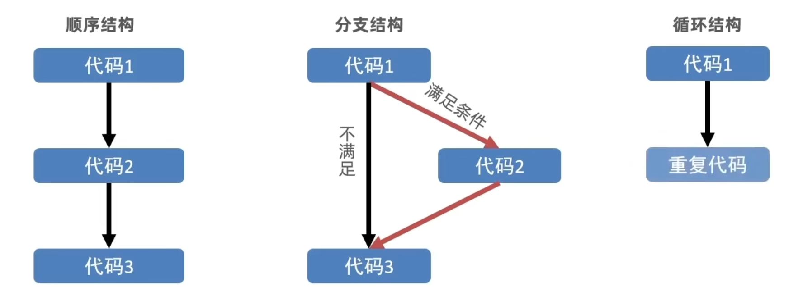

## 分支语句

### 三大分支语句

- if分支语句
- 三元运算符
- switch 语句

## if分支语句

if语句三种使用：单分支、双分支、多分支

### 单分支

- ```javascript
  if (条件) {
     	满足条件要执行的代码
  }
  ```

  - 括号内的条件为true时，进入大括号里执行代码
  - 小括号内的结果若不是布尔类型时，会发生隐式转换转为布尔类型
  - 如果大括号只有一个语句，大括号可以省略（不提倡这样做）

### 双分支

- ```javascript
  if (条件) {
      1、满足条件要执行的代码
  } else {
      2、不满足条件要执行的代码
  }
  ```

  - 括号内条件为true时，执行第一串代码

  - 括号内条件为false时，执行第二串代码

  - ```javascript
    练习：判断是否为闰年
    //  用户输入
    let year = Number(prompt('请输入年份'))
    // 判断输出
    if (year % 4 === 0 && year % 100 !== 0  || year % 400 !== 0) {
    	alert(`${year}是闰年`)
    } else {
    	alert(`${year}不是闰年`)
    }
    ```

### 多分支

- ```javascript
  if (条件1) {
      代码1
  } else if (条件2) {
      代码2
  } else if (条件3) {
      代码3
  } else {
      代码n
  }
  ```

  - 先判断条件1，满足条件1就执行条件1，其他不执行
  - 若不满足条件1则向下判断条件2，满足则执行代码2，其他不执行
  - 若依然不满足则继续往下，以此类推
  - 若以上条件都不满足，执行else里的代码n
  - 注意：可以写N个条件

## 三元运算符

- 语法：

  - ```javascript
    条件 ? 满足条件执行的代码 : 不满足条件执行的代码
    ```

- 使用场景：比if双分支**更简单**的写法，可以使用三元表达式

- 一般用同于取值

  - ```javascript
    let max = 3 < 5 ? 5 : 3  
    // 定义一个变量max 如果3 < 5为真，则max=5，否则max=3
    ```

  - ```javascript
    // 数字补0
    // 用户输入
    let num = +prompt('请输入数字')
    // 判断输出
    num = num < 10 ? '0' + num : num
    alert(num)
    ```


## switch分支语句

- 语法：

  - ```javascript
    switch (数据) {
    	case 值1:
    		代码1
    		break
    	case 值2:
    		代码2
    		break
    	default:
    		代码n
    		break
    }
    ```

- 释义：

  - 找到跟小括号里数据**全等**的case值，并执行里面对应的代码
  - 若没有全等 === 的则执行default里的代码

- 注意：一定要加上break

## if多分支语句和switch的区别

### 共同点

- 都能实现多分支选择，多选1
- 大部分情况下可以互换

### 区别

- switch...case语句通常处理case为比较**确定值**的情况，而if...else..语句更加灵活，通常用于**范围判断**
- switch 语句进行判断后直接执行程序语句，效率更高，if...else语句有几种判断情况，就判断几次
- switch 一定要注意 必须是 === 全等（**数据类型**），注意**break**

### 结论

- 当分支比较少是，if...else语句执行效率高
- 当分支比较多时，switch语句执行效率高，而且结构清晰

## while循环

**循环**重复执行一些操作

- 释义：在**满足条件**期间重复执行某些代码

- 语法：

  - ```javascript
    while (循环条件) {
        要重复执行的代码（循环体）
    }
    ```

  - 当小括号里的条件为true才会进入**循环体**执行代码

  - while大括号里代码执行完毕后不会跳出，而是继续回到小括号里判断条件是否满足，若满足又执行大括号里的代码，然后再回到小括号判断条件，直到括号内条件不满足，即跳出

- **while循环三要素**

  - 变量的其实值

  - 终止条件

  - 变量变化量（自增或自减）

  - ```javascript
    let i = 1 //变量起始值
    while(i<=3){ //终止条件
        document.write('我会循环3次')
        i++  //变量变化量
    }
    ```

## for循环

### for循环的基本使用

- 作用：重复执行代码

- 好处：把声明起始值、循环条件、变化值写到一起，让人一目了然，时最常用的循环形式

- 语法：

  - ```javascript
    for (变量起始值; 终止条件; 变量变化量){
        //循环体
    }
    ```

  - ```javascript
    // 无限循环
    for (; ;) {
        console.log(11)
    }
    ```

### 循环嵌套

- 语法

  - ```javascript
    for (外部声明记录循环次数的变量; 循环条件; 变化值) {
        for (内部声明记录循环次数的变量; 循环条件; 变化值){
            循环体
        }
    }
    ```

## for循环和while循环的区别

- 当明确了循环的次数的时候推荐使用for循环
- 当不明确循环的次数的时候推荐使用while循环

## 退出循环

### break 和 continue

- 循环结束：
  - break：退出循环
  - continue：结束本次循环，继续下次循环
- 区别：
  - break：退出整个循环，一般用于结果已经得到，后续的循环不需要时
  - continue：退出整个循环，一般用于结果已经得到，后续的循环不需要的时候可以使用

## 数组

### 什么是数组

- 数组（array）是一种可以按顺序保存数据的**数据类型**
- 为什么要数组
  - 多个数据可以用数组保存，放到单个变量中，方便管理


### 数组的基本使用

- 声明语法

  - ```javascript
    1、字面量声明数组
    let 数组名 = [数据1、数据2、数据4,...,数据5]
    ```

  - ```javascript
    2、使用new Array 构造函数声明
    let arr = new Array(1,2,3,4)
    ```

- 数组里面可以存放任意**数据类型**

- 可以通过下标（从0开始）取值

  - ```javascript
    数组名[下标]
    ```

### 遍历数组

```javascript
let name = ['马超','赵云','张飞','关羽','黄忠']
    for (let i = 0; i < name.length; i++) {
        document.write(`${name[i]}<br>`)
    }
```

### 求数组最大值最小值

```javascript
let arr = [2, 6, 1, 77, 52, 99, 7]
let max = arr[0]
let min = arr[0]
for (i = 1; i < arr.length; i++) {
	if (arr[i] > max) {
		max = arr[i]
	}
	if (arr[i]<min) {
		min = arr[i]
	}
}
document.write(`最大值为${max},最小值为${min}`)
```

### 数组查

- 通过下标查值

  - ```javascript
    数组[下标]
    ```

### 数组改

- 通过下标修改

  - ```javascript
    let arr = []
    arr[0] = 1  // 此时arr = [1]
    arr[1] = 5  // 此时arr = [1,5]
    ```

  - ```javascript
    //给所有的数组元素后面加上指定的字符
    let arr = ['pink', 'red', 'green']
    for (let i = 0; i < arr.length; i++) {
    	arr[i] += '老师'
    }
    ```

### 数组增

- 通过**数组.push()**方法将一个或多个元素添加到数组**末尾**，并返回该数组的新长度

  - ```javascript
    arr.push(元素1,元素2,元素3,...,元素n)
    ```

  - 返回值：调用该方法时，新的length属性值将被返回

  - ```javascript
    console.log(arr.push('deeppink'))
    ```

  - 返回值是  arr.length

- 通过**数组.unshift(新增的内容)**将一个或多个元素添加到数组的**开头**，并返回该数组的新长度

  - ```javascript
    arr.unshift(元素1,元素2,元素3,...,元素n)
    ```

### 数组删

- **数组.pop()**能删除数组中的**最后一个**元素，并返回该元素的值

  - ```javascript
    arr.pop()  //一定要带括号
    ```

- **数组.shift()**删除数组中的**第一个**元素，并返回该元素的值

  - ```javascript
    arr.shift()  //一定要带括号
    ```

- **数组.splice()**删除指定元素

  - ```javascript
    arr.splic(start,deleteCount)  //start起始位置，deleteCount删除几个元素（缺省时删到最后）
    ```

### 数组筛选

- 将数组[2, 0, 6, 1, 77, 0, 52, 0, 25, 7]中大于10的数存到新数组中

  - ```javascript
    let arr = [2, 0, 6, 1, 77, 0, 52, 0, 25, 7]
    let newArr = []
    for (let i = 0; i < arr.length; i++) {
    	if (arr[i] >= 10) {
    	}
    }
    ```

- 将数组[2,0,6,1,77,0,52,0,25,7]中的0去掉后，形成一个不包含0的新数组

  - ```java
    let arr = [2, 0, 6, 1, 77, 0, 52, 0, 25, 7]
    let newArr = []
    for (let i = 0; i < arr.length; i++) {
    	if (arr[i] !== 0){
    		newArr.push(arr[i])
    	}
    }
    ```

### 冒泡排序

```javascript
let arr = [5, 3, 1, 2, 4]
for (let i = 0; i < arr.length - 1; i++) {
	for (let j = 0; j < arr.length - i - 1; j++) {
	if (arr[j] > arr[j+1]) {
		let temp = arr[j]
			arr[j] = arr[j+1]
			arr[j+1] = temp
		}
	}
}
```

## 作用域

==一段程序代码中所用到的名字并不总是有效和可用的，而限定这个名字的**可用性的代码范围**就是这么名字的**作用域**==

作用：提高程序逻辑的局部性，增强可靠性，减少名字冲突

### 全局作用域

==做用于所有代码执行的环境==

- 整个script标签内部
- 一个独立的JS文件

### 局部作用域

==作用域函数内的代码环境==

### 全局变量与局部变量

==根据作用域的部不同，变量可以分为：全局变量与局部变量==

- 全局变量
  - 在任何区域都可以访问和修改
- 局部变量
  - 只能在当前函数内部访问和修改
  - 形参可以看作函数的局部变量

### 变量的访问原则

-  只要是代码，就至少有一个作用域
- 写在函数内部的局部作用域
- 如果函数中还有函数，那么在这个作用域中就又可以诞生一个作用域
- 访问原则：**在能够访问到的情况下先局部，局部没有在找全局**

## 函数

==function,是被设计为**执行特定任务**的代码块（代码复用）==

说明：函数可以把具有相同或相似逻辑的代码封装起来，通过调用执行这些封装代码逻辑，有利于**精简代码方便使用**

### 函数的使用

#### 函数声明

- 语法

  - ```javascript
    functioon 函数名(参数1，参数2，……，参数n) {
        函数体
        return 返回值
    }
    ```

- 命名规范

  - 和变量命名基本一致
  - 尽量小驼峰式命名法
  - 前缀应该为动词

#### 函数调用

- 语法

  - ```javascript
    函数名(参数1，参数2，……，参数n)
    ```

  - 注意：声明（定义）的函数必须调用才会真正被执行，使用()调用函数

### 函数的参数以及默认参数

- 参数的分类
  - ==函数定义时的参数时形参==
  - ==函数调用时的参数叫实参==
    - 实参可以是变量
    - 实参少于形参，会自动填上undefined
    - 实参多余形参，剩余的实参会被忽略

#### 函数的默认参数

- 语法

  - ```javascript
    functioon 函数名(参数1 = 0，…… ) {
        函数体
    }
    ```

  - 释义

    - 当函数在调用时，没有传递参数，则会使用形参默认值
    - 默认值只会在缺少实参时才会被执行

### 函数的返回值

==当调用斗个函数时，这个函数会返回一个结果出来，这个结果就是返回值==

**作用**

- 函数内部不需要输出结果，而是返回结果
- 对执行结果的扩展性更高，可以让其他的程序使用这个结果

```javascript
function fn(){
    return 20
}
let re = fn()
```

- **释义**：
  - 当函数 fn() 被执行时，fn() = 20
  - 相当于定义了一个变量 **函数() = 返回值**
  - 所以re = fu() = 20
- **细节**：
  - return 立即结束当前行数，后面的代码不会被执行
  - return 不能换行写
  - 函数如果没有写return则函数的返回结果是：undefined

### 匿名函数

#### 1.函数表达式

语法

```javascript
// 定义
let fn = function(参数) {
    console.log('函数表达式')
}
// 调用
fn(参数)
```

##### 函数表达式和具名函数的区别

1. 具名函数的表用可以写到任何位置（可以先调用再声明）
2. 函数表达式需先声明后调用

#### 2.立即执行函数

语法

==使用场景：避免全局变量之间的污染==

```javascript
//方式1
(function (形参) { console.log(11) })(实参);
//方式2
(function (形3参){ console.log(11) }(实参));
```

注意：不需要调用，立即执行，必需要加上 **;**

## 逻辑中断

> 只存在与&& 和 || 中，当满足一定条件会让右边代码不执行
>
> ==通过左边就能得到整个式子的结果，右边的式子将不会被执行==

- && 左边为false 就中断
- | | 左边true 就中断
- 无论是&& 还是 || ，运算结果都是最后被执行的表达式值，一般用在变量赋值

## 转换为布尔型

```javascript
console.log(Boolean('pink'))  // 强制转换为布尔型
```

=='空字符串'、undefined、null、false、NaN转换为布尔值后为，其余都为true==

## 对象

> 对象（object）：一种数据类型
>
> ==是一种无序的数据集合==用于描述某个事物

### 声明对象

```javascript
let 对象名 = {
    属性:值
    属性:值
    属性:值
}
let 对象名 = new Object{}
```

### null

null 也是 JavaScript 中数据类型的一种，通常只用它来表示不存在的对象。使用 typeof 检测类型它的类型时，结果为 `object`。

### 对象由属性和方法组成

- 属性：信息或特征，本质上是一个变量
- 方法：功能或行为，本质上是一个函数

#### 属性

- 数据描述性的信息称为属性
- 属性都是成对出现的，包括姓名和值，姓名和值之间用`;`隔开
- 多个属性之间用 `,`隔开
- 属性是依附在对象上的变量
- 属性名为`空格`或者
- 属性的本质是一个变量

### 对象操作

### 查

> 使用`.`获得对象中属性对应的值
>
> 通过对象名[属性名]获得对应属性值

```javascript
对象名.属性名
对象名['属性名']
```

### 改

```javascript
对象名.属性 = 新值
```

### 增

```javascript
对象名.新属性 = 新值
```

#### 删

```javascript
delete 对象名.属性
```

### 对象的方法

```javascript
// 声明
let obj = {
    uname : '刘德华',
    song: function () {
        console.log('冰雨')
    }
}
// 调用
obj.song()
```

- 方法是由方法名和函数两部分构成，它们之间使用`:`分隔
- 多个属性之间使用`,`分隔
- 方法是依附在对象中的函数
- 方法名可以使用" "或' ' ，一般情况下省略，除非遇到特殊符号
- 方法的本质是函数

### 遍历对象

```javascript
for (let k in obj) {
	console.log(k)  // 属性名（字符串型，带引号）
	console.log(obj[k])  // 值
}
```

==for in不提倡用于遍历数组，因为k时字符串==

### 案例-学生信息表渲染

```html
<!DOCTYPE html>
<html lang="en">
<head>
    <meta charset="UTF-8">
    <title>Title</title>
    <style>
        h2 {
            text-align: center;
        }

        table, th, td {
            border: solid 1px black;
            border-collapse: collapse;
        }

        table {
            width: 600px;
            text-align: center;
            margin: 0 auto;
        }

        th {
            background-color: #6E6E6E;
            color: white;
        }

        tr:hover{
            background-color: #dcdcdc;
        }
    </style>
</head>
<body>
<table>
    <h2>学生信息表</h2>
    <tr>
        <th>序号</th>
        <th>name</th>
        <th>age</th>
        <th>gender</th>
        <th>hometown</th>
    </tr>
    <script>
        let students = [
            {name: "小明", age: 18, gender: "男", hometown: "河北省"},
            {name: "小红", age: 19, gender: "女", hometown: "河南省"},
            {name: "小刚", age: 17, gender: "男", hometown: "山西省"},
            {name: "小丽", age: 18, gender: "女", hometown: "山东省"}
        ]

        for (i=0; i<students.length; i++){
            document.write(`
            <tr>
                <td>${i + 1}</td>
                <td>${students[i].name}</td>
                <td>${students[i].age}</td>
                <td>${students[i].gender}</td>
                <td>${students[i].hometown}</td>
            </tr>
`)
        }
    </script>
</table>
</body>

</html>
```


### 内置对象

#### Math

`Math` 是 JavaScript 中内置的对象，称为数学对象，这个对象下即包含了属性，也包含了许多的方法。

##### 属性

- Math.PI，获取圆周率

```javascript
// 圆周率
console.log(Math.PI);
```

##### 方法

- Math.random，生成 0 到 1 间的随机数

```javascript
// 0 ~ 1 之间的随机数, 包含 0 不包含 1[0,1)
Math.random()
// 生成 N ~ M 之间的随机数
Math.floor(Math.random() * (M - N + 1)) + N
```

- Math.ceil，数字向上取整

```javascript
// 舍弃小数部分，整数部分加1
Math.ceil(3.4)
```

- Math.floor，数字向下取整

```javascript
// 舍弃小数部分，整数部分不变
Math.floor(4.68)
```

- Math.round，四舍五入取整

```javascript
// 取整，四舍五入原则
Math.round(5.46539)
Math.round(4.849)
```

- Math.max，在一组数中找出最大的

```javascript
// 找出最大值
Math.max(10, 21, 7, 24, 13)
```

- Math.min，在一组数中找出最小的

```javascript
// 找出最小值
Math.min(24, 18, 6, 19, 21)
```

- Math.pow，幂方法

```javascript
// 求某个数的多少次方
Math.pow(4, 2) // 求 4 的 2 次方
Math.pow(2, 3) // 求 2 的 3 次方
```

- Math.sqrt，平方根

```javascript
// 求某数的平方根
Math.sqrt(16)
```

数学对象提供了比较多的方法，这里不要求强记，通过演示数学对象的使用，加深对对象的理解。

## 术语解释

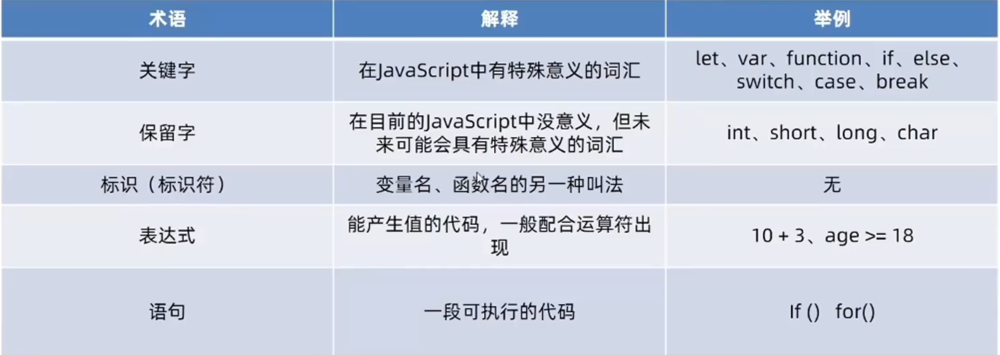

## 基本数据类型和引用数据类型

简单类型有叫做基本数据类型或者==值类型==，复杂数据类型又叫做==引用数据类型==

- 值类型：在存储变量中存储的是==值本身==，因此叫做值类型,放在栈里
  - string，number，boolean，undefined，null
- 引用类型：在存储时变量中存储的仅仅是==地址（引用）==，因此叫做引用数据类型，地址在栈里，内容放在堆里
  - 通过new关键字创建的对象（系统对象、自定义对象），如Object、Array、Date等

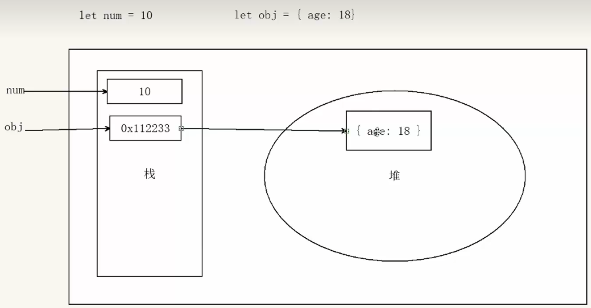

```javascript
// 案例
let num1 = 10
let num2 = num1
num2 = 20
console.log(num1) // 结果为10
```

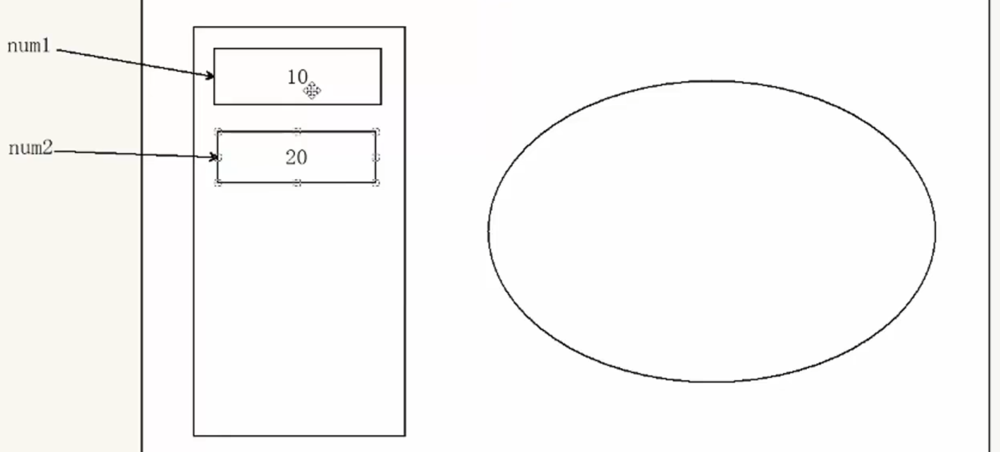

```javascript
let obj1 = {
    age:18
}
let obj2 = obj1
obj2.age = 20
console.log(obj1.age) // 输出 20
```

# Web APIs

> 作用：使用JS去操作html和浏览器
>
> 分类：DOM（文档对象模型）、BOM（浏览器对象模型）

## 变量的声明

### let or const

建议：**const优先**，尽量使用const

- const语义化更好
- 如果变量在声明时就知道不会被更改，使用const
- 在实际开发中，react框架，基本使用const

### 前端开发建议

1. 有变量先使用const
2. 如果后面发现需要被修改，再更改为let

### let与const转换

1. 如果基本数据类型（数组）发生改变则**不能**将let转换为const

2. 复杂数据类型（数组与对象）发生改变**也可以**将let转换为const

3. 因为简单数据类型（变量）更改时其内存地址会被更改

4. 复杂数据类型更改时内存地址不会被更改 

5. 注意：

   1. ```javascript
      const names =[] //新数组
      names = [1,2,3] //新数组
      const obj = {}  //新对象
      obj = {
          uname:'000' //新对象
      }
      // 禁止这样使用，内存地址不一样
      ```

   2. ```javascript
      const names = []
      names[0] = 1
      names[1] = 2
      names[2] = 3
      const obj = {}
      obj.uname = '000'
      //可以声明空数组/对象后使用追加的方式添加数据
      ```

## DOM

> DOM(Document Object Model -- **文档对象模型**)DOM是浏览器提供的一套专门用来**操作网页内容**的功能
>
> 作用：开发网页内容特效和实现用户交互

### DOM树

- 将HTML文档以树状结构直观的表现出来
- 描述网页内容关系的名词
- 作用：**文档树直观的体现了标签与标签之间的关系**
- 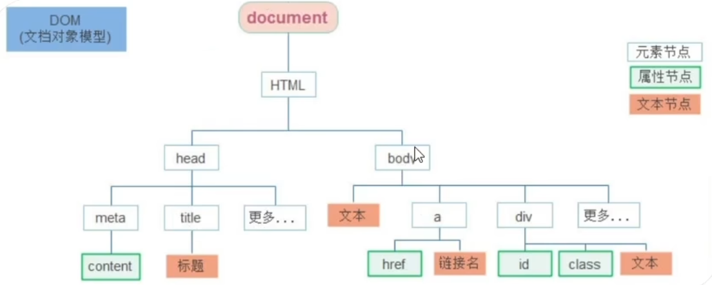

### DOM对象

> 浏览器根据HTML标签生成JS对象

- 所有的标签属性都可以在对象上找到
- 修改这个对象的属性会自动映射到标签身上

### DOM的核心思想

> 把网页内容当**对象**处理

### document对象

- 是DOM里提供的一个最大的对象
- 他提供的属性和方法都是**用来访问和操作网页内容的**
  - document.write()
- 网页所有内容都在document里面

### 获取DOM对象

> 根据css选择器来获取DOM元素

#### 语法

##### 选择单个元素

```html
document.querySelector('css选择器')  //里面包含一个或多个有效的css选择器字符串
//举例
<div class="box">123</div>
<div class="box">abc</div>
<p id="nav">导航栏</p>
<ul>
	<li>测试2</li>
	<li>测试3</li>
</ul>
<script>
	const box = document.querySelector('.box')//返回值是选择器匹配的第一个元素，一个HTMLElement对象
	console.log(box)
	const nav = document.querySelector('#nav')
	console.log(nav)
	//获取第一个li
	const li1 = document.querySelector('ul li:first-child')
	console.log(li1)
</script>
```

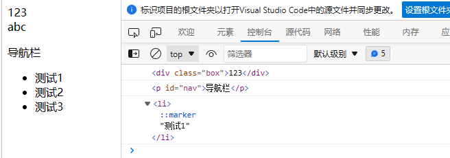 

##### 选择多个元素

> 返回值是一个NodeList 对象集合（伪数组）

- 有长度有索引号的数组
- 但是没有pop()，push()等数组方法
- 哪怕是由一个元素querySelectorAll获取过来的也是一个伪数组

```html
<ul>
	<li>测试1</li>
	<li>测试2</li>
	<li>测试3</li>
</ul>
<script>
	const li1 = document.querySelectorAll('ul li')
	console.log(li1)
</script>
```

##### 调用属性

> 获取单个元素可以直接修改，当获取多个元素时，只能通过遍历的方式

```html
<p id="nav">导航栏</p>
<script>
    const nav = document.querySelector('#nav')
    nav.style.color = 'blue'
</script>
```

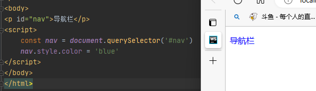 

### 操作元素内容

方法：

- 对象.innerText属性
  - 将文本内容添加/更新到任意标签位置
  - 只显示纯文本，**不解析标签**
- 对象.innerHTML属性
  - 将文本内容添加/更新到任意标签位置
  - **会解析标签**，多标签建议使用模板字符

```html
// innerText
<div class="box"></div>
<script>
const box = document.querySelector('.box')
console.log(box.innerText)  // 获取文字内容
box.innerText = '我是一个盒子' // 修改文字内容
</script>
// innerHTML
```

 

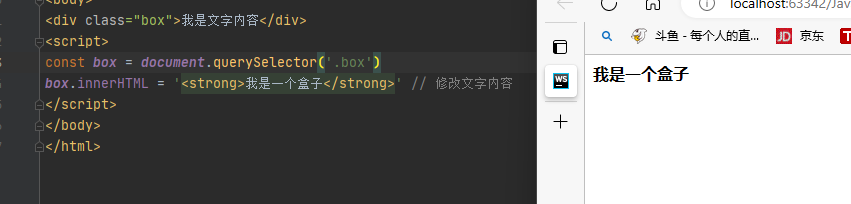 

### 操作元素的常见属性

#### 语法

```html
// 对象.属性 = 值
<div >
    
</div>
<script>
    const img = document.querySelector('img')
    img.src="../image/2.jpg"
    img.height="300"
    img.width="480"
</script>
```

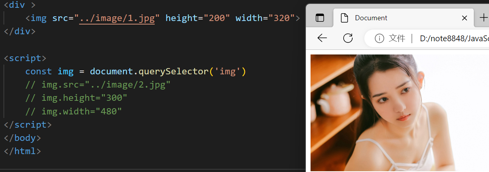

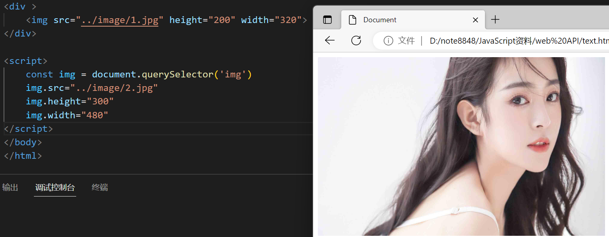

#### 随机图片案例

```html
<body>
    
    <script>
        const img_arr = 		["images/1.webp","images/2.webp","images/3.webp","images/4.webp","images/5.webp","images/6.webp"]
        const img = document.querySelector('img')
        img.src = img_arr[Math.floor(Math.random()*img_arr.length)]
    </script>
</body>
```

### 操作元素的样式属性

> 通过JS设置/修改标签元素的样式属性

#### 通过style操作

注意：==一定要加上css单位==

```html
<head>
	<style>
        .box {
            width: 200px;
            height: 200px;
            background-color: pink;
        }
    </style>
</head>
<body>
<div >
    <div class="box"></div>
</div>
<script>
   const box = document.querySelector('.box')
   box.style.width = '300px'
   box.style.height = '300px'
   box.style.backgroundColor = 'hotpink' // 多组单词采取小驼峰命名法
</script>
```

#### 通过类名（className）操作

特点：会==覆盖==前面的类名

```html
<style>
	div {
		width: 200px;
		height: 200px;
		background-color: hotpink;
	}
	.box {
		width: 300px;
		height: 300px;
		background-color: pink;
		margin: 100px auto;
		padding: 10px;
		border: 1px solid #000;
	}
    .nav {
		color: red;
	}
</style>
<body>
    <div class="nav">123</div>
<script>
    // 获取元素
    const div = document.querySelector('div')
    // 添加类名，因为class是个关键字，所以用className
    div.className = 'box'
</script>
</body>
```

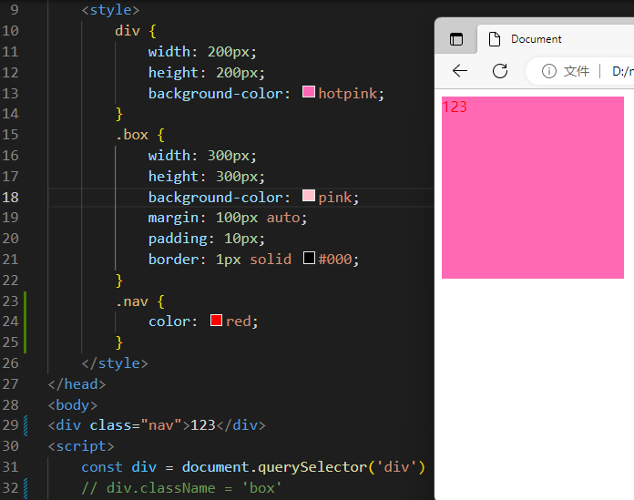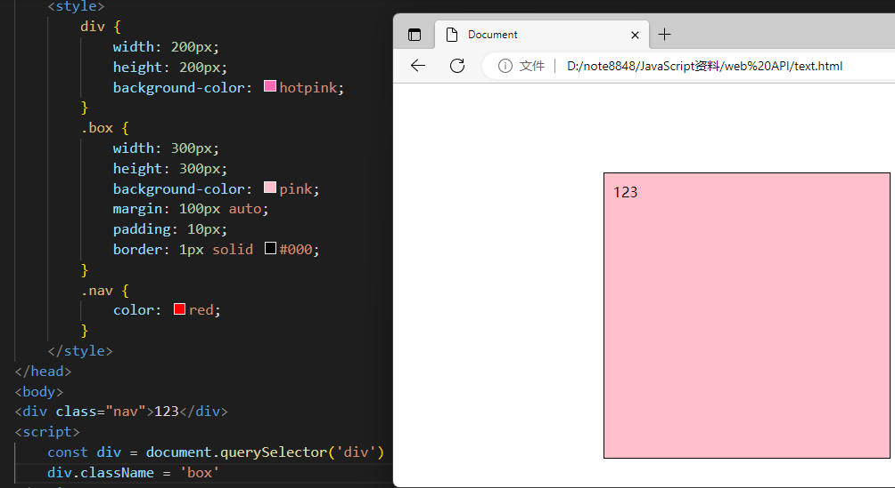

##### 类名叠加

>className是使用新值`换`旧值, 如果需要添加一个类,需要保留之前的类名

```html
<style>
	div {
		width: 200px;
		height: 200px;
		background-color: hotpink;
	}
	.box {
		width: 300px;
		height: 300px;
		background-color: pink;
		margin: 100px auto;
		padding: 10px;
		border: 1px solid #000;
	}
    .nav {
		color: red;
	}
</style>
<body>
    <div class="nav">123</div>
<script>
    // 获取元素
    const div = document.querySelector('div')
    // 添加多个类名，因为class是个关键字，所以用className
    div.className = 'nav box'
</script>
</body>
```

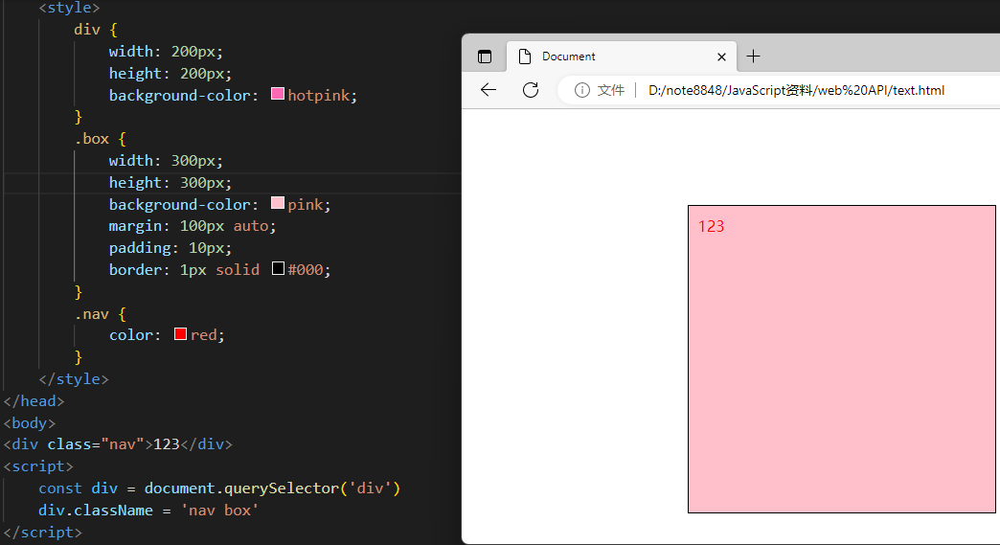 

#### 通过classList操作

注意：当一个元素有多个类名时，它的样式取决于==style表==中的定义顺序，而不是HTML中的类名顺序。style表中`后定义`的类名会==覆盖==前面的类名。

> 为了解决className 容易覆盖以前的类名，我们可以通过classList方式追加和删除类名

```html
<style>
	div {
		width: 200px;
		height: 200px;
		background-color: pink;
	}

	.active {
		width: 300px;
        height: 300px;
        background-color: hotpink;
        margin-left: 100px;
	}
</style>
<body>
    <div class="one"></div>
    <script>
        //add是个方法 添加  追加 类名不加
        box.classList.add('active')
        // remove() 移除 类
        box.classList.remove('one')
        // toggle切换类 检查是否有该类名，没有就加上，有就删掉
        box.classList.toggle('one')
        </script>
</body>
```

#### className和classList区别

- className会覆盖以前的类名
- classList不会影响以前的类名

### 操作表单元素属性

check、disable

```html
//获取值：DOM.对象.属性名
<body>
<input type="text" value="电脑">
<script>
    const input = document.querySelector('input') //获取DOM对象
    console.log(input.value)  // 获取对象属性值，innerHTML不能获取表单内容
</script>
//修改值：DOM.对象.属性名 = 新值
<body>
<input type="text" value="电脑">
<script>
    const input = document.querySelector('input') //获取DOM对象
    input.type = 'password'  // 修改对象属性值
</script>
//
<body>
<input type="checkbox" id="false">
<input type="checkbox" id="true">
<button disable>点击</button>
<script>
    // 使用 checked 来判断是否勾选复选框
    const input = document.querySelector('#true')
    input.checked = true
    // 使用 disabled 来判断是否禁用 button
    const button = document.querySelector('button')
    button.disabled = flase // 默认为false 不禁用
</script>
</body>
```

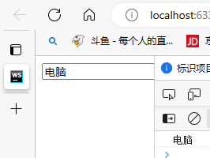 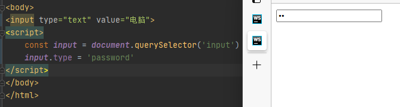 

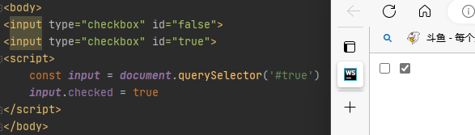 

### 自定义属性 data-

自定义属性必须以`data-`开头 

#### 获取自定义属性

> 通过dataset获取自定义属性，返回值是一个对象

```html
<body>
<div data-id="1" data-spm="111">1</div>
<div data-id="2">2</div>
<div data-id="3">3</div>
<div data-id="4">4</div>
<div data-id="5">5</div>
<script>
    const one = document.querySelector('div')
    console.log(one.dataset) //获取自定以属性的集合
    console.log(one.dataset.id) //获取对应的自定义属性
</script>
</body>
```

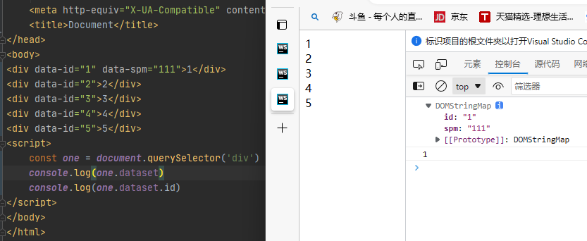 

## 定时器-间歇函数

> 网页中每隔一段时间需要`自动`执行一段代码，定时器的返回值是一个id数字

### 开启定时器

```javascript
setInterval(函数,间隔时间)  //每间隔多长时间（单位是毫秒 1s = 1000ms），调用一次函数
let n = setInterval(function () {console.log(`每一秒钟我会出实现一次<br>`)},1000)
console.log(n)
```

### 关闭定时器

```javascript
let n = setInterval(function () {console.log(`每一秒钟我会出实现一次<br>`)},1000)
clearInterval(n) // 关闭定时器
n = setInterval(function () {console.log(`每一秒钟我会出实现一次<br>`)},1000) // 重新开启定时器
```

### 案例

#### 案例1：倒计时效果

```html
<!DOCTYPE html>
<html lang="en">
<head>
    <meta charset="UTF-8">
    <meta name="viewport" content="width=device-width, initial-scale=1.0">
    <title>Document</title>
</head>
<body>
<textarea name="" id="" cols="30" rows="10">
        用户注册协议
        欢迎注册成为京东用户！在您注册过程中，您需要完成我们的注册流程并通过点击同意的形式在线签署以下协议，请您务必仔细阅读、充分理解协议中的条款内容后再点击同意（尤其是以粗体或下划线标识的条款，因为这些条款可能会明确您应履行的义务或对您的权利有所限制）。
        【请您注意】如果您不同意以下协议全部或任何条款约定，请您停止注册。您停止注册后将仅可以浏览我们的商品信息但无法享受我们的产品或服务。如您按照注册流程提示填写信息，阅读并点击同意上述协议且完成全部注册流程后，即表示您已充分阅读、理解并接受协议的全部内容，并表明您同意我们可以依据协议内容来处理您的个人信息，并同意我们将您的订单信息共享给为完成此订单所必须的第三方合作方（详情查看
    </textarea>
<br>
<button class="btn" disabled>我已经阅读用户协议(5)</button>
<script>
    const btn = document.querySelector('.btn') //获取按钮
    let n = 5
    let timer = setInterval(function () {
        n--
        btn.innerHTML = `我已经阅读用户协议(${n})`
        if (n === 0) {
            btn.innerHTML = `我同意该协议`
            btn.disabled = false
            clearInterval(timer)
        }
    }, 1000)
</script>
</body>
</html>
```

#### 案例2：定时轮播图

```html
<!DOCTYPE html>
<html lang="en">

<head>
    <meta charset="UTF-8"/>
    <meta http-equiv="X-UA-Compatible" content="IE=edge"/>
    <meta name="viewport" content="width=device-width, initial-scale=1.0"/>
    <title>轮播图点击切换</title>
    <style>
        * {
            box-sizing: border-box;
        }

        .slider {
            width: 560px;
            height: 400px;
            overflow: hidden;
        }

        .slider-wrapper {
            width: 100%;
            height: 320px;
        }

        .slider-wrapper img {
            width: 100%;
            height: 100%;
            display: block;
        }

        .slider-footer {
            height: 80px;
            background-color: rgb(100, 67, 68);
            padding: 12px 12px 0 12px;
            position: relative;
        }

        .slider-footer .toggle {
            position: absolute;
            right: 0;
            top: 12px;
            display: flex;
        }

        .slider-footer .toggle button {
            margin-right: 12px;
            width: 28px;
            height: 28px;
            appearance: none;
            border: none;
            background: rgba(255, 255, 255, 0.1);
            color: #fff;
            border-radius: 4px;
            cursor: pointer;
        }

        .slider-footer .toggle button:hover {
            background: rgba(255, 255, 255, 0.2);
        }

        .slider-footer p {
            margin: 0;
            color: #fff;
            font-size: 18px;
            margin-bottom: 10px;
        }

        .slider-indicator {
            margin: 0;
            padding: 0;
            list-style: none;
            display: flex;
            align-items: center;
        }

        .slider-indicator li {
            width: 8px;
            height: 8px;
            margin: 4px;
            border-radius: 50%;
            background: #fff;
            opacity: 0.4;
            cursor: pointer;
        }

        .slider-indicator li.active {
            width: 12px;
            height: 12px;
            opacity: 1;
        }
    </style>
</head>

<body>
<div class="slider">
    <div class="slider-wrapper">
        
    </div>
    <div class="slider-footer">
        <p>对人类来说会不会太超前了？</p>
        <ul class="slider-indicator">
            <li></li>
            <li></li>
            <li></li>
            <li></li>
            <li></li>
            <li></li>
            <li></li>
            <li></li>
        </ul>
        <div class="toggle">
            <button class="prev">&lt;</button>
            <button class="next">&gt;</button>
        </div>
    </div>
</div>
<script>
    // 1. 初始数据
    const sliderData = [
        {url: './images/slider01.jpg', title: '对人类来说会不会太超前了？', color: 'rgb(100, 67, 68)'},
        {url: './images/slider02.jpg', title: '开启剑与雪的黑暗传说！', color: 'rgb(43, 35, 26)'},
        {url: './images/slider03.jpg', title: '真正的jo厨出现了！', color: 'rgb(36, 31, 33)'},
        {url: './images/slider04.jpg', title: '李玉刚：让世界通过B站看到东方大国文化', color: 'rgb(139, 98, 66)'},
        {url: './images/slider05.jpg', title: '快来分享你的寒假日常吧~', color: 'rgb(67, 90, 92)'},
        {url: './images/slider06.jpg', title: '哔哩哔哩小年YEAH', color: 'rgb(166, 131, 143)'},
        {url: './images/slider07.jpg', title: '一站式解决你的电脑配置问题！！！', color: 'rgb(53, 29, 25)'},
        {url: './images/slider08.jpg', title: '谁不想和小猫咪贴贴呢！', color: 'rgb(99, 72, 114)'},
    ]
    // 获取元素
    const img = document.querySelector('.slider-wrapper img')
    const footer_bg = document.querySelector('.slider-footer')
    const P = document.querySelector('.slider-footer p')
    const active = document.querySelectorAll('.slider-indicator li')
    active[i].classList.add('active')
    let i = 0 //信号量：控制图片张数
    setInterval(function () {
        i === 7 ? i = 0 : i++ // 如果i>=数组的长度那么回到第一张，如果小于数组的长度那么下一张
        console.log(i)
        // 替换图片
        img.src = sliderData[i].url
        // alert(`${sliderData[random].url},${random}`)
        // 替换title文字
        P.innerHTML = sliderData[i].title
        // 替换footer背景颜色
        footer_bg.style.background = sliderData[i].color
        // 更换高亮点
        /*active[i].classList.add('active')
        i === 0 ? active[7].classList.remove('active') : active[i - 1].classList.remove('active') //判断i是否等于0，是的话移除
        第七个，不是的话移除上一个*/
        //删除以前的active
        document.querySelector('.slider-indicator .active').classList.remove('active')
        // 只让当前li添加active
        active[i].classList.add('active')
    }, 1000)
</script>
</body>

</html>
```

## 事件

### 事件监听

> 事件：编程时系统内发生的动作或发生的事情
>
> 事件监听：让程序检测是否有事件发生，一旦有事件触发，将立即调用一个函数做出响应

#### 语法

```javascript
元素对象.addEventListener('事件类型',要执行的函数)
```

### 事件类型

1. 鼠标事件
   1. click	鼠标点击
   2. mouseenter 鼠标经过
   3. mouseleave 鼠标离开
2. 焦点事件
   1. focus 获得焦点
   2. blur 失去焦点
3. 键盘事件
   1. keydown 键盘按下触发
   2. keyup 键盘抬起触发
4. 文本时间
   1. input 用户输入事件

### 案例-轮播图完整版

编程思路：

+ 事件类型
  + 左右按钮鼠标单击事件
  + 鼠标移进或移出事件
  + 自动播放事件

```html
<!DOCTYPE html>
<html lang="en">
<head>
    <meta charset="UTF-8">
    <title>Title</title>
    <style>
        #box-body {
            width: 560px;
            height: 400px;
            background-color: #9a9afa;
            margin: 0 auto;
        }

        #box-body img {
            width: 100%;
        }

        #box-body p {
            color: white;
            margin-top: 15px;
            margin-left: 15px;
        }

        li {
            width: 8px;
            height: 8px;
            float: left;
            position: relative;
            left: -24px;
            border-radius: 50%;
            background-color: #fff;
            opacity: 0.4;
            cursor: pointer;
            list-style: none;
        }

        li:not(:first-child) {
            margin-left: 15px;
        }

        li.active {
            width: 10px;
            height: 10px;
            opacity: 1;
        }

        #buttons {
            float: right;
            position: relative;
            top: -40px;
            left: -20px;
        }

        #buttons button {
            width: 28px;
            height: 28px;
            background-color: white;
            opacity: 0.8;
            cursor: pointer;
            border: none;
            border-radius: 4px;
        }

        #buttons button:hover {
            background: rgba(255, 255, 255, 0.5);
        }

        #buttons button:nth-child(1) {
            margin-right: 8px;
        }
    </style>
</head>
<body>
<div id="box-body">
    
    <p>对人类来说会不会太超前了？</p>
    <ul>
        <li class="active"></li>
        <li></li>
        <li></li>
        <li></li>
        <li></li>
        <li></li>
        <li></li>
        <li></li>
    </ul>
    <div id="buttons">
        <button><</button>
        <button>></button>
    </div>
</div>
</body>
<script>
    const sliderData = [
        {url: './images/slider01.jpg', title: '对人类来说会不会太超前了？', color: 'rgb(100, 67, 68)'},
        {url: './images/slider02.jpg', title: '开启剑与雪的黑暗传说！', color: 'rgb(43, 35, 26)'},
        {url: './images/slider03.jpg', title: '真正的jo厨出现了！', color: 'rgb(36, 31, 33)'},
        {url: './images/slider04.jpg', title: '李玉刚：让世界通过B站看到东方大国文化', color: 'rgb(139, 98, 66)'},
        {url: './images/slider05.jpg', title: '快来分享你的寒假日常吧~', color: 'rgb(67, 90, 92)'},
        {url: './images/slider06.jpg', title: '哔哩哔哩小年YEAH', color: 'rgb(166, 131, 143)'},
        {url: './images/slider07.jpg', title: '一站式解决你的电脑配置问题！！！', color: 'rgb(53, 29, 25)'},
        {url: './images/slider08.jpg', title: '谁不想和小猫咪贴贴呢！', color: 'rgb(99, 72, 114)'},
    ]
    // 信号量
    let numberID = 0
    const img = document.querySelector('#box-body img')
    const title = document.querySelector('#box-body p')
    const boxBody = document.querySelector('#box-body')

    const buttons = document.querySelectorAll('#buttons button')
    // 前进按钮
    buttons[1].addEventListener('click', function (){
        numberID ++
        if (numberID >= sliderData.length){
            numberID = 0
        }
        img.src = sliderData[numberID].url
        title.innerText = sliderData[numberID].title
        boxBody.style.backgroundColor = sliderData[numberID].color
        document.querySelector('#box-body .active').classList.remove('active')
        document.querySelector(`#box-body ul li:nth-child(${numberID + 1})`).classList.add('active')
    })

    // 后退按钮
    buttons[0].addEventListener('click', function (){
        numberID --
        if (numberID < 0){
            numberID = sliderData.length - 1
        }
        img.src = sliderData[numberID].url
        title.innerText = sliderData[numberID].title
        boxBody.style.backgroundColor = sliderData[numberID].color
        document.querySelector('#box-body .active').classList.remove('active')
        document.querySelector(`#box-body ul li:nth-child(${numberID + 1})`).classList.add('active')
    })

    // 定时器设置
    let timer = setInterval(function (){
        buttons[1].click()
    }, 1000)

    boxBody.addEventListener('mouseenter', function (){
        clearInterval(timer)
    })

    boxBody.addEventListener('mouseleave', function (){
        timer = setInterval(function (){
            buttons[1].click()
        }, 1000)
    })
</script>
</html>
```


### 事件对象

> 是个对象，这个对象里有事件触发时的相关信息

#### 获取对象

> 在事件绑定的回调函数的第一个参数就是事件对象，一般命名为even、ev、e

```javascript
// 元素.addEventListener('click',function(e){})  e就是事件对象
```

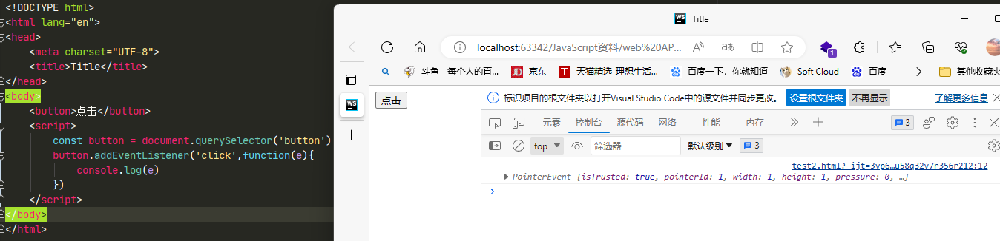 

#### 常用属性

- type：获取当前的事件类型
- clientX/clientY：获取光标相对于浏览器可见窗口左上角的位置 
  - 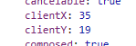 
- offsetX/offsetY：获取光标相对于当前DOM元素左上角的位置
- key：用户按下键盘键的值

### 环境对象this

> 环境对象hi函数内部特殊的变量**this**，它代表当前函数运行时所处的环境，指向的是函数的调用者

```javascript
// 每个函数都有this，普通函数里的this指向的是windo
function fn() {
	console.log(this)
}
fn()
```

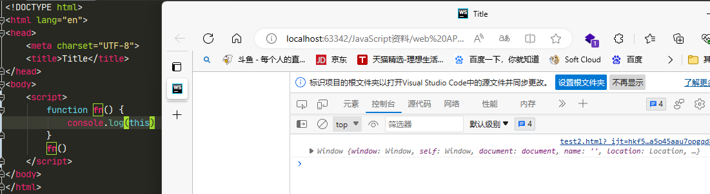 

==直接调用函数，相当于`window.函数`，所以this指代window==

```html
<body>
<button>点击</button>
<script>
    const btn = document.querySelector('button')
    btn.addEventListener('click',function () {
        console.log(this)
    })
</script>
</body>
```

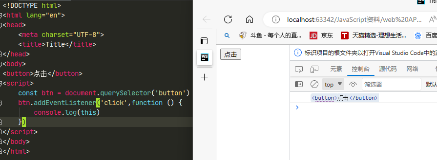 

==点击事件，该函数为`btn调用`，所以this只想button==

#### 示例

```html
// 点击后将按钮变成红色
<body>
<button>点击</button>
<script>
    const btn = document.querySelector('button')
    btn.addEventListener('click',function () {
        this.style.color = 'red'
    })
</script>
</body>
```

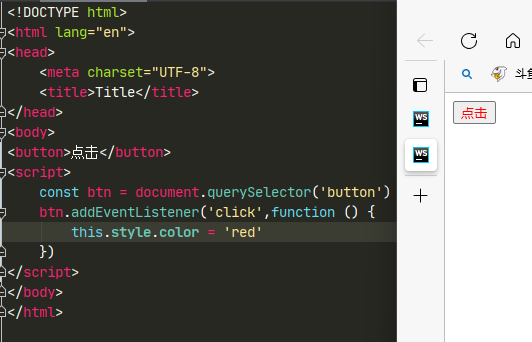 

### 回调函数

> 函数A作为参数传递给函数B时，函数A为回调函数

### 全选反选案例

```html
<!DOCTYPE html>
<html>
<head lang="en">
    <meta charset="UTF-8">
    <title></title>
    <style>
        * {
            margin: 0;
            padding: 0;
        }

        table {
            border-collapse: collapse;
            border-spacing: 0;
            border: 1px solid #c0c0c0;
            width: 500px;
            margin: 100px auto;
            text-align: center;
        }

        th {
            background-color: #09c;
            font: bold 16px "微软雅黑";
            color: #fff;
            height: 24px;
        }

        td {
            border: 1px solid #d0d0d0;
            color: #404060;
            padding: 10px;
        }

        .allCheck {
            width: 80px;
        }
    </style>
</head>
<body>
<table>
    <tr>
        <th class="allCheck">
            <input type="checkbox" name="" id="checkAll"> <span class="all">全选</span>
        </th>
        <th>商品</th>
        <th>商家</th>
        <th>价格</th>
    </tr>
    <tr>
        <td>
            <input type="checkbox" name="check" class="ck">
        </td>
        <td>小米手机</td>
        <td>小米</td>
        <td>￥1999</td>
    </tr>
    <tr>
        <td>
            <input type="checkbox" name="check" class="ck">
        </td>
        <td>小米净水器</td>
        <td>小米</td>
        <td>￥4999</td>
    </tr>
    <tr>
        <td>
            <input type="checkbox" name="check" class="ck">
        </td>
        <td>小米电视</td>
        <td>小米</td>
        <td>￥5999</td>
    </tr>
</table>
<script>
    // 获取DOM对象
    const allcheck = document.querySelector('.allCheck input')
    const cks = document.querySelectorAll('.ck')
    // 编写全选事件
    allcheck.addEventListener('click', function () {
        for (let i = 0; i < cks.length; i++) {
            cks[i].checked = this.checked
        }
    })
    // 编写反选事件
    for (let i = 0; i < cks.length; i++) {
        cks[i].addEventListener('click',function () {
            checkAll.checked = document.querySelectorAll('.ck:checked').length === cks.length
        })
    }
</script>
</body>
</html>
```

### 事件流

> 事件流是指事件完整执行过程中的流动路径，实际工作中都是使用事件冒泡为主

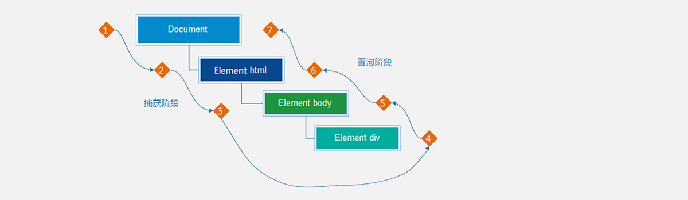 

#### 事件捕获

> 从DOM的根元素开始去执行对应的事件（从外到里），事件捕获需要写对应代码才能看到效果

##### 语法

`addEventListener`第三个参数传入true代表捕获阶段触发，默认是冒泡

```javascript
DOM.addEventListener(事件类型,事件处理函数,是否使用捕获机制)  // addEventListener第三个参数传入true代表捕获阶段触发
```

#### 事件冒泡

> 当一个元素的事件被触发时，同样的事件将会在该元素的所有祖先元素中依次被触发。
>
> 简单理解：当一个元素触发事件后，会依次向上调用父级元素的`同名事件(同意事件类型)`，事件冒泡默认是存在的

#### 阻止事件流动

> 需求：把事件就限制在当前元素内	
>
> 前提：阻止事件冒泡需要拿到事件对象
>
> 即可以阻止冒泡也可以阻止捕获

##### 语法

```javascript
document.addEventListener('click', function (ev){
        ev.stopPropagation()
    })
```

### 事件解绑

#### L0事件解绑

```javascript
document.onclick = function (){
    alert('OK~')
    document.onclick = null
}
```

#### L2事件解绑

**匿名函数无法被解绑**

```javascript
function fun(){
   alert('YES')
}

document.addEventListener('click', fun)
document.removeEventListener('click', fun)
```

### 鼠标经过的区别

+ `mouseover`和`mouseout`会有冒泡效果
+ `mouseenter`和`mouseleave`没有冒泡效果（推荐）

### 事件委派

+ 优点：减少注册次数，可以提高程序性能
+ 原理：事件委托其实是利用事件冒泡特点
  + 给**父元素注册事件**，当我们触发子元素的时候，会冒泡到父元素身上，从而触发父元素的事件
+ 实现：事件对象`.target.tagName`可以获得真正触发事件的元素

```html
<body>
<ul>
    <li>1</li>
    <li>2</li>
    <li>3</li>
</ul>
</body>
<script>
    const ul = document.querySelector('ul')
    ul.addEventListener('click', function (){
        alert('Hello!')
    })
</script>
```

### 阻止冒泡

在某些情况下需要阻止默认行为的发生，比如 阻止 链接的跳转，表单域跳转

语法：

```javascript
<script>
    const a = document.querySelector('a')
    a.addEventListener('click', function (ev) {
        ev.preventDefault()
    })
</script>
```

### 其他事件

#### 页面加载事件

##### load加载页面

+ 加载外部资源（如图片、外联CSS和JavaScript等）加载完毕时触发的事件
+ 事件名：load
+ 监听页面所有资源加载完毕
  + 给window添加load事件
  + 注意：不光可以监听整个页面资源加载完毕，也可以针对某个资源绑定load事件

```javascript
window.addEventListener('load', function (){
        // 执行的操作
    })
```

##### DOMContentLoaded

+ 当初始的HTML文档被完全加载和解析完成之后，`DOMComtentLoaded`事件被触发，而无需等待样式表、图像等完全加载
+ 事件名：`DOMContentLoaded`
+ 监听页面DOM加载完毕
  + 给document添加`DOMContentLoaded`事件

```javascript
document.addEventListener('DOMContentLoaded', function (){
		// 要执行的操作
    })
```

#### 页面滚动事件

##### 监听页面滚动事件

```javascript
<script>
    window.addEventListener('scroll', function (){
        console.log('滚动了')
    })
</script>
```

##### 页面滚动事件-获取位置

+ `scrollLeft`和`scrollTop`（属性）
  + 获取被卷去的大小
  + 获取元素内容往左、往上滚出去看不到的举例
  + 这两个值是可**读写**的
+ 尽量在scroll事件里面获取被卷去的举例

```javascript
<!DOCTYPE html>
<script>
    window.addEventListener('scroll', function () {
        const n = document.documentElement.scrollTop
        console.log(n)
    })
</script>
```

#### 页面尺寸事件

+ `resize`事件
  + 会在窗口尺寸改变的时候触发事件

+ 获取**窗口宽高**
  + 获取元素的可见部分宽高（不包含边框，margin，滚动条等）
  + `clientWidth`和`clientHeight`

```html
<script>
    window.addEventListener('resize', function () {
        console.log(document.documentElement.clientWidth)
        console.log(document.documentElement.clientHeight)
    })
</script>
```

+ 获取**元素宽高**
  + 获取元素的自身宽高、包含元素自身设置的宽高、padding、border
  + `offsetWidth`和`offsetHeight`
  + 获取出来的是数值、方便计算
  + 注意：获取的是可视宽高，如果盒子是隐藏，获取的结果是0
+ 获取**元素位置**
  + 获取元素举例自己定位父级元素的左、上距离
  + `offsetLeft`和`offsetTop`注意是只读属性

##### 总结

|             属性              |                   作用                   |                            说明                            |
| :---------------------------: | :--------------------------------------: | :--------------------------------------------------------: |
|   `scrollLeft`和`scrollTop`   |            被卷去的头部和左侧            |                  配合页面滚动来用，可读写                  |
| `clientWidth`和`clientHeight` |            获得元素宽度和高度            | 不包含border，margin，滚动条，用于js获取元素大小、只读属性 |
| `offsetWidth`和`offsetHeight` |            获得元素宽度和高度            |            包含border、padding、滚动条等，只读             |
|   `offsetLeft`和`offsetTop`   | 获取元素距离自己定位父级元素的坐、上距离 |              获取元素位置的时候使用、只读属性              |

## 日期对象

### 实例化

```html
const data = new Date()
```

### 时间对象方法

|      方法       |        作用        |         说明         |
| :-------------: | :----------------: | :------------------: |
| `getFullYear()` |      获得年份      |     获取四位年份     |
|  `getMonth()`   |      获得月份      |     取值为 0~11      |
|   `getData()`   | 获取月份中的每一天 | 不同月份取值也不相同 |
|   `getDay()`    |      获取星期      |      取值为 0~6      |
|  `getHours()`   |      获取小时      |     取值为 0~23      |
| `getMinutes()`  |      获取分钟      |     取值为 0~59      |
| `getSeconds()`  |       获取秒       |     取值为 0~59      |

```html
<script>
    const div = document.querySelector('div')
    function dataFunc(){
        const data = new Date()
        return `北京时间：${data.getFullYear()}/${data.getMonth()+1}/${data.getDate()} ${data.getHours()}:${data.getMinutes()}:${data.getSeconds()}`
    }

    div.innerText = dataFunc()
    setInterval(function (){
        div.innerHTML = dataFunc()
    }, 100)
</script>
```

**其他自带格式化时间字符串方法**

```html
<script>
    const div = document.querySelector('div')
    setInterval(function (){
        const data = new Date()
        // div.innerHTML = data.toLocaleString()       //2023/10/6 18:50:34
        // div.innerHTML = data.toLocaleDateString()     //2023/10/6
        div.innerHTML = data.toLocaleTimeString()    //18:52:00
    }, 1000)
</script>
```

### 时间戳

1. 使用`getTime()`方法

   ```javascript
   console.log(new Date().getTime())
   ```

2. **简写 +new Data()**

   ```javascript
   console.log(+new Date())
   ```

3. 使用 `Data.now()`

   ```javas
   console.log(Date.now())
   ```

4. 获取指定时间的时间戳

   ```javascript
   console.log(+new Date('2023-01-06 19:11:00'))
   ```


## 节点操作

### DOM 节点

+ DOM节点：DOM树里每一个内容都称之为节点
+ **元素节点：**
  + 所有的标签 比如 body、div
  + html 是根节点
+ 属性节点：所有的属性 比如 href
+ 文本节点：所有的文本

### 查找节点

+ 父节点查找：

  + `parentNode`属性
  + 返回最近一级的父节点 找不到返回null

+ ```
  子元素.parentNode
  ```

+ 子节点查找：

  + `childNodes`：获得所有子节点、包括文本节点（空格、换行）
  + `children`属性（重点）
    + 仅获得所有元素节点
    + 返回的还是一个伪数组

+ ```
  父元素。children
  ```

+ 兄弟关系查找

  + 下一个兄弟节点：`nextElementSibling`属性
  + 上一个兄弟节点：`previousElementSibling`属性

### 增加节点

插入到父元素的最后一个子元素

```
父元素。appealChild(要插入的元素)
```

插入到父元素中某个子元素的前面

```html
父元素，insertBefore(要插入的元素, 在哪个元素前面)
```

将子元素插到父元素的最前面

```
父元素。insertBefore(要插入的元素, 父元素.children[0])
```

### 克隆节点

`cloneNode`会克隆出一个跟原标签一样的元素，括号内传入布尔值

+ 若为true，则代表克隆时会包含后代节点一起克隆
+ 若为false，则代表克隆时不包含后代节点
+ 默认为false

```
元素。cloneNode(布尔值)
```

### 删除节点

在JavaScript原生DOM操作中，要删除元素必须通过**父元素删除**

```
父元素.removeChlid(要删除的元素)
```

## M端事件

| 触屏touch事件 | 说明                          |
| ------------- | ----------------------------- |
| touchstart    | 手指触摸到一个DOM元素时触发   |
| touchmove     | 手指在一个DOM元素上滑动时触发 |
| touchend      | 手指从一个DOM元素行移开时触发 |

## Window对象

### BOM（浏览器对象模型）

+ BOM（Browser Object）是浏览器对象模型

  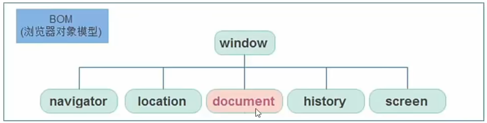

+ Window对象是一个全局对象，也可以说是JavaScript中的顶级对象

+ 像document、alert()、console.log()这些都说window的属性，基本BOM的属性和方法都说window的

+ 所有通过var定义在全局作用域中的变量、函数都会编程window对象的属性和方法

+ window对象下的属性和方法调用的时候可以省略window

### 定时器-延时函数

JavaScript内置的一个用来让代码延迟执行的函数，叫`setTimeout`

```html
setTimeout(回调函数, 等待的毫秒数)
```

setTimeout仅仅只执行一次，所以可以理解为就是把一段代码延迟执行，平时省略window

**清除延时函数**

```
let timer = setTimeout(回调函数, 等待的毫秒数)
clearTimeout(timer)
```


### JS执行机制

JavaScript语言的一大特点就是**单线程**，也就是说，同一个事件只能做一件事

此时，JavaScript就推出了**同步任务**和**异步任务**的概念

#### 同步任务

同步任务都说在主线程上执行，形成一个执行栈（无需等待，直接执行的代码）

#### 异步任务

JS的异步是通过回调函数实现的

一般而言，异步任务有以下三种类型：

1. 普通事件，如click、resize等
2. 资源加载，如load、error等
3. 定时器，包括 setinterval、setTimeout等

异步若腾武相关添加到任务队列中（任务队列也称为消息队列）

#### JS执行机制

1. 先执行执行栈中的同步任务
2. 异步任务放入任务队列中
3. 一旦执行栈中的所有同步人任务执行完毕，系统就会一次读取任务队列中的异步任务，于是读取的异步任务结束等待状态，进入执行栈，开始执行

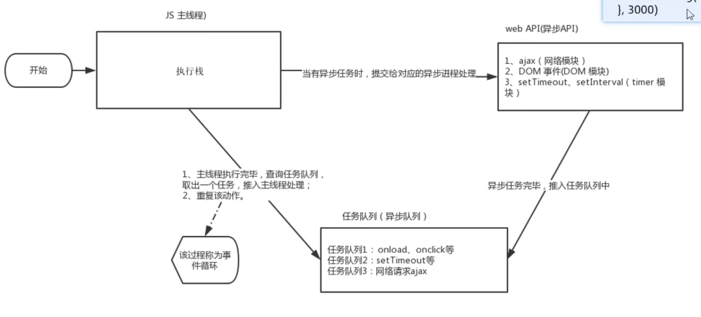

#### 总结

首先明确一点：JS是**单线程**运行的，当遇到异步任务时，会将这些任务先放到任务队列中，在主线程的所有任务执行完毕之后再回来执行异步任务队列

### location对象

#### 常用属性和方法

`location.href`：获取完整的URL地址，对其赋值时用于地址的跳转

```
location.href = 'http://www.baidu.com'
```

`location.search`属性获取地址中携带的参数，符号`?`后面部分

```
console.log(location.search)
```

`location,search`属性获取地址中的哈希值，符号`#`后面部分

```
console.log(location.hash)
```

`location.reload`方法用来刷新页面，传入参数true时表示强制刷新

```
location.reload(true)
```

### history对象

| history对象方法 | 作用                                                  |
| --------------- | ----------------------------------------------------- |
| back()          | 可以后退功能                                          |
| forward()       | 前进功能                                              |
| go(参数)        | 前进后退功能 参数如果时 1 前进1个页面 -1 后退一个页面 |

## 本地存储

### 本地存储介绍

随着项目的健全，会遇到要将数据存储到本地数据库中，这些数据会存储在**用户浏览器**（本地计算机）

### 本地存储分类

#### `localStorage`

数据永久存储

**增加数据**

```
localStorage.setItem('uname', '小明')
```

**获取数据**

```
localStorage.getItem('uname')
```

**删除数据**

```
localStorage.removeItem('uname')
```

**修改数据**

```
localStorage.setItem('uname', '小红')
```

#### `sessionStorage`

+ 生命周期为关闭浏览器窗口
+ 在同一个窗口下数据可以共享
+ 以键值对的形式存储使用
+ 用法跟`localStorage`基本相同

### 存储发杂数据类型

由于浏览器只能存储字符串，所以需要将复杂数据类型转换为JSON格式

```html
const obj = {
    uname: 'pink老师',
    age: 18
}

    localStorage.setItem('obj', JSON.stringify(obj))
console.log(JSON.parse(localStorage.getItem('obj')))
```

## 数组map和join方法

### `map()`方法

map 可以遍历数组并处理数据，**返回一个新数组**

```javascript
const arr = ['red', 'blue', 'green']
const newArr = arr.map(function (ele, index){
    console.log(index)      // 数组索引号
    return ele + '颜色'
})
console.log(newArr)     // [ "red颜色", "blue颜色", "green颜色" ]
```

### `join()`方法

join() 方法用于把数组中的所有元素转**换为一个字符串**，默认分隔符是逗号

```javascript
const arr = ['red', 'blue', 'green']
console.log(arr.join(' '))      // red blue green
```

## 正则表达式

### 介绍

正则表达式是用于匹配字符组合的一种模式

### 语法

**1. 正则表达式书写**

```
const 变量名 = /表达式/ 
```

**2， 判断是否有符合规则的字符串**

```
regObj.test(被检查的字符串)	// 返回布尔值regObj.exec(被检查的字符串)	// 返回数组
```

```html
const str = "我想学前端"
const reg = /前端/
console.log(reg.test(str))      // true
```

```html
const str = "我想学前端"
const reg = /前端/
console.log(reg.exec(str))      // true
```

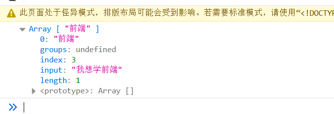

### 元字符

具有特殊含义的字符，极大提高了灵活性和强大的匹配功能，比如我们可以将26个英文字符写为`[a-z]`

#### 边界符

| 边界符 | 说明                           |
| ------ | ------------------------------ |
| ^      | 表示匹配行首的文本（以谁开始） |
| $      | 表示匹配行尾的文本（以谁结束） |

#### 量词

量词用来 **设定某个模式出现的次数**

| 量词  | 说明           |
| ----- | -------------- |
| *     | 重复0次或多次  |
| +     | 重复1次或多次  |
| ?     | 重复零次或一次 |
| {n}   | 重复n次        |
| {n,}  | 重复n次或多次  |
| {n,m} | 重复n到m次     |

### 字符类

**`[]`匹配字符集合**，表示一个范围

```    const str = "abcd"
const str = "abcd"
const reg = /[abc]/
console.log(reg.test(str))      // true
```

```
[a-z]：a到z的26个英文字母
[a-zA-Z]：表示大小写都可以
[0-9]：表示数字0~9都可以
```

**[] 里面加上 ^ 表示取反符号**

```
[^a-z] 匹配除了小写字母以外的字符
```

**预定义**

| 预定类 | 说明                                                         |
| ------ | ------------------------------------------------------------ |
| \d     | 匹配0-9之间的任一位数字，相当于[0-9]                         |
| \D     | 匹配所有0-9以外的字符，相当于 `[^0-9]`                       |
| \w     | 匹配任意的字母、数字和下划线，相当于 `[A-Za-z0-9_]`          |
| \W     | 除所有字母、数字和下划线以外的字符，相当于 `[^A-Za-z0-9]`    |
| \s     | 匹配空格（包括换行符、制表符、空格等），相等于`[\t\r\n\v\f]` |
| \S     | 匹配肥空格的字符，相当于 `[^\t\r\n\v\f]`                     |

### 修饰符

修饰符约束正则执行的某些细节行为，如是区分大小写、是否支持多行匹配等

语法：

```
/表达式/修饰符
```

+ `i`是单词 ignore 的缩写，正则匹配时字母不区分大小写
+ `g`时单词 global 的缩写，匹配所有满足正则表达式的结果

 **replace替换**

```
字符串.replace(/正则表达式/, '')
```

# JS 进阶

## 01 作用域

### 1.1 局部作用域

#### 局部作用域

1. 函数内部声明的变量，在函数外部无法访问
2. 函数的参数也是函数内部的局部变量
3. 不同函数内部声明的变量无法互相访问
4. 函数执行完毕后，函数内部的变量实际被清空了

#### 块作用域

在 JavaScript 中使用`{ }`包裹的代码称为代码块，代码块内部声明的变量外部将【有可能】无法访问；如`for循环`、`if判断`

1. let 声明的变量会产生块作用域，var不会产生块作用域
2. const 声明的常量也会产生块作用域
3. 不同代码块之间的变量无法互相访问
4. 推荐使用了let 或 const

### 1.2 全局作用域

`<script>`标签和`.js`的【最外层】就是所谓的全局作用域，在此声明的变量在函数内部也可以被访问。全局作用域中声明的变量，任何其他作用域都可以被访问

### 1.3 作用域链

作用域链本质上是最底层的**变量查找机制**

+ 在函数被执行时，会**优先查找当前**函数作用域中查找变量
+ 如果当前作用域找不到则会**依次逐级查找父级作用域**直到全局作用域

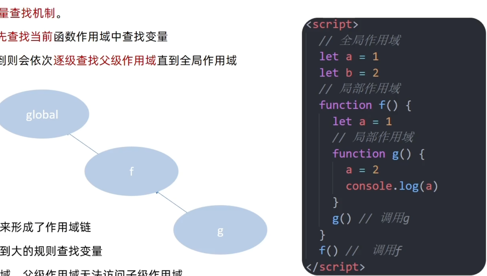

**总结：**

1. 嵌套关系的作用域串联起来形成了作用域链
2. 相同作用域链中按着从小到大的规则查找变量
3. 子作用域能够访问父作用域，父级作用域无法访问子级作用域

### 1.4 JS垃圾回收机制

#### 内存的生命周期

JS环境中分配的内存，一般有如下**生命周期**：

1. **内存分配：**当我们生命变量、函数、对象的时候，系统会自动为他们分配内存
2. **内存使用：**即读写内存、也就是使用变量、函数等
3. **内存回收：**使用完毕，由**垃圾回收器**自动回收不在使用的内存

**说明：**

+ 全局变量一般不会回收（关闭页面回收）
+ 一般情况下**局部变量的值** ，不用了，会被**自动回收**掉

**内存泄露：**程序中分配的**内存**由于某种原因程序**未释放**或**无法释放**叫做**内存泄露**

#### 算法说明

##### 堆栈空间分配区别：

1. 栈（操作系统）：由**操作系统自动分配释放**函数的参数值、局部变量等，基本数据类型放到栈里面
2. 堆（操作系统）：一般由程序员分配释放，若程序员不释放，由**垃圾回收机制**回收。复杂数据类型存储到堆里面

下面介绍两种常见的流量器**垃圾回收算法**：**引用计数法** 和 **标记清除法**

###### 引用计数

IE采用的引用计数算法，定义“**内存不再使用**”，就是看一个**对象**是否有指向它的引用，没用引用了就回收对象

算法：

1. 跟踪记录被**引用的次数**
2. 如果被引用了一次，那么就记录次数1，多次引用会**累加++**
3. 如果减少一个引用就**减1--**
4. 如果引用次数是**0**，则释放内存

但它却存在一个致命问题：嵌套引用（循环引用）

如果两个对象相互引用，尽管他们已不再使用，垃圾回收期不会进行回收，导致内存泄露

```JavaScript
function fn() {
    let o1 = {}
    let 02 = {}
    o1.a = o2
    o2.a = p1
    return '引用计数无法回收'
}
```

因为他们的引用次数永远不会是0，这样的相互应用如果说很大量的存在就会导致大量的内存泄露

###### 标记清除法

**这是现在大多数浏览器使用的方法**

核心：

1. 标记清除算法将“不再使用的对象”定义为“**无法达到的对象**”
2. 就是从**根部**（在JS中就是全局对象）出发定时扫描内存中的对象
3. 那些**无法**由根部出发触及到的**对象被标记**为不再使用，稍后进行**回收**

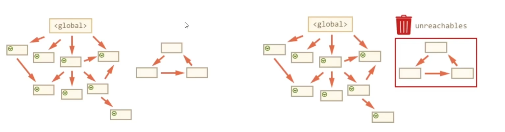

### 1.5 闭包

概念：一个函数对周围状态的引用捆绑一起，内层函数中访问到其外层函数的作用域

简单理解：**闭包 = 内层函数 + 外层函数的变量**

```javascript
  function outer(){
    const a = 1
    function f(){
      console.log(a)
    }
    return f
  }

  const fn = outer()
  fn()
```

### 1.6 变量提升

`var`声明的变量允许变量在声明之前即被访问，如下：

```javascript
console.log(num + "件")
var num = 10;

// 输出
undefined件
```

在JavaScript执行的时候会以下下面的形式执行

```javascript
var num;
console.log(num + "件")
num = 10;
```

**注意：**

1. 变量咋未声明即被访问时会报语法错误
2. 变量在var声明之前即被访问，变量的值未undefined
3. let/const声明的变量不存在变量提升
4. 变量提升出现在相同作用域当中
5. 实际开发中推荐先声明在访问变量

## 02 函数进阶

### 2.1 函数提升

函数提升与变量提升比较类似，时值函数在声明之前即可被调用

```javascript
  foo()
  function foo(){
    console.log(1)
  }
```

上面代码在执行之前，JavaScript会优先检查函数声明并把函数声明提升到最前面，如下：

```javascript
  function foo(){
    console.log(1)
  }
  foo()
```

**总结：**

1. 函数提升能够使函数的声明调用更灵活
2. 函数表达式不存在提升的现象
3. 函数提升出现在相同作用域当中

### 2.2 函数参数

#### 2.2.1 动态参数

`argument`时函数内部内置的伪数组变量，它包含了调用函数时传入的所有实参

```javascript
    function sum() {
        let sum = 0
        for (let i = 0; i < arguments.length; i++) {
            sum += arguments[i]
        }
        console.log(sum)
    }

    sum(1, 2, 3, 4, 5, 6)
    sum(1, 2, 3, 4, 5, 6, 8, 8, 8)
</script>
```

**总结：**

1. `arguments`是一个伪数组，只存在于函数中
2. `arguments`的作用时动态获取函数的实参
3. 可以通过for循环依次得到传递过来的实参

#### 2.2.2 剩余参数

1. `...`是语法符号，置于最末函数形参之前，用于获取多余的实参
2. 借助`...`获取的剩余实参，是个真数组

```javascript
    function spider(url, method, ...arr){
        console.log(url)
        console.log(method)
        console.log(arr)
    }
    
    spider('http://www.baidu.com', 'get', 'uname=admin&passwd=admin')
```

#### 2.2.3 展开运算符

展开运算符`...`，将一个数组进行展开

典型应用场景：求数组最大值（最小值）、合并数组等，相当于python中的解引用

```javascript
const arr = [1,2,3,4]
console.log(Math.max(...arr))       // 4
console.log(Math.min(...arr))       // 1
```

```javascript
const arr1 = [1,2,3,4]
const arr2 = [5,6,7,8]
const arr3 = [...arr1, ...arr2]
console.log(arr3)
```

### 2.3 箭头函数

#### 2.3.1 箭头函数介绍

箭头函数是一种极致简洁的写法，如下：

正常函数写法：

```javascript
const fn = function (a){
    console.log(a)
}
```

1、箭头函数写法：

```javascript
const fn = (x) => {
    console.log(x)
}
```

2、只有一个形参的时候，可以省略小括号

```javascript
const fn = x => {
    console.log(x)
}
```

3、只有一行代码的时候，可以省略大括号

```
const fn = x => console.log(x)
```

4、只有一行代码的时候，可以省略`retuen`

```javascript
const fn = x => x+x		// return x+x
```

5、箭头函数直接返回对象

```
const fn = uname => ({uname: uname})
```

#### 2.3.2 箭头函数求和

1. 箭头函数没有`argument`动态参数
2. 箭头函数没有`argument`动态参数，但是又剩余参数`...args`

```javascript
    const fn = (...arr) => {
        let sum = 0
        for (let i = 0; i < arr.length; i++) {
            sum += arr[i]
        }
        return sum
    }

    const result = fn(1,2,3,4,5)
    console.log(result)
```

#### 2.3.3 箭头函数 this

在箭头函数出现之前，每一个新函数根据它是被如何调用的来定义这个函数的this值，但是箭头函数不会创建自己的this，它只会从自己的作用域链的上一层沿用this

这里解释一下，这里的调用链是：`window.obj.sayHi()`，箭头函数沿用`obj`的this，所以是window，如果觉得太抽象，就记住：**在调用链上往上看两层**

```javascript
    obj = {
        uname: 'Jack',
        sayHi: () => {
            console.log(this)       // Window
        }
    }

    obj.sayHi()
```

在看下面代码，调用链为：`window.obj.sayHi.fn`，网上看两层，就是`o`

```javascript
    obj = {
        uname: 'Jack',
        sayHi: function (){
            const fn = () => {
                console.log(this)       // obj
            }
            fn()
        }
    }

    obj.sayHi()
```

### 2.4 结构赋值

#### 2.4.1 数组解构

**基本语法：**

1. 赋值运算符 = 左侧的 [] 用于批量声明变量，右侧数组单元值被赋值给左侧的变量
2. 变量的顺序对应数组单元值的位置依次进行赋值操作

```javascript
    const arr = [100, 80, 60]
    const [max, avg, min] = arr
    console.log(max)
    console.log(avg)
    console.log(min)
```

**典型应用：变量交换**

```javascript
let a = 1
let b = 2;
[b,a] = [a,b]
```

#### 2.4.2 对象解构

##### 2.4.2.1 基本语法：

1. 赋值运算符 = 左侧的 {} 用于批量声明变量，右侧对象的属性值将被赋值给左侧的变量
2. 对象属性的值将被赋值给与属性名相同的变量
3. 注意结构的变量名不要和外面的变量名冲突否则报错
4. 对象中找不到与变量名一致的属性时变量值为 undefined

```javas
const {uname, age} = {uname: 'jack', age: 18}
console.log(uname)
console.log(age)
```

##### 2.4.2.2 给新边变量名赋值

可防止变量名冲突

```javascript
const {uname: username, age} = {uname: 'jack', age: 18}
console.log(username)
console.log(age)
```

##### 2.4.2.3 数组对象结构

```javascript
const pig = [{uname: 'jack', age: 18}]
const [{uname, age}] = pig
console.log(uname)
console.log(age)
```

##### 2.4.2.4 多级对象解构

```javascript
const pig = {
    name: '佩奇',
    family: {
        mother: '猪妈妈',
        father: '猪爸爸',
        sister: '乔治'
    },
    age: 6
}

const {name, family: {mother, father, sister}, age} = pig
console.log(name)
console.log(mother)
console.log(father)
console.log(sister)
console.log(age)
```

### 2.5 遍历数组 forEach

```javascript
const arr = ['pink', 'red', 'green']
arr.forEach(function (item, index){
    console.log(`当前数组元素时：${item}`)
    console.log(`当前数组元素的索引是：${index}`)
})
```

# AJAX  入门

## 1. AJAX入门与axios使用

### 1.1 AJAX定义

AJAX 是异步的 JavaScript 和 XML（Asynchronous Javascript And XML）。简单来说，就是使用`XMLHttpRequest`对象与服务器通信。它可以使用JSON，XML，HTML和text文本等格式发送和接收数据。AJAX最吸引人的就是它的“异步”特性，也就是说它可以在不重新刷新页面的情况下与服务器通信，交换数据，或更新网页

### 1.2 axios 使用

1. 引入 axios.js：https://cdn.jsdelivr.net/npm/axios/dist/axios.min.js
2. 使用 axios 函数

```javascript
// 引入 axios.js
<script src="https://cdn.jsdelivr.net/npm/axios/dist/axios.min.js"></script>
<script>
    // 2. 使用axios函数
    axios({
    	// 向哪个URL请求数据
        url: 'http://hmajax.itheima.net/api/province'
    }).then(result => {
        console.log(result)
        console.log(result.data.list)
        document.querySelector('.my-p').innerHTML = result.data.list.join("<br/>")
    })
</script>
```

### 1.3 参数查询

浏览器在提供给服务器的额外信息，让服务器返回浏览器想要的数据

下面例子最后发送的URL：`http://hmajax.itheima.net/api/city?pname='河北省'`

```javascript
<script src="https://cdn.jsdelivr.net/npm/axios/dist/axios.min.js"></script>
<script>
    // 2. 使用axios函数
    axios({
        url: 'http://hmajax.itheima.net/api/city',
    	// 这里写 GET 请求参数的键值对
        params: {
            pname: '河北省'
        }
    }).then(result => {
        console.log(result)
    })
</script>
```

### 1.4 常用方法和请求数据

`axios`用`method`指定请求方法，`data`指定表单数据

```javascript
<script src="https://cdn.jsdelivr.net/npm/axios/dist/axios.min.js"></script>
<script>
    /*
      注册用户：http://hmajax.itheima.net/api/register
      请求方法：POST
      参数名：
        username：用户名（中英文和数字组成，最少8位）
        password：密码  （最少6位）

      目标：点击按钮，通过axios提交用户和密码，完成注册
    */
    document.querySelector('.btn').addEventListener('click', () => {
        axios({
            url: 'http://hmajax.itheima.net/api/register',
            method: 'post',
            data: {
                username: 'qwddwqdwq123',
                password: '123456789'
            }
        }).then(result => {
            console.log(result)
        })
    })
</script>
```

### 1.5 axios 错误处理

`axios`错误处理可以使用`catch`方法来处理错误信息

```javascript
<script src="https://cdn.jsdelivr.net/npm/axios/dist/axios.min.js"></script>
<script>
    /*
      注册用户：http://hmajax.itheima.net/api/register
      请求方法：POST
      参数名：
        username：用户名（中英文和数字组成，最少8位）
        password：密码  （最少6位）

      目标：点击按钮，通过axios提交用户和密码，完成注册
    */
    document.querySelector('.btn').addEventListener('click', () => {
        axios({
            url: 'http://hmajax.itheima.net/api/register',
            method: 'post',
            data: {
                username: 'qwddwqdwq123',
                password: '123456789'
            }
        }).then(result => {
            console.log(result)
        }).catch(error => {
            alert(`${error.response.data.message}`)
        })
    })
</script>
```

### 1.6 `from-searialize`的使用

JavaScript中，可以直接使用插件 `from-searialize` 获取指定表单的键值对

+ 参数1：要获取哪个表单的数据
  + 表单元素设置name属性，值会作为对象的属性名
  + 建议name属性的值，最好和接口文档参数一致
+ 参数2：配置对象
  + hash：设置获取数据结构
    + true：JS对象（推荐）一帮请求体里提交给服务器
    + false：查询字符串
  + empty：设置是否获取空值
    + true：获取空值（推荐）
    + false：不获取空值

```javascript
<script src="lib/form-serialize.js"></script>
<script>
    document.querySelector('.btn').addEventListener('click', () => {
        const from = document.querySelector('.example-form')

        const data = serialize(from, {hash: true, empty: true})
        console.log(data)
    })
</script>
```

### 1.7 `BootStrap` 弹框使用

> 官网：https://getbootstrap.com/docs/5.3/components/modal/

#### 1.7.1 导入 BootStrap

首先需要看清楚版本，当前官网的是 BootStrap5 版本，链接如下

```html
<link href="https://cdn.bootcdn.net/ajax/libs/twitter-bootstrap/5.2.3/css/bootstrap.min.css" rel="stylesheet">
<script src="https://cdn.bootcdn.net/ajax/libs/twitter-bootstrap/5.2.3/js/bootstrap.bundle.min.js"></script>
```

#### 1.7.2 CSS 控制弹框

**通过 data 属性**：在控制器元素（比如按钮或者链接）上设置属性 **data-bs-toggle="modal"**，同时设置 **data-bs-target="#identifier"** 或 **href="#identifier"** 来指定要切换的特定的模态框（带有 id="identifier"）。

```html
<!-- Button trigger modal -->
<button type="button" class="btn btn-primary" data-bs-toggle="modal" data-bs-target="#exampleModal">
  Launch demo modal
</button>

<!-- Modal -->
<div class="modal fade" id="exampleModal" tabindex="-1" aria-labelledby="exampleModalLabel" aria-hidden="true">
  <div class="modal-dialog">
    <div class="modal-content">
      <div class="modal-header">
        <h1 class="modal-title fs-5" id="exampleModalLabel">Modal title</h1>
        <button type="button" class="btn-close" data-bs-dismiss="modal" aria-label="Close"></button>
      </div>
      <div class="modal-body">
        ...
      </div>
      <div class="modal-footer">
        <button type="button" class="btn btn-secondary" data-bs-dismiss="modal">Close</button>
        <button type="button" class="btn btn-primary">Save changes</button>
      </div>
    </div>
  </div>
</div>
```

#### 1.7.3 JavaScript控制

```javascript
// 1. 创建弹框对象
const modalDOM = document.querySelector('.modal')
const modal = new bootstrap.Modal(modalDOM)

// 展示弹框
modal.show()
// 隐藏弹框
modal.hide()
```

### 1.8 图片上传

通过 JavaScript 将图片上传到服务器，并通过服务器返回访问图片的链接

```javascript
<script src="https://cdn.jsdelivr.net/npm/axios/dist/axios.min.js"></script>
<script>
    // 文件选择元素->change改变事件
    document.querySelector('.upload').addEventListener('change', event => {
        // event.target.files[0] 获取图片数据，FormData 打包
        const fd = new FormData()
        // img 为后台参数规定的can'shu
        fd.append('img', event.target.files[0])

        axios({
            url: 'http://hmajax.itheima.net/api/uploadimg',
            method: 'post',
            data: fd
        }).then(result => {
            document.querySelector('.my-img').src = result.data.data.url
        })
    })
</script>
```

## 2. XMLHTTP Request

### 2.1 XMLHTTP Request 基本使用

定义：XMLHttpRequest（XHR）对象用于与服务器交互。通过XMLHttpRequest可以在不刷新页面的情况下请求特定URL，获取数据。这允许在不影响用户操作的情况下，更新页面的布局内容

```javascript
    const xhr = new XMLHttpRequest()
    // 创建请求
    xhr.open('请求fan', 'http://hmajax.itheima.net/api/province')
    // 监听响应结果
    xhr.addEventListener('loadend', () => {
        console.log(xhr.response)
    })
    
    // 发起请求
    xhr.send()
```

### 2.2 XMLHTTP Request 查询参数

JavaScript 自带的 `URLSearchParams` 方法可以将参数参数自动转换为URL参数格式。代码使用如下：

```javascript
const pName = document.querySelector('.province').value
        const cName = document.querySelector('.city').value

        const paramsOBJ = new URLSearchParams({
            pname: pName,
            cname: cName
        })
        
        console.log(paramsOBJ.toString())
```

### 2.3 XMLHTTP Request POST 提交

```javascript
    document.querySelector('.reg-btn').addEventListener('click', () => {
        const xhr = new XMLHttpRequest()
        //  创建 POST 请求方法
        xhr.open('POST', 'http://hmajax.itheima.net/api/register')
        // 设置数据类型：JSON 
        xhr.setRequestHeader('Content-Type', 'application/json')

        // 账号密码
        let data = {username: 'Aa1234567891', 'password': '123456'}
        // 将 数据对象 打成 JSON 格式
        data = JSON.stringify(data)

        xhr.addEventListener('loadend', () => {
            console.log(xhr.response)
        })

        xhr.send(data)
    })
```

对于一个完整的 HTTP POST请求必须包含下面这4个字段：

```
POST /index.php HTTP/1.1
Host: 192.168.231.153:8000
Content-Type: application/json
Content-Length: 13

{"username":"Aa1234567891","password":"123456"}
```

## 3. Promise

### 3.1 认识 Promise

定义：`Permise`对象用于表示一个异步操作的最终完成（或失败）及其结果值

```javascript
    // 创建 Promise 对象
    const p = new Promise((resolve, reject) => {
        // 成功调用 resolve，失败调用 reject
        // resolve('执行成功')
        reject('执行失败')
    })

    p.then(result => {
        console.log(result)
    }).catch(error => {
        console.log(error)
    })
```

### 3.2 Promise 的三种状态

一个`Promise`对象，必然处于以下几种状态之一

+ 待定（pending）：初始状态，即没有被兑现，也没有被拒绝
+ 已兑现（fulfilled）：意味着：操作成功完成
+ 已拒绝（rejected）：意味着：操作失败

注意：`Promise`兑现一旦被 兑现/拒绝 就是已敲定了，状态无法再被改变

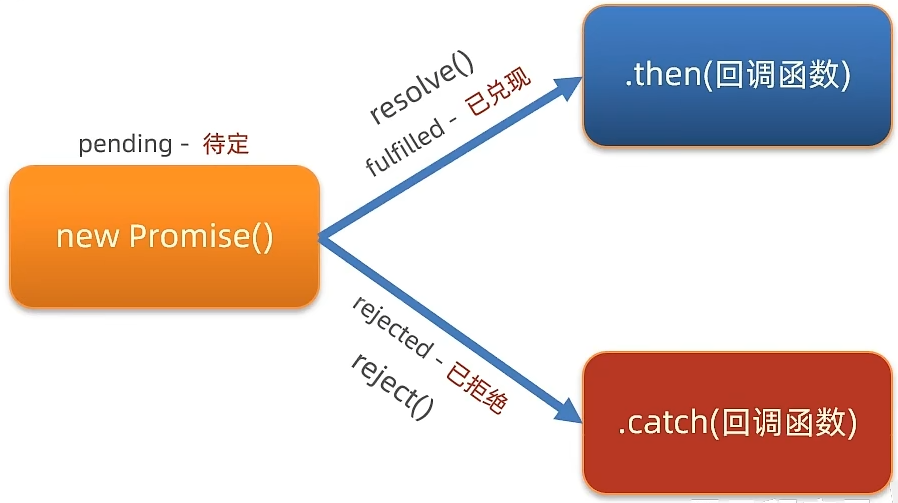

对于`Promise`对象状态的查看可以直接使用 `console.log(对象)` 来查看

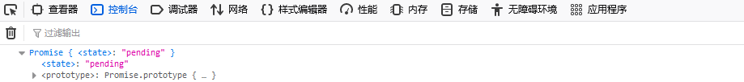

### 3.3 Promise和XHR获取省份列表

本案例主要是通过 `Promise`和`XHR`  的使用让我们来理解`axios`的原理

```javascript
    const p = new Promise((resolve, reject) => {
        const xhr = new XMLHttpRequest()
        xhr.open('GET', 'http://hmajax.itheima.net/api/province11')
        xhr.addEventListener('loadend', () => {
            // 成功则丢给 resolve 处理
            if (xhr.status >= 200 && xhr.status < 300){
                resolve(xhr.response)
       		// 失败则丢给 reject 处理
            }else {
                reject(new Error(rejec))
            }
        })

        xhr.send()
    })
	
    // 处理成功的数据
    p.then(result => {
        const data = JSON.parse(result)
        const htmlStr = data.list.map(item => {
            return `<li>${item}</li>`
        })
        document.querySelector('.cname').innerHTML = htmlStr
    // 处理失败的错误
    }).catch(error => {
        document.querySelector('.cname').innerHTML = error.response
    })
```

### 3.4 封装简易 axios

根据 `Promise` 和`xhr` 的知识封装属于自己的 axios

```javascript
    function myAxios(config) {
        return  new Promise((resolve, reject) => {
            const xhr = new XMLHttpRequest()
            xhr.open(config.method || 'GET', config.url)
            xhr.addEventListener('loadend', () => {
                if (xhr.status >= 200 && xhr.status < 300){
                    resolve(JSON.parse(xhr.response))
                }else {
                    reject(new Error(xhr.response))
                }
            })
            xhr.send()
        })
    }

    myAxios({
        url: 'http://hmajax.itheima.net/api/province'
    }).then(result => {
       document.querySelector('.pname').innerHTML = result.list.join('<br/>')
    }).catch(error => {
        console.log(error)
    })
```

### 3.4 封装简易 axios 带 GET 参数

下面代码是在 简易axios 的基础上带上HTTP GET query参数

```javascript
    function myAxios(config) {
        return  new Promise((resolve, reject) => {
            const xhr = new XMLHttpRequest()
            // 判断有无 config.params，有则带上
            if (config.params){
                const query = new URLSearchParams(config.params).toString()
                config.url += `?${query}`
            }

            xhr.open(config.method || 'GET', config.url)
            xhr.addEventListener('loadend', () => {
                if (xhr.status >= 200 && xhr.status < 300){
                    resolve(JSON.parse(xhr.response))
                }else {
                    reject(new Error(xhr.response))
                }
            })
            xhr.send()
        })
    }

    myAxios({
        url: 'http://hmajax.itheima.net/api/area',
        params: {
            pname: '辽宁省',
            cname: '大连市'
        }
    }).then(result => {
       document.querySelector('.pname').innerHTML = result.list.join('<br/>')
    }).catch(error => {
        console.log(error)
    })
```

### 3.5 封装简易 axios 带 POST 参数

这是在上面的代码的基础上进一步封装 POST 方法

```javascript
    function myAxios(config) {
        return  new Promise((resolve, reject) => {
            const xhr = new XMLHttpRequest()
            // 支持完整 GET 方法
            if (config.params){
                const query = new URLSearchParams(config.params).toString()
                config.url += `?${query}`
            }

            xhr.open(config.method || 'GET', config.url)
            xhr.addEventListener('loadend', () => {
                if (xhr.status >= 200 && xhr.status < 300){
                    resolve(JSON.parse(xhr.response))
                }else {
                    reject(new Error(xhr.response))
                }
            })

            // 支持 完整POST 方法
            if (config.data){
                xhr.setRequestHeader('Content-Type', 'application/json')
                const jsonStr = JSON.stringify(config.data)
                xhr.send(jsonStr)
            }else {
                xhr.send()
            }
        })
    }

    myAxios({
        url: 'http://hmajax.itheima.net/api/register',
        method: 'POST',
        data: {
            username: 'sadx21213',
            password: '1dwa56d1wa6'
        }
    }).then(result => {
        console.log(result)
    }).catch(error => {
        console.log(error)
    })
```

## 4. 各种知识点总结

#### 4.1 同步代码和异步代码

同步代码：浏览器是按照我们书写代码的顺序一行一行地执行程序的。浏览器会等待代码的解析和工作，在上一行完成后才会执行写一行。这样很有必要，因为每一行新的代码都是建立在前面代码的基础之上的（逐行执行，需原地等待结果后，才继续向下执行）

异步代码：异步编程技术使你的程序可以在执行一个可能长期运行的任务的同时继续对其他事件做出反应而不必等待任务完成。于此同时，你的程序也将在任务完成后显示结果（调用后耗时，不阻塞代码继续执行（不必原地等待），在将来完成后触发一个回调函数）

#### 4.2 Promise 链式结构解决回调函数地狱

##### 4.2.1 什么是回调函数地狱？

回调函数地狱指的是在A回调函数中嵌套着B回调函数，而B回调函数又嵌套则回调函数C。以此环环相扣。这样的代码会出现耦合性低，可读性差，异常捕获困难的问题

典型回调函数如下：

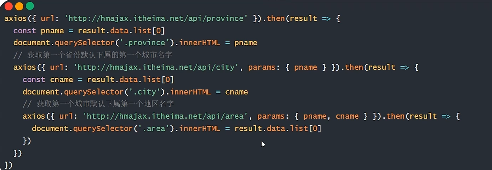

##### 4.2.2 Promise 链式结构解决回调函数地狱

核心思想：首先明确一点，`axios`中的`then()`是由pormise抛出的，那么只要在一个axios执行完毕之后再抛出一个新的promise则可构造出 peomise链，以此代码的维护性和耦合性就会高很多。从而解决回调函数地狱的问题

```javascript
let pname = ''
    let cname = ''
    axios({
        url: 'http://hmajax.itheima.net/api/province'
    }).then(result => {
        pname = result.data.list[0]
        document.querySelector('.province').innerHTML = pname

        return axios({url: 'http://hmajax.itheima.net/api/city', params: {pname}})
    }).then(result => {
        cname = result.data.list[0]
        document.querySelector('.city').innerHTML = cname

        return axios({url: 'http://hmajax.itheima.net/api/area', params: {pname, cname}})
    }).then(result => {
        document.querySelector('.area').innerHTML = result.data.list[0]
    })
```

#### 4.3 asynchronous函数和await解决回调函数地狱

核心思想：`async`将函数标记为异步函数，await阻塞代码执行，直到有结果返回。以此类推

```javascript
    async function getData(){
        const pnameObj = await axios({url: 'http://hmajax.itheima.net/api/province'})
        const pname = pnameObj.data.list[0]
        const cnameObj = await axios({url: 'http://hmajax.itheima.net/api/city', params:{pname}})
        const cname = cnameObj.data.list[0]
        const areaObj = await axios({url: 'http://hmajax.itheima.net/api/area', params: {pname, cname}})
        const area = areaObj.data.list[0]

        document.querySelector('.province').innerHTML = pname
        document.querySelector('.city').innerHTML = cname
        document.querySelector('.area').innerHTML = area
    }

    getData()
```

#### 4.4 JavaScript 异常处理

JavaScript 的异常处理使用语句：`try...catch`

```javascript
try{
        async function getData(){
            const pnameObj = await axios({url: 'http://hmajax.itheima.net/api/province'})
            const pname = pnameObj.data.list[0]
            const cnameObj = await axios({url: 'http://hmajax.itheima.net/api/city', params:{pname}})
            const cname = cnameObj.data.list[0]
            const areaObj = await axios({url: 'http://hmajax.itheima.net/api/area', params: {pname, cname}})
            const area = areaObj.data.list[0]

            document.querySelector('.province').innerHTML = pname
            document.querySelector('.city').innerHTML = cname
            document.querySelector('.area').innerHTML = area
        }
    }catch (error){
        console.log(error)
    }
```

#### 4.5 Promise.all 静态方法

`Promise.all`对象可以用于需要同时发出多个AJAX请求并将结果整合一起处理的情况

```javascript
// 语法
const p = Promise.all([Promise对象, Promise对象])
p.then(result => {
    // result 结果：[Promise对象成功结果, Promise对象成功结果, ...]
}).catch(error => {
    // 第一个失败的Promise对象，抛出的异常
})
```

示例：同时请求多个城市的天气情况并处理

# Node.js

## 1 Node.js 安装

官网下载Node.js的安装包直接安装即可，安装完后在DOS窗口上输入`node -v`有回显即安装成功！

对于PHPStorm需要先重启一下计算机才能正确加载node.js

```powershell
PS D:\PHP\JavaScript\nodeJS>  node -v
v16.19.0
```

## 2. Node.js fs模块-读写文件

### 2.1 Node.js 读文件

```javascript
const fs = require('fs')
fs.readFile('文件路径', (err, data) => {
    // 读取后的回调函数
    // data 是文件内容 Buffer 数据流
})

// 示例
fs.readFile('./test.txt', (err, data) => {
    if (err) console.log(err)
    console.log(data.toString())
})
```

### 2.2 Node.js 写文件

```javascript
const fs = require('fs')
fs.writeFile('文件路径', '写入内容', err => {
    // 写入后的回调函数
})

// 示例
fs.writeFile('./test.txt', 'Hello Node.js', err => {
    if (err){
        console.log(err)
    }
    console.log('写入成功')
})
```

## 3 Node.js path模块-路径处理

在 Node.js 中，对于相对文件路径`../`的处理，是取决于当前终端环境的路径的。这也导致脚本执行会非常不稳定，所以这里推荐使用`__dirname`内置变量；`__dirname`返回的是当前node.js脚本的路径

```javascript
console.log(__dirname)			// D:\PHP\JavaScript\nodeJS
```

`path.join()`会使用特定平台的分割符，作为分界线，讲所有给定的路径片段链接在一起

```javascript
const path = require('path')
console.log(path.join(__dirname, 'test.txt'))			// D:\PHP\JavaScript\nodeJS\test.txt
```

`__dirname`与`path.join()`一起使用读取文件示例

```javascript
const path = require('path')
const fs = require('fs')

fs.readFile(path.join(__dirname, 'test.txt'), (err, data) => {
    console.log(data.toString())
})
```

## 4 Node.js HTTP模块-创建web服务

```javascript
const http = require('http')
const server = http.createServer()

server.on('request', (req, res) => {
    // 由于返回的内容中有中文字符，所以这里讲编码改为 utf-8
    res.setHeader('Content-Type', 'text/plain;charset=utf-8')
    res.end('欢迎使用 Node.js')
})

// 启动并监听HTTP服务
server.listen(3000, () => {
    console.log('3000 端口启动成功')
})
```

## 5 案例：Node.js 返回HTML代码

```javascript
const http = require('http')
const path = require('path')
const fs = require('fs')
const server = http.createServer()

server.on('request', (req, res) => {
    // 通过路径判断回显的资源
    if (req.url === '/index.html'){
        // 读取HTML文件
        fs.readFile(path.join(__dirname, '../AJAX/02.案例_图书管理/index.html'), (err, data) => {
            if (err) return err
            let htmlStr = data.toString()
            // 压缩代码传到前端
            htmlStr = htmlStr.replace(/[\r\n]/g, '')
            // 注意：这里需要浏览器执行HTML代码，所以 Content-Type 值为：text/html
            res.setHeader('Content-Type', 'text/html;charset=utf-8')
            res.end(htmlStr)
        })
    }else {
        res.setHeader('Content-Type', 'text/plain;charset=utf-8')
        res.end('请求资源不存在')
    }
})

server.listen(3000, () => {
    console.log('3000 端口启动成功')
})
```

## 6 Node.js 模块化

如果想把js文件打包成Node.js的模块，则可以使用 `module.exports` 将要暴露的属性和函数暴露出去

```javascript
const baseURL = 'http://127.0.0.1:8080'
const arraySum = function (array){
    let sum = 0
    array.map(item => {
        sum += item
    })
    return sum
}

module.exports = {
    url: baseURL,
    arraySum: arraySum
}
```

在使用的时候就可以直接用`require`将模块包含进来

```javascript
const obj = require('./utils')
```

## 7 Node.js ECMAScript-默认导入导出

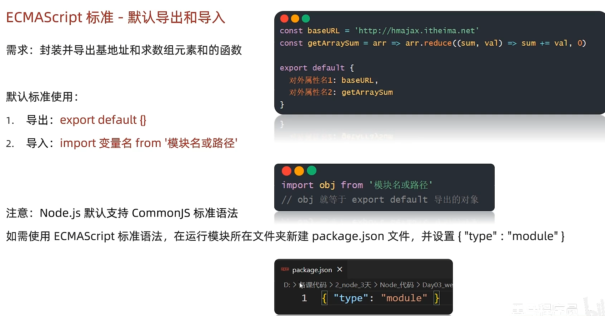


## 8 Node.js ECMAScript-命名导入导出

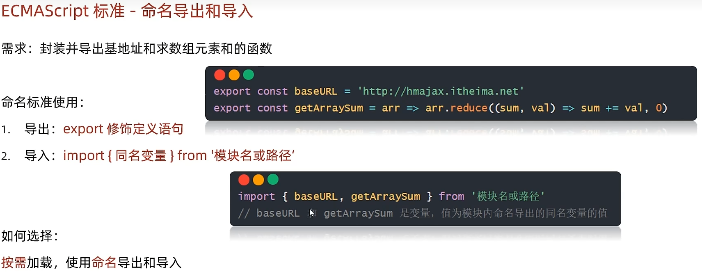

## 9 Node.js npm 本地软件包管理

### 9.1 npm 换源

```
PS D:\PHP\JavaScript\nodeJS> npm config set registry http://registry.npm.taobao.org/
// 查看当前源
PS D:\PHP\JavaScript\nodeJS> npm config get registry
http://registry.npm.taobao.org/
```

### 9.2 nrm 管理源

#### 9.2.1 下载nrm

```
D:\PHP\JavaScript\nodeJS>npm install nrm -g
```

#### 9.2.2 查看所有npm源

```
D:\PHP\JavaScript\nodeJS>nrm ls
  npm ---------- https://registry.npmjs.org/
  yarn --------- https://registry.yarnpkg.com/
  tencent ------ https://mirrors.cloud.tencent.com/npm/
  cnpm --------- https://r.cnpmjs.org/
  taobao ------- https://registry.npmmirror.com/
  npmMirror ---- https://skimdb.npmjs.com/registry/
```

#### 9.2.3 切换源

```
D:\PHP\JavaScript\nodeJS>nrm use npm  
 SUCCESS  The registry has been changed to 'npm'.
```

### 9.3 npm 初始化和使用

```
npm init -y			// 初始化清单文件
npm install pkgName		// 下载需要的软件包
```

#### 9.3.1 使用软件包

```javascript
import dayjs from "dayjs";
const newDateStr = dayjs().format('YYYY-MM-DD')
console.log(newDateStr)
```

#### 9.3.2 npm 安装所有依赖

**注意：**项目中必须包含`package-lock.json`和`package.json`文件

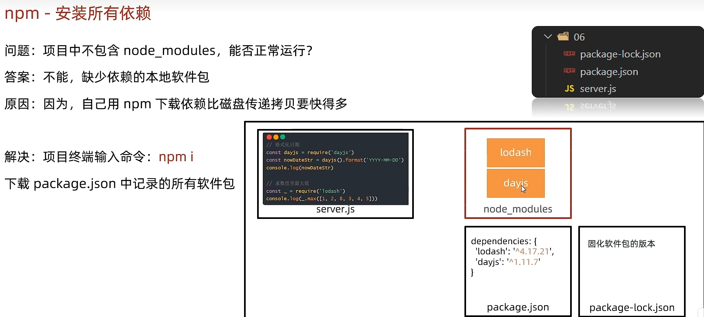

```
PS D:\PHP\JavaScript\nodeJS> npm install 
[##################] \ reify:dayjs: sill audit bulk request { dayjs: [ '1.11.10' ] }
```

#### 9.3.3 包的语义化和规范

包的版本号是以“点分十进制”形式进行定义的，总共有三位数字，例如：2.24.0

其中每一位的数字所代表的含义如下：

第一位数字：大版本（底层重构修改）

第二位数字：功能版本

第三位数字：Bug修复版本

版本号提升的规则：只要前面的版本号增长了，则后面的版本号归零

## 10 Node.js npm 全局软件包

软件包区别：

+ 本地软件包：当前项目内使用，封装属性和方法，存在于 node_modules
+ 全局软件包：本机所有项目使用，封装命令和工具，存在于系统设置的位置

nodemon 作用：替代 node 命令，检测代码更改，自动重启程序

安装：`npm install -g`

### 1.10.1 PHPstorm 无法使用nodemon

由于PHPStorm默认使用的是Power shell，而Power Shell默认是禁止运行脚本的，所以无法启动`nodemon`，这里将终端改为DOS即可，注意重启PHP Storm

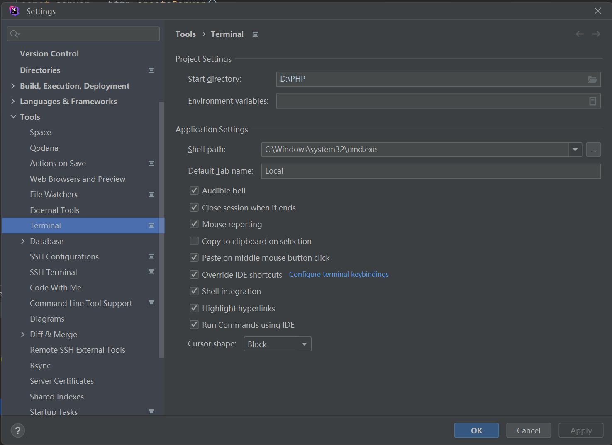

## 11 Node.js Express

### 11.1 Express 简介

#### 11.1.1 什么是Express

Express 的作用和Node.js内置的http模块类似，是专门用来创建web服务器的

#### 11.1.2 Express 能做什么

+ Web 网站服务器：专门对外提供Web网页资源的服务器
+ API 接口服务器：专门对外提供API接口的服务器

### 11.2 Express 的基本使用

#### 11.2.1 Express 安装

```
D:\PHP\JavaScript\express> npm install express@4.17.1
```

#### 11.2.2 Express 创建基本的Web服务器

```javascript
const express = require('express')
// 创建web服务器
const app = express()

// 调用 app.listen 启动服务器
app.listen(80, () => {
    console.log('express server running at http://127.0.0.1')
})
```

#### 11.2.3 Express 监听get方法

```javascript
// app.get('请求路径', (request, response))

app.get('/user', (req, res) => {
    res.send({name: '张三', age: '18', gender: '男'})
})
```

#### 11.2.4 Express 监听post方法

```javascript
app.post('/user', (req,res) =>{
    res.send('POST 方法请求成功')
})
```

#### 11.2.5 获取URL中携带的查询参数

node.js 使用`req.query`接收URL中的查询参数

```javascript
app.get('/', (req, res) => {
    res.send(req.query)
})
```

#### 11.2.6 获取URL中的动态参数

`req.params`获取到的就是`id`的值，返回的是一串JSON键值对

```javascript
app.get('/user:id', (req, res) => {
    res.send(req.params)
})
```

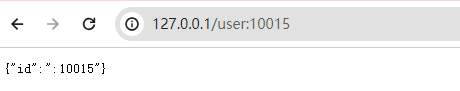

### 11.3 托管静态资源

#### 11.3.1 `express.static()`

Express在指定的静态目录中查找文件，并对外提供资源的访问路径，因此，存放静态文件的目录名不会出现在URL中

可将指定目录下的所有资源直接暴露出去

如果需要暴露多个静态资源，那么使用多次`express.static()`即可

```javascript
app.use(express.static('./public'))
```

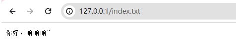

#### 11.3.2 挂载路径前缀

如果希望在托管的静态资源访问路径之前，挂载路径前缀，则可以使用如下方式：

```javascript
app.use('/public', express.static('./public'))
```

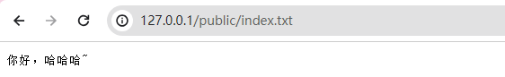

### 11.4 Express 路由

#### 11.4.1 初识Express路由

##### 11.4.1.1 Express 中的路由

在Express中，路由指的是客户端的请求与服务器处理函数之间的映射关系

Express中的路由分3部分组成，分别是请求的类型、请求的URL地址、处理函数，格式如下：

```
app.METHOD(PATH, HANDKER)
```

##### 11.4.1.2 路由的匹配过程

每当一个请求到达服务器之后，需要先经过路由的匹配，只有匹配成功之后，才会调用对应的处理函数

在匹配时，会按照路由的顺序进行匹配，如果请求类型和请求的URL同时匹配成功，则Express会将这次请求，转交给对应的function函数进行处理

**路由匹配的注意点：**

1. 按照定义的先后顺序进行匹配
2. 请求类型和请求的URL同时匹配成功，才会调用对应的处理函数

##### 1.11.4.1.3 最简单的用法

```javascript
const express = require('express')
const app = express()

app.get('/', (req, res) => {
    res.send('GET 请求成功')
})

app.post('/', (req, res) => {
    res.send('POST 请求成功')
})

app.listen(80, () => {
    console.log('express server running at http://127.0.0.1')
})
```

#### 11.4.2 模块化路由

为了方便对路由进行模块化管理，Express不建议将路由直接挂载到app上，而是推荐将路由抽离为单独的模块。

将路由抽离为单独的模块步骤如下：

1. 创建路由模块对应的.js文件
2. 使用`express.Router()`函数创建路由对象
3. 向路由对象上挂载具体的路由
4. 使用`module.exports`向外共享路由对象
5. 使用`app.use()`函数注册路由模块

#### 11.4.3 创建路由模块

```javascript
const express = require('express')
const router = express.Router()

router.get('/user/get', (req, res) => {
    res.send('Get 请求成功')
})

router.post('/user/post', (req, res) => {
    res.send('POST 请求成功')
})

// 将路由模块暴露出去
module.exports = router
```

#### 11.4.4 注册路由模块

```javascript
const express = require('express')
// 导入路由模块
const router = require('./Router')
const app = express()

// 使用路由模块
app.use(router)

app.listen(80, () => {
    console.log("Express server is run at http://127.0.0.1")
})
```

#### 11.4.5 为路由模块添加前缀

路由模块添加前缀的方式与静态资源托管添加路由模块的方式一样

```javascript
app.use('/api', router)
```

### 11.5 Express 中间件

#### 11.5.1 Express中间件的调用流程

当一个请求到达Express的服务器之后，可以连续调用多个中间件，从而对这次请求进行**预处理**

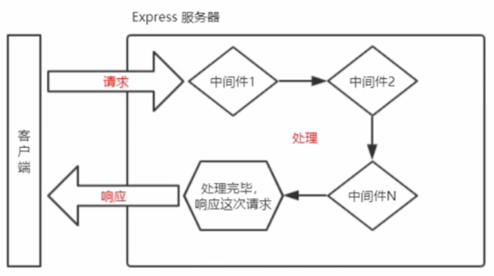

#### 11.5.2 Express 中间件的格式

Express的中间件，本质上就是一个**function处理函数**，Express中间件格式如下：

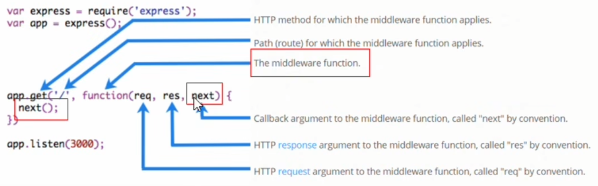

注意：中间件函数的形参列表中，**必须包含next参数**。而路由处理函数中值包含req和res

**next 函数**是实现多个中间件连续调用的关键，它表示把流程关系转交给下一个中间件或路由

#### 11.5.3 定义中间件函数

```javascript
const mw = function (req, res, next){
    console.log("中间件函数 1")
    next()
}
```

#### 11.5.4 全局生效的中间件

客户端发起的任何请求，到达服务器之后，**都会触发的中间件**，叫做全局生效中间件

通过调用`app.use(中间件函数)`，即可定义一个**全局生效的中间件**，如下：

```javascript
const mw = function (req, res, next){
    console.log("中间件函数 1")
    next()
}

// 全局生效的中间件
app.use(mw)
```

上面的代码也可以简化成下面的形式：

```javascript
app.use(function (req, res, next){
    console.log("简化中间件函数 1")
    next()
})
```

#### 11.5.5 中间件的作用

多个中间件之间，共享同一份req和res，基于这个特性，我们可以在上有的中间件，统一为req或res对象添加自定义的属性或方法，供下游的中间件或路由进行使用

```javascript
app.use(function (req, res, next){
    // 通过在 req 上创建属性来接收返回值并让后续的中间件调用
    req.startTime = new Date()
    next()
})
```

**注意：**对于多个中间件，会按照中间件定义的先后顺序依次进行调用

#### 11.5.6 局部生效的中间件

不使用`app.use()`定义的中间件，叫做局部生效的中间件，如下：

```javascript
const mw = function (req, res,next){
    console.log('这是专属于 user 的中间件')
    next()
}

// mw 这个中间件函数只会在”当前路由中生效“，这种用法属于”局部生效的中间件“
app.get('/user', mw,(req, res) => {
    res.send('User Page.')
})

app.get('/', (req, res) => {
    res.send('Home Page.')
})
```

#### 11.5.7 定义多个局部中间件

可以在路由中，通过如下两种等价的方式，使用多个局部中间件

```javascript
app.get('/user', mw1, mw2, (req, res) => {
    res.send('User Page.')
})

// 这种方法跟上面的方法等价
app.get('/user', [mw1, mw2], (req, res) => {
    res.send('User Page.')
})
```

#### 11.5.8 中间件的注意事项

1. 一定要在**路由之前**注册中间件
2. 客户端在发送过来的请求，**可以连续调用多个**中间件进行处理
3. 执行完中间件的业务代码之后，**不要忘记调用next()函数**
4. 为了**防止代码逻辑混乱**，调用next()函数不要再写额外的代码
5. 连续调用多个中间件时，多个中间件之间，**共享**req和res对象

#### 11.5.7 错误处理中间件

错误级别中间件的作用：专门用来捕获整个项目中发生异常错误，从而防止项目异常崩溃的问题

格式：错误级别中间件的function处理函数，必须又4个参数，形参顺序从前到后，分别是`err, req, res, next`

```javascript
app.get('/', (req, res) => {
    throw new Error('服务器错误');
    res.send('Home Page.')
});

app.use(function (err, req, res, next){
    console.log("错误信息：" + err.message);
    res.send('错误信息：' + err.message);
    next();
});
```

**注意：**错误级别中间件必须注册在所有路由之后

#### 11.5.8 Express 内置的中间件

自Express 4.16.0 版本开始，Express 内置了3个常用的中间件，极大的提高了Express项目开发效率和体验

1. `express,static` 快速托管静态资源的内置中间件
2. `express.json`解析JSON格式的请求体数据
3. `express.urlencoded`解析URL-encoded格式的请求体数据

```javascript
// 配置解析 application/json 格式数据的内置中间件
app.use(express.json)
// 配置解析 application/x-www-form-urlencoded 格式数据的内置中间件
app.use(express.urlencoded({extend: false}))
```

#### 11.5.9 express.json 中间件的使用

```
JSON 数据格式：{"name": "Bob", "age", 18}
```

```javascript
// 调用 express.json 中间件的使用
app.use(express.json())

app.post('/user', (req, res) => {
    // 使用 req.body 接收
    console.log(req.body)
    res.send('OK!')
})
```

#### 11.5.10 express.urlencoded 中间件的使用

```
application/x-www-from-urlencoded 数据格式示例：username=JohnDoe&password=secretpassword
```

```javascript
app.use(express.urlencoded({extended: false}))
app.post('/book', (req, res) => {
    console.log(req.body)
    res.send('OK!')
})
```

#### 11.5.11 第三方中间件

这里以 `body-parser` 示例

**1. 下载中间件**

```
D:\PHP\JavaScript\express>npm install body-parser
```

**2. 使用**

```
application/x-www-from-urlencoded 数据格式示例：username=JohnDoe&password=secretpassword
```

```javascript
app.use(parser.urlencoded({extend: false}))

app.post('/book', (req, res) => {
    console.log(req.body)
    res.send('OK!')
})
```

#### 11.5.12 Node.js 事件监听

Node.js 的事件监听格式如下：

```javascript
req.on('事件名', function)
```

常见事件：

`data`：当请求体中带有表单数据的时候自动触发

```javascript
    let str = ''    
	req.on('data', (chunk) => {
        str += chunk
    })
```

`end`：当检测到请求体中的所有数据传输完毕后自动触发

```javascript
    req.on('end', () => {
        req.body = qs.parse(str)
        next()
    })
```

#### 11.5.13 自定义中间件

本案例以一个能自动解析`application/x-www-form-urlencoded`函数示例

```javascript
const qs = require('querystring')

const parser = function (req, res, next){
    // 考虑到可能请求体的数据太大，导致会分包传输，这里额外使用 str 变量以叠加的方式接收
    let str = ''
    req.on('data', (chunk) => {
        str += chunk
    })

    req.on('end', () => {
        req.body = qs.parse(str)
        next()
    })
}

module.exports = parser
```

使用

```javascript
const parser = require('./custom-body-parser')
app.use(parser)

app.post('/book', (req, res) => {
    res.setHeader('Content-Type', 'text/html;charset=utf-8')
    res.send(req.body)
})
```

## 12 cors 跨域共享资源

### 12.1 使用cors中间件解决资源跨域问题

使用步骤如下：

1. 运行`npm install cors`安装中间件
2. 使用`const cors = require('cors')`导入中间件
3. 在路由之前调用`app.use(cors)`配置中间件

### 12.2 什么是CORS

cors（Cross-Origin Resource Sharing，跨域资源共享）由一系列HTTP响应头组成，这些HTTP响应头决定浏览器是否阻止前端JS代码跨域获取资源

浏览器的同源安全策略默认会阻止网页“跨域”获取资源，但如果接口服务器配置了CORS相关的HTTP响应头，就可以解除浏览器前端的跨域访问限制

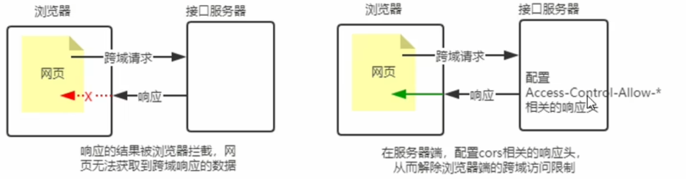

### 12.3 CORS的注意事项

1. CORS 主要在服务器端进行配置，客户端浏览器无需做任何额外的配置，即可请求开启了CORS接口
2. CORS在浏览器中有兼容性，只有执行XMLHttpRequest Level 2 的浏览器，才能正常访问开启了CORS的服务器

### 12.4 响应头部 - `Access-Control-Allow-Origin`

响应头部中可以携带一个 Access-Control-Allow-Origin字段，其语法如下：

其中通配符`*`表示允许所有的跨域请求

```
Access-Control-Allow-Origin: <origin> | *
```

其中，origin参数的值指定了允许访问该资源的外域URL

例如，下面的字段值将只允许来自`http://www.baidu.com`的请求

```
res.setHeader('Access-Control-Allow-Origin', 'http://www.baidu.com')
```

#### 12.5 响应头部 - `Access-Control-Allow-Headers`

默认情况下，CORS仅支持客户福安向服务器发送如下9个请求头

```
Accept、Accept-Language、Content-Language、DPR、Downlink、Save-Date、Viewport-Width、Width、Content-Type（之仅限于 text/plain、multipart/from-data、application/x-www-from-urlencoded三者之一）
```

如果客户端向服务器发送了额外的请求头信息，则需要在服务器端，通过Access-Control-Allow-Headers对额外的请求头进行声明，否则这次请求会失败

```
// 允许客户端额外向服务器发送 Content-Type 请求头和 X-Custom-Header 请求头
// 注意：多个请求头之间使用英文的都好进行分割
res.setHeader('Access-Control-Allow-Headers', 'Content-Type, X-Custom-Header')
```

#### 12.6 CORS 响应头部 - Access-Control-Allow-Method

默认情况下，CORS仅支持客户端发起GET、POST、HEAD请求

如果客户端希望通过PUT、DELETE等方式请求服务器的资源，则需要在服务器端、通过`Access-Control-Allow-Methods`开值明实际请求所有允许使用HTTP方法

```
// 只允许 POST、GET、DELETE、HEAD 请求方法
res.setHeader('Access-Control-Allow-Methods', 'POST, GET, DELETE, HEAD')
// 允许所有的HTTP请求方法
res.setHeader('Access-Control-Allow-Methods', '*')
```

### 12.7 简单请求和预检请求

#### 12.7.1 简单请求

1. 请求方式：GET、POST、HEAD三者之一

2. HTTP 头部信息不超过以下几种字段，**无自定义字段头部**

   ```
   Accept、Accept-Language、Content-Language、DPR、Downlink、Save-Date、Viewport-Width、Width、Content-Type（之仅限于 text/plain、multipart/from-data、application/x-www-from-urlencoded三者之一）
   ```

#### 12.7.2 预检请求

只要符合以下任何一个条件的请求，都需要进行预检查请求：

1. 请求方法为：GET、POST、HEAD之外的请求Method类型
2. 请求头中包含自定头部字段
3. 向服务器发送了`application/json`格式的数据

在浏览器域服务器正确通信之前，**浏览器会先发送OPTION请求进行预检，以便获知服务器是否允许实际请求**，所以这一次的OPTION请求称为“预检请求”。**服务器成功响应预检请求后，才会发送真正的请求，并且携带真实数据**

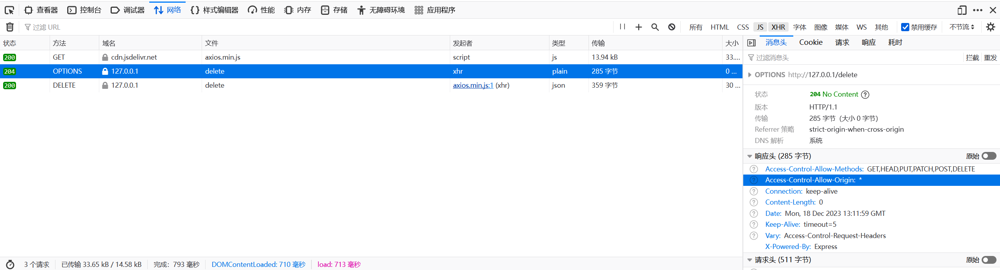

## 13 MySQL模块

### 13.1 安装并配置MySQL模块

#### 13.1.1 安装MySQL模块

```
D:\PHP\JavaScript\mysql>npm init -y
D:\PHP\JavaScript\mysql>npm install mysql 
```

#### 13.1.2 连接Mysql模块并测试

```javascript
const mysql = require('mysql')
const db = mysql.createPool({
    host: '127.0.0.1',
    user: 'root',
    password: 'root',
    database: 'security'
})

// 测试是否成功连接
db.query('select database()', (err, result) => {
    if (err) return console.log(err)
    console.log(result)
})
```

### 13.2 Mysql中的增删改查

#### 13.2.1 查

**注意：**返回的是一个数组

```javascript
db.query('select * from users', (err, result) => {
    if (err) return console.log(err.message)
    console.log(result)
})
```

#### 13.2.2 插

node.js 可以使用`?`做占位符填充SQL语句

`result.affectedRows`代表的是影响的行数！

```javascript
const user = {username: 'Spider', password: 'Aa123456'}
const sqlStr = 'insert into users (username, password) values (?,?)'
db.query(sqlStr, [user.username, user.password], (err, result) => {
    if (err) return console.log(err.message, db.query.sql)
    if (result.affectedRows === 1){
        console.log('插入成功！')
    }
})
```

当然也可以使用模板字符串的方式插入数据

```javascript
const user = {username: 'Spider', password: 'Aa123456'}
db.query(`insert into users (username, password) values ('${user.username}', '${user.password}')`, (err, result) => {
    if (err) return console.log(err.message)
    if (result.affectedRows === 1){
        console.log('插入成功')
    }
})
```

**便捷写法：**当字段名和要插入的对象键名相同时，即可使用便捷写法，如下：

```javascript
const user = {username: 'Sugar', password: 'Aa123456'}
const sqlStr = 'insert into users SET ?'
db.query(sqlStr, user, (err, result) => {
    if (err) return console.log(err)
    if (result.affectedRows === 1){
        console.log('插入成功')
    }
})
```

#### 13.2.3 改

```javascript
const user = {id: 19, username: 'Cat', password: '123456'}
const sqlStr = 'update users set username=?, password=? where id=?'
db.query(sqlStr, [user.username, user.password, user.id], (err, result) => {
    if (err) return console.log(err.message)
    if (result.affectedRows === 1){
        console.log('修改成功')
    }
})
```

**便捷写法：**更新数据时，如果数据对象的每个属性和数据表的字段一一对应，则可以通过如下方式快速更新数据

```javascript
const user = {id: 19, username: 'Dog', password: '123456'}
const sqlStr = 'update users set ? where id=?'
db.query(sqlStr, [user, user.id], (err, result) => {
    if (err) return console.log(err.message)
    if (result.affectedRows === 1){
        console.log('插入成功')
    }
})
```

#### 13.2.4 删

如果SQL语句中有多个占位符，则必须使用数组为每个占位符指定具体的值；如果SQL语句中只有一个占位符，则可以省略数组

```javascript
const sqlStr = 'delete from users where id=?'
db.query(sqlStr, 19, (err, result) => {
    if (err) return console.log(err)
    if (result.affectedRows === 1){
        console.log('删除成功')
    }
})
```

## 14 Web开发模式

### 14.1 服务端渲染的Web开发模式

服务端渲染的概念：服务器发送给客户端的HTML页面，是在服务器通过字符串的拼接，动态生成的。因此，客户端不需要使用AJAX这样的技术额外请求页面的数据。代码如下：

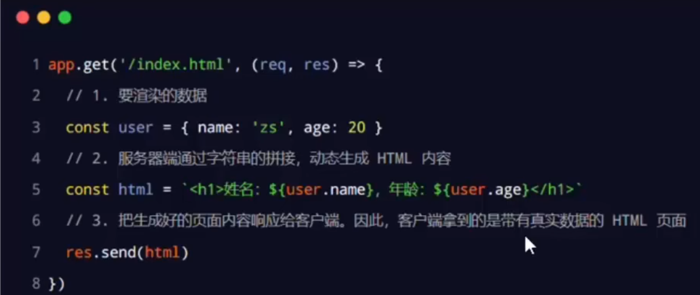

### 14.2 服务端渲染的优缺点

优点：

1. 前端耗时少：因为服务器复杂动态生成HTML内容，浏览器只需要直接渲染页面即可
2. 有利于SEO：因为服务器响应的是完整的HTML页面内容，所以爬虫更容易爬取获取信息

缺点：

1. 占用服务端资源：即服务端完成HTML页面内容的拼接。如果请求较多，会对服务端造成一定的访问压力
2. 不利于前后端分离，开发效率低：使用服务端渲染，则无法进行分工合作，尤其对前端复杂度高的项目，不利于项目高效开发
