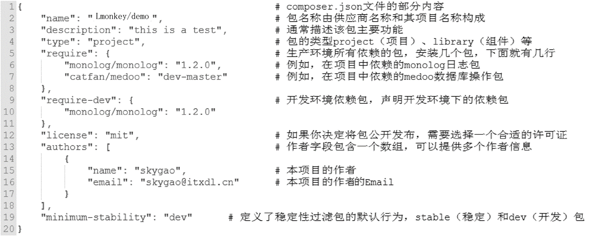
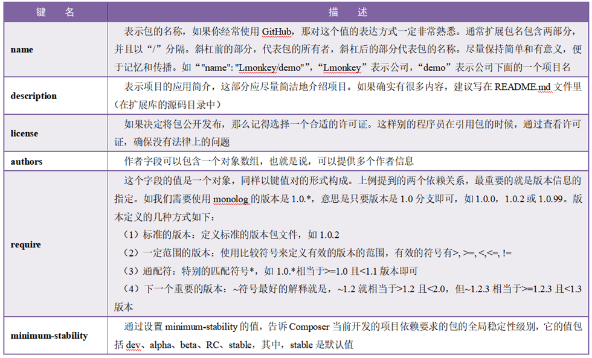
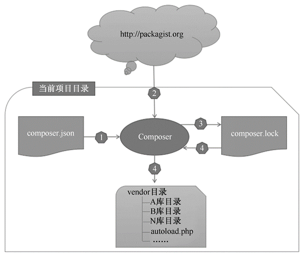
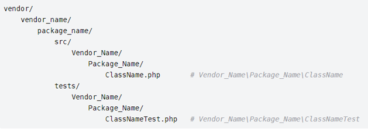
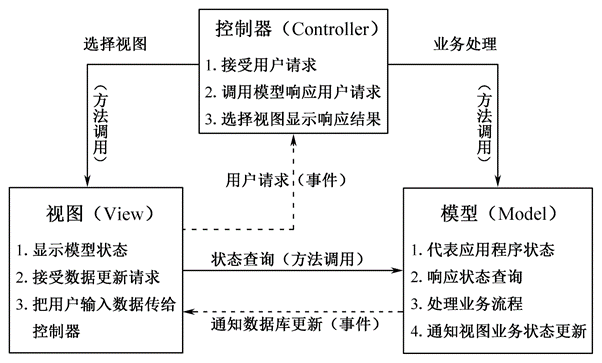
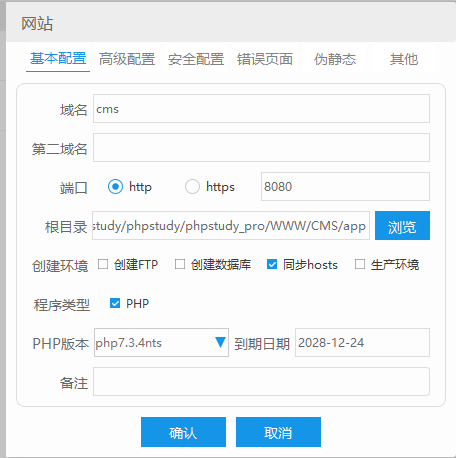

# PHPThink

## 1.PHPThink 入门开启

### 一．框架简介 

1. ThinkPHP6.0 是目前框架正式版的最新版本，发布于 2019 年10 月24 日（今天）；
2. TP 框架是免费开源的、轻量级的、简单快速且敏捷的 PHP 框架；
3. 你可以免费使用 TP 框架，甚至可以将你的项目商用； 
4. ThinkPHP6.0 要求 PHP 版本是 7.1+以上，官方推荐 7.3（目前最新版本是7.3.x）；
5. 那我该学习哪个版本？如果你的生产环境是 5.6 ~ 7.0 之间，推荐TP5.1；
6. 如果你是自己的 vps 服务器，可以安装较高的 PHP 版本 7.1+，推荐TP6.x；
7. 集成环境这里采用 windows 结合 wamp，其它系统或环境满足版本要求即可; 
8. 除了 PHP7.1+，还需要开启 PDO 数据库引擎和 MBstring 字符串扩展；
9. 我在以往的 wamp 版本上添加了一个目前最新的 PHP7.3.11；（PHP7.4 是RC）

### 二．安装步骤 

1. 官网不提供软件包下载，采用 Composer 下载和更新； 
2. 这里只演示 windows 安装，Mac 和 Linux 方法参考一下手册；
3. 在 Windows 中，你需要下载并运行 Composer-Setup.exe；
4. 打开 windows 下的运行：cmd，然后运行如下代码（或 Mac 和Linux 控制台）：composer config -g repo.packagist composer https://packagist.phpcomposer.com 
5. 如果上述地址产生阻碍，可以使用国内的： composer config -g repo.packagist composer https://mirrors.aliyun.com/composer/ 
6. 现在，先启用服务器环境，测试本地 Web 环境是否正常； 
7. 如果你是首次安装 ThinkPHP6.0，那么先从 cmd 中切换到你要加载的目录；composer create-project topthink/think tp6 
8. 如果要更新你的项目版本，直接进入项目根目录，然后直接如下代码：composer update topthink/framework 

### 三．测试运行 

1. 在 cmd 命令行的项目目录中，输入运行命令； php think run 
2. 在浏览器输入：http://127.0.0.1:8000 或 http://localhost:8000 
3. 如果 80 端口没有被占用的情况下，使用如下命令直接访问http://localhost；php think run -p 80 4. 如此，ThinkPHP6.0 已经帮我们将域名自动部署到 public 里了。

## 2. 开发规范和目录结构

### 一．开发规范 

1. ThinkPHP6.0 遵循的是 PSR-2 的命名规范和 PSR-4 的自动加载；

2. 目录和文件的规范如下： 

   a. 目录名（小写+下划线）； 

   b. 类库和函数文件统一以.php 为后缀； 

   c. 类的文件名均以命名空间定义，并且命名空间的路径和类库文件所在路径一致； 

   d. 类（包含接口和 Trait）文件采用驼峰式命名（首字母大写），其它采用小写+下划线命名； 

   e. 类名（包括接口和 Trait）和文件名保持一致，统一采用驼峰式命名（首字母大写）； 

3. 函数和类、属性命名规范如下：  

   a. 类的命名采用驼峰法（首字母大写），如：User、UserType；

   b. 函数的命名使用小写字母和下划线（小写字母开头）的方式，如：get_client_ip； 

   c. 方法的命名使用驼峰法（首字母小写），如：getUserName；

   d. 属性的命名使用驼峰法（首字母小写），如：tableName；

   e. 特例：以双下划线__打头的函数或方法作为魔术方法，如：__call 和 __autoload； 

4. 常量与配置的规范如下： 

   a. 常量以大写字母和下划线命名，如：APP_PATH； 

   b. 配置参数以小写字母和下划线命名，如：url_convert；

   c. 环境变量定义使用大写字母和下划线命名，如：APP_DEBUG；

5. 数据表和字段的规范如下： 

   a. 数据表和字段采用小写加下划线方式命名； 

   b. 并注意字段名不要以下划线开头，如： think_user 表和user_name 

   c. 字段不建议使用驼峰和中文作为数据表及字段命名； 

### 二．目录结构 

1. ThinkPHP6.0 支持多应用模式部署，app 是应用目录； 

2. 默认情况下，是采用的单模式，如下图结构：

   

3. 多应用模式下，结构如下图： 

   

4. 上图中，app_name 可以有多个，即多应用模式； 

5. 在目录结构上，只确保对外可访问的仅 public 目录；

    

6. 在 app 目录中，还提供了一些文件，这些文件将在后面逐步讲到

   

## 3. 开启调试与配置文件

### 一．开启调试 

1. 在开发阶段，我们建议开启框架的调试模式； 

2. 调试模式开启后，会牺牲一些执行效率，但大大提高了开发排错的能力；

3. 当项目部署到生产环境时，再关闭调试模式即可； 

4. 安装好的 TP6.0 默认并没有开启调试，可以在域名后面胡乱输入字符回车；

5. 此时，页面只会提示：“页面错误，请稍后再试~”，表示调试未开启；

6. 通过命令行安装的 TP6.0，会自动在根目录生成一个.example..env 文件；

7. 这个.env 文件是环境配置文件，我们只要删除前面的.example.即可生效；

8. 此时，刷新页面，右下角会出现 Trace 调试小图标，说明调试开启了；

9. 查看.env 文件，打开调试的环境变量为 APP_DEBUG = true，false 关闭；

10. 那么，开启调试模式有那些显著的优势呢？ 

    a. 记录系统运行流程的执行过程； 

    b. 展示错误和调试信息，并开启日志记录； 

    c. 模版修改可以及时生效(不会被缓存干扰)； 

    d. 启动右下角的 Trace 调试功能，更加强大； 

    e. 发生异常时，也会显示异常信息； 

11. 当然，还有一种模式，就是关闭调试的时候，也可以显示简要的错误信息；

12. 首先，关闭调试模式：APP_DEBUG = false； 

13. 然后，根目录下 config 的 app.php 最后一样设置为： `show_error_msg' => true`

### 二．配置信息 

1. 配置文件有两种形式，开启调试我们采用的.env 文件这是一种，适合本地；
2. 另一种配置文件，在根目录下的 config 里，有很多类型的配置，适合部署；
3. 官方手册明确表示：**`.env `环境变量用于本地开发测试，部署后会被忽略；**
4. 那么，我们怎么去获取这些配置文件的值呢？ 
5. 对于.env 文件，比如[DATABASE]下的 HOSTNAME = 127.0.0.1 获取方式如下：`use think\facade\Env; return Env::get('database.hostname'); `
6. 对于 config 文件，比如 database.php 下的 hostname，获取方式如下：`use think\facade\Config; return Config::get('database.connections.mysql.hostname'); `
7. 也可以判断这两种文件的配置是否存在，使用 has 方法判断：`echo Env::has('database.hostname'); echo Config::has('database.connections.mysql.hostname'); `
8. 关于这两种配置文件的优先级，**在本地测试时.env 优先于config；**
9. 从 config 配置中可以看出，它是先读取.env 的，然后再默认配置一个自己的；
10. 而到了部署环境，.env 会被忽略，则自动切换到 config 配置；

## 4. URL 访问模式

### 一．URL 解析 

1. ThinkPHP 框架非常多的操作都是通过 URL 来实现的； 

2. 多应用：http://serverName/index.php/应用/控制器/操作/参数/值…；

3. 单应用：http://serverName/index.php/控制器/操作/参数/值…；

4. 由于 TP6.0 默认是单应用模式，多应用需要作为扩展安装，避免混乱暂时搁置；

5. http://serverName 是域名地址，比如 127.0.0.1:8000 或localhost/tp6/

6. index.php 这个文件，是根目录下 public/下的 index.php(入口文件)；

7. 控制器：app 目录下有一个 controller 控制器目录的 Test.php(控制器)；

8. Test.php 控制器的类名也必须是 class Test，否则错误；

9. 操作就是控制器类里面的方法，比如：index(默认免写)或hello(必写)；

10. 那么完整形式为： 

    ```
    a. 域名访问
    http://localhost/tp6/public/index.php/test/hello/value/world
    http://localhost/路径/控制器/类名/操作数（方法名）/值（实参）
    
    b.IP地址访问
    http://127.0.0.1:8000/index.php/test/hello/value/world 
    http://127.0.0.1:8000/控制器/类名/操作数（方法名）/值（实参）
    ```

    

    ```PHP
    class Test { 
        public function index() {
            return 'test'; 
        } 
        public function hello($value = '') {
            return 'hello '.$value; } 
    }
    ```

     

11. public/index.php 中的 index.php 可以省略，只要设置URL 重写即可；

12. httpd.conf 配置文件中加载了 mod_rewrite.so 模块； 

13. AllowOverride None 将 None 改为 All； 

14. 此时，路径变更为： `http://localhost/tp6/public/test/hello/value/world `

### 二．URL 兼容模式 

1. 上个要点已经了解了 URL 所有访问规则，通过创建 Test 控制器更加了解；
2. 如果上面那种形式的 URL 不支持的话，可以使用兼容模式的方式来访问：http://localhost/tp6test3/public/?s=test/hello/value/world

## 5. 控制器定义

### 一．控制器定义 

1. 控制器，即 controller，控制器文件存放在 controller 目录下；
2. 如果想改变系统默认的**控制器文件目录**，可以在 config 下route.php 配置：`'controller_layer' => 'controller123' `
3. **类名和文件名大小写保持一致**，并采用驼峰式（首字母大写）；`namespace app\controller; class Test {...} `
4. 从上面两段代码得知 Test.php 的实际位置为：app\controller\Test.php 
5. 在 Test 类创建两个方法 index(默认)和 hello，访问 URL 如下：`http://localhost/tp6/public/test/ http://localhost/tp6/public/test/hello `
6. 那么如果创建的是双字母组合，比如 class HelloWorld，访问URL 如下：`http://localhost/tp6test3/public/helloworld http://localhost/tp6test3/public/hello_world `
7. 如果你想避免引入同类名时的冲突，可以 route.php 设置控制器后缀：`'controller_suffix' => true `
8. 此时，Test.php 就必须改成 TestController.php，并类名也需要增加后缀；

### 二．渲染输出 

1. ThinkPHP 直接采用方法内 return 返回的方式直接就输出了；

2. TP不支持直接输出数组，可以使用 json 输出，直接采用 json 函数； `$data = array('a'=>1, 'b'=>2, 'c'=>3); return json($data) `

   ```php
       public function arrayOutput(){
           $arr = ['a', 'b', 'c', 'd', 'e'];
           return json_encode($arr);
       }
   ```

3. 不推荐使用 die、exit 等 PHP 方法中断代码执行，推荐助手函数`halt()；halt('中断测试');`

## 6. 基础.空.多级控制器

### 一．基础控制器 

1. 一般来说，创建控制器后，推荐继承基础控制器来获得更多的方法；

2. 基础控制器仅仅提供了控制器验证功能，并注入了think\App和think\Request；

3. 这两个对象后面会有章节详细讲解，下面我们继承并简单使用一下；

   ```php
   namespace app\controller; 
   use app\BaseController; 
   
   class Test extends BaseController { 
       public function index() { 
           //返回实际路径 return $this->app->getBasePath(); 
           //返回当前方法名 return $this->request->action(); 
       } 
   } 
   ```

### 二．空控制器 

在单应用模式下，我们可以给项目定义一个 Error 控制器类，来提醒错误（相当于自定义404页面 或其他错误）；

```php
class Error { 
    public function index() { 
        return '当前控制器不存在！'; 
    } 
} 
```

### 三．多级控制器 

1. 所谓多级控制器，就是在控制器 controller 目录下再建立目录并创建控制器；

2. 我们在 controller 目录下建立 group 目录，并创建 Blog.php 控制器；

3. 而此时，我们需要访问的地址为：http://localhost:8000/group.blog 

   ```php
   class Blog { 
       public function index() { 
           return 'index'; 
       } 
       public function read() { 
           return 'read'; 
       } 
   }
   ```


## 7.连接数据库与模型初探

### 一．连接数据库 

1. ThinkPHP 采用内置抽象层将不同的数据库操作进行封装处理；

2. 数据抽象层基于 PDO 模式，无须针对不同的数据库编写相应的代码；

3. 使用数据库的第一步，就是连接你的数据库； 

4. 在根目录的 config 下的 database.php 可以设置数据库连接信息；

5. 大部分系统已经给了默认值，你只需要修改和填写需要的值即可；

6. 本地测试，会优先采用.env 的配置信息，我们和 database 配置对应上即可；

   ```php
   'type' => Env::get('database.type', 'mysql'), 
   'hostname' => Env::get('database.hostname', '127.0.0.1'),
   'database' => Env::get('database.database', 'grade'), 
   'username' => Env::get('database.username', 'root'), 
   'password' => Env::get('database.password', '123456'),
   'hostport' => Env::get('database.hostport', '3306'), 
   'charset' => Env::get('database.charset', 'utf8'), 
   'prefix' => Env::get('database.prefix', 'tp_'), 
   ```

7. 可以通过删除改变.env 的配置，或删除.env 来验证 database 的执行优先级；

8. 在 database.php 配置中，default 表示设置默认的数据库连接；

9. connections 配置数据库连接信息，可以是多个数据库，便于切换；

10. 默认的数据库连接名称为：'mysql'，再复制一组数据库链接信息：'demo'切换；

11. 创建一个用于测试数据连接的控制器：DataTest.php； 

    ```php
    namespace app\controller; 
    use think\facade\Db; 
    
    class DataTest { 
        public function index() { 
            $user = Db::table('tp_user')->select(); 
            //$user = Db::connect('mysql')->table('tp_user')->select();return json($user); 
        } 
        
        public function demo() { 
            $demo = Db::connect('demo')->table('tp_user')->select();return json($demo); 
        } 
    } 
    ```

12. 暂时不必理解这里的代码，只要运行起来看到效果即可，后面章节会详解；

### 二．模型初探 

1. 在 app 目录下创建一个 model 目录，并创建 User.php 的模型类；

   ```php
   namespace app\model; 
   use think\Model; 
   class User extends Model { 
       protected $connection = 'demo'; 
   } 
   ```

2. User 继承模型基类，即可实现数据调用，后面章节会详解讲解；

3. 而受保护的字段$connection，则是切换到 demo 数据库；

4. 控制器端的调用方式如下，具体原理，后面模型章节会详解；

   ```php
   public function getUser() { 
       $user = User::select(); 
       return json($user); 
   }
   ```

## 8. 数据库的数据查询

### 一．单数据查询 

1. Db::table()中 table 必须指定完整数据表（包括前缀）；
2. 如果希望只查询一条数据，可以使用 find()方法，需指定where 条件；`Db::table('tp_user')->where('id', 27)->find() `
3. Db::getLastSql()方法，可以得到最近一条 SQL 查询的原生语句；`SELECT * FROM `tp_user` LIMIT 1 `
4. 没有查询到任何值，则返回 null； 
5. 使用 findOrFail()方法同样可以查询一条数据，在没有数据时抛出一个异常；`Db::table('tp_user')->where('id', 1)->findOrFail() `
6. 使用 findOrEmpty()方法也可以查询一条数据，但在没有数据时返回一个空数组；`Db::table('tp_user')->where('id', 1)->findOrEmpty(); `

### 二．数据集查询 

1. 想要获取多列数据，可以使用 select()方法； `Db::table('tp_user')->select(); SELECT * FROM `tp_user` 
2. 多列数据在查询不到任何数据时返回空数组，使用 selectOrFail()抛出异常；`Db::table('tp_user')->where('id', 1)->selectOrFail(); `
3. 在 select()方法后再使用 toArray()方法，可以将数据集对象转化为数组；`$user = Db::table('tp_user')->select()->toArray(); dump($user); `
4. 当在数据库配置文件中设置了前缀，那么我们可以使用 name()方法忽略前缀；`Db::name('user')->select(); `

### 三．其它查询 

1. 通过 value()方法，可以查询指定字段的值（单个），没有数据返回null；`Db::name('user')->where('id', 27)->value('username'); `

2. 通过 colunm()方法，可以查询指定列的值（多个），没有数据返回空数组；`Db::name('user')->column('username'); `

3. 可以指定 id 作为列值的索引；` Db::name('user')->column('username', 'id'); `

4. 如果处理的数据量巨大，成百上千那种，一次性读取有可能会导致内存开销过大；

5. 为了避免内存处理太多数据出错，可以使用 chunk()方法分批处理数据；

6. 比如，每次只处理 100 条，处理完毕后，再读取 100 条继续处理；

   ```php
   Db::table('tp_user')->chunk(3, function($users) { 
       foreach ($users as $user) { 
           dump($user); } 
       echo 1; 
   });
   ```

   

7. 可以利用游标查询功能，可以大幅度减少海量数据的内存开销，它利用了PHP生成器特性。每次查询只读一行，然后再读取时，自动定位到下一行继续读取；

   ```php
   $cursor = Db::table('tp_user')->cursor(); foreach($cursor as $user){ dump($user); }
   ```

## 9. 数据库的链式查询

### 一．查询规则 

1. 前面课程中我们通过指向符号“->”多次连续调用方法称为：链式查询；

2. 当 Db::name('user')时，返回查询对象(Query)，即可连缀数据库对应的方法；

3. 而每次执行一个数据库查询方法时，比如 where()，还将返回查询对象(Query)；

4. 只要还是数据库对象，那么就可以一直使用指向符号进行链式查询；

5. 再利用 `find()、select()`等方法**返回数组(Array)或数据集对象(Colletion)；**

6. 而 find()和 select()是结果查询方法（放在最后），并不是链式查询方法；

   ```php
   Db::name('user')->where('id', 27)->order('id', 'desc')->find()
   ```

7. 除了查询方法可以使用链式连贯操作，CURD 操作也可以使用（后续课程研究）；

8. 那么，有多少种类似 where()的链式操作方法呢？打开手册瞄一下。。。

### 二．更多查询 

1. 如果多次使用数据库查询，那么每次静态创建都会生成一个实例，**造成浪费**；

2. 我们可以把对象实例保存下来，再进行反复调用即可； 

   ```php
   $userQuery = Db::name('user'); 
   $dataFind = $userQuery->where('id', 27)->find(); 
   $dataSelect = $userQuery->select(); 
   ```

3. 当同一个对象实例第二次查询后，会保留第一次查询的值；

   ```php
   $data1 = $userQuery->order('id', 'desc')->select(); 
   $data2 = $userQuery->select(); 
   return Db::getLastSql(); 
   SELECT * FROM `tp_user` ORDER BY `id` DESC 
   ```

4. 通过示例对象做多次查询时，会将上次查询的SQL语句保存到该示例对象中，此时我们在二次查询之前需要使用`removeOption()`清空SQL语句

   ```php
   $userQuery->removeOption('where')->select();
   ```

   

## 10. 数据库的数据新增

### 一．单数据新增 

1. 使用 insert()方法可以向数据表添加一条数据，更多的字段采用默认；

   ```php
   $data = [ 'username' => '辉夜', 'password' => '123', 'gender' => '女', 'email' => 'huiye@163.com', 'price' => 90, 'details' => '123' ]; 
   Db::name('user')->insert($data); 
   ```

2. 如果新增成功，insert()方法会返回一个 1 值；

   ```php
    return Db::name('user')->insert($data); 
   ```

3. 如果你添加一个不存在的字段数据，会抛出一个异常 Exception；

4. 如果想强行新增抛弃不存在的字段数据，则使用 strick(false)方法，忽略异常；

   ```php
   Db::name('user')->strict(false)->insert($data); 
   ```

5. 如果我们采用的数据库是 mysql，可以支持 replace 写入；

6. insert 和 replace 写入的区别，前者表示表中存在主键相同则报错，后者则修改；

   ```php
   Db::name('user')->replace()->insert($data); return Db::getLastSql(); 
   ```

7. 使用 insertGetId()方法，可以在新增成功后返回当前数据ID；

   ```php
   return Db::name('user')->insertGetId($data);
   ```

###  二．批量数据新增 

1. 使用 insertAll()方法，可以批量新增数据，但要保持数组结构一致；

   ```php
   $datas = [
               [
                   'username' => '卡莉斯塔',
                   'password' => '123',
                   'gender' => '女',
                   'email' => 'kalisita@163.com',
                   'price' => 90,
                   'details' => '123'
               ],
               [
                   'username' => '凯尔',
                   'password' => '123',
                   'gender' => '女',
                   'email' => 'kaier@163.com',
                   'price' => 90,
                   'details' => '123'
               ]
           ];
   
   $query = Db::name('user');
   return $query->insertAll($datas);
   ```

### 三．save()新增 

1. save()方法是一个通用方法，可以自行判断是新增还是修改(更新)数据；

2. save()方法判断是否为新增或修改的依据为，是否存在主键，不存在即新增；

   ```php
   Db::name('user')->save($data);
   ```

## 11. 数据库的修改删除

### 一．数据修改 

1. 使用 update()方法来修改数据，修改成功返回影响行数，没有修改返回0；

   ```php
   $data = [ 'username' => '李白' ]; 
   return Db::name('user')->where('id', 38)->update($data); 
   ```

2. 如果修改数据包含了主键信息，比如 id，那么可以省略掉where 条件；

   ```php
   $data = [ 'id' => 231, 'username' => '李白' ]; 
   return Db::name('user')->update($data); 
   ```

3. 如果想让一些字段修改时执行 SQL 函数操作，可以使用 exp()方法实现；

   ```php
   Db::name('user')->where('id', 232) ->exp('email', 'UPPER(email)') ->update(); 
   ```

4. 如果要自增/自减某个字段，可以使用 inc/dec 方法，并支持自定义步长；

   ```php
   Db::name('user')->where('id', 232) ->inc('price') ->dec('status', 2) ->update(); 
   ```

5. 一个更加简单粗暴灵活的方式，使用::raw()方法实现 3，4 点的内容；

   ```php
   Db::name('user')->where('id', 232) ->update([ 
       'email' => Db::raw('UPPER(email)'),
       'price' => Db::raw('price + 1'),
       'status' => Db::raw('status - 2')
   ]);
   ```

   

6. 使用 save()方法进行修改数据，这里必须指定主键才能实现修改功能；

   ```php
   Db::name('user')->where('id', 232) ->save(['username'=>'李黑']); 
   ```

### 二．数据删除 

1. 极简删除可以根据主键直接删除，删除成功返回影响行数，否则0；

   ```php
   Db::name('user')->delete(51); 
   ```

2. 根据主键，还可以删除多条记录；

   ```php
    Db::name('user')->delete([48,49,50]); 
   ```

3. 正常情况下，通过 where()方法来删除； 

   ```php
   Db::name('user')->where('id', 47)->delete(); 
   ```

4. 通过 true 参数删除数据表所有数据，我还没测试，大家自行测试下；

   ```php
   Db::name('user')->delete(true);
   ```

   

## 12. 数据库的查询表达式

### 一．比较查询 

1. 查询表达式支持大部分常用的 SQL 语句，语法格式如下： where('字段名','查询表达式','查询条件'); 

2. 在查询数据进行筛选时，我们采用 where()方法，比如 id=80；

   ```php
   Db::name('user')->where('id', 80)->find(); Db::name('user')->where('id','=',80)->find(); 
   ```

3. 使用`<>、>、<、>=、<=`可以筛选出各种符合比较值的数据列表；

   ```php
   Db::name('user')->where('id','<>',80)->select(); 
   ```

### 二．区间查询 

1. 使用 like 表达式进行模糊查询； 

   ```php
   Db::name('user')->where('email','like','xiao%')->select(); 
   ```

2. like 表达式还可以支持数组传递进行模糊查询； 

   ```php
   Db::name('user')->where('email','like',['xiao%','wu%'], 'or')->select(); 
   SELECT * FROM `tp_user` WHERE (`email` LIKE 'xiao%' OR `email` LIKE 'wu%') 
   ```

3. like 表达式具有两个快捷方式 whereLike()和 whereNoLike()；

   ```php
   Db::name('user')->whereLike('email','xiao%')->select(); 
   Db::name('user')->whereNotLike('email','xiao%')->select(); 
   ```

4. between 表达式具有两个快捷方式 whereBetween()和 whereNotBetween()；

   ```php
   Db::name('user')->where('id','between','19,25')->select(); 
   Db::name('user')->where('id','between',[19, 25])->select(); 
   Db::name('user')->whereBetween('id','19,25')->select(); 
   Db::name('user')->whereNotBetween('id','19,25')->select(); 
   ```

5. in 表达式具有两个快捷方式 whereIn()和 whereNotIn()；

   ```php
   Db::name('user')->where('id','in', '19,21,29')->select(); 
   Db::name('user')->where('id','in', [19, 21, 29])->select(); 
   Db::name('user')->whereIn('id','19,21,29')->select(); 
   Db::name('user')->whereNotIn('id','19,21,29')->select(); 
   ```

6. null 表达式具有两个快捷方式 whereNull()和 whereNotNull()；

   ```php
   Db::name('user')->where('uid','null')->select(); 
   Db::name('user')->where('uid','not null')->select(); 
   Db::name('user')->whereNull('uid')->select(); 
   Db::name('user')->whereNotNull('uid')->select();
   ```

###  三．EXP 查询 

1. 使用 exp 可以自定义字段后的 SQL 语句； 

   ```php
   Db::name('user')->where('id','exp','IN (19,21,25)')->select();
   Db::name('user')->whereExp('id','IN (19,21,25)')->select();
   ```

## 13. 数据库的时间查询

### 一．传统方式 

1. 可以使用`>、<、>=、<=`来筛选匹配时间的数据； 

   ```php
   Db::name('user')->where('create_time', '>', '2018-1-1')->select(); 
   ```

2. 可以使用 between 关键字来设置时间的区间； 

   ```php
   Db::name('user')->where('create_time', 'between', ['2018-1-1', '2019-12-31'])->select(); Db::name('user')->where('create_time', 'not between', ['2018-1-1', '2019-12-31'])->select();
   ```

### 二．快捷方式 

1. 时间查询的快捷方法为 whereTime()，直接使用`>、<、>=、<=`；

   ```php
   Db::name('user')->whereTime('create_time', '>', '2018-1-1')->select(); 
   ```

2. 快捷方式也可以使用 between 和 not between； 

   ```php
   Db::name('user')->whereBetween('create_time', ['2018-1-1', '2019-12-31'])->select(); 
   ```

3. 还有一种快捷方式为：whereBetweenTime()和 whereNotBetweenTime()；

   ```php
   Db::name('user')->whereBetweenTime('create_time', '2018-1-1', '2019-12-31')->select(); 
   ```

4. 默认的大于>，可以省略； 

   ```php
   Db::name('user')->whereTime('create_time', '2018-1-1')->select(); 
   ```

### 三．固定查询 

1. 使用 whereYear 查询今年的数据、去年的数据和某一年的数据

   ```php
   Db::name('user')->whereYear('create_time')->select(); 
   Db::name('user')->whereYear('create_time', 'last year')->select(); 
   Db::name('user')->whereYear('create_time', '2016')->select(); 
   ```

2. 使用 whereMonth 查询当月的数据、上月的数据和某一个月的数据；

   ```php
   Db::name('user')->whereMonth('create_time')->select(); 
   Db::name('user')->whereMonth('create_time', 'last month')->select(); 
   Db::name('user')->whereMonth('create_time', '2016-6')->select(); 
   ```

3. 使用 whereDay 查询今天的数据、昨天的数据和某一个天的数据；

   ```php
   Db::name('user')->whereDay('create_time')->select(); 
   Db::name('user')->whereDay('create_time', 'last day')->select(); 
   Db::name('user')->whereDay('create_time', '2016-6-27')->select(); 
   ```

   

### 四．其它查询 

1. 查询指定时间的数据，比如两小时内的；

   ```php
    Db::name('user')->whereTime('create_time', '-2 hours')->select();
   ```

2. 查询两个时间字段时间有效期的数据，比如会员开始到结束的期间；

   ```php
   Db::name('user')->whereBetweenTimeField('start_time', 'end_time')->select();
   ```

## 14.聚合.原生.子查询

### 一．聚合查询 

1. 使用 count()方法，可以求出所查询数据的数量； 

   ```php
   Db::name('user')->count(); 
   ```

2. count()可设置指定 id，比如有空值(Null)的 uid，不会计算数量；

   ```php
   Db::name('user')->count('uid'); 
   ```

3. 使用 max()方法，求出所查询数据字段的最大值； 

   ```php
   Db::name('user')->max('price'); 
   ```

4. 如果 max()方法，求出的值不是数值，则通过第二参数强制转换；

   ```php
   Db::name('user')->max('price', false); 
   ```

5. 使用 min()方法，求出所查询数据字段的最小值，也可以强制转换；

   ```php
   Db::name('user')->min('price'); 
   ```

6. 使用 avg()方法，求出所查询数据字段的平均值； 

   ```php
   Db::name('user')->avg('price'); 
   ```

7. 使用 sum()方法，求出所查询数据字段的总和； 

   ```php
   Db::name('user')->sum('price');
   ```

### 二．子查询 

1. 使用 fetchSql()方法，可以设置不执行 SQL，而返回 SQL 语句，默认true；

   ```php
   Db::name('user')->fetchSql(true)->select(); 
   ```

2. 使用 buildSql()方法，也是返回 SQL 语句，不需要再执行select()，且有括号；

   ```php
   Db::name('user')->buildSql(true); 
   ```

3. 结合以上方法，我们实现一个子查询；

   ```php
   $subQuery = Db::name('two')->field('uid')->where('gender', '男')->buildSql(true); 
   $result = Db::name('one')->where('id','exp', 'IN '.$subQuery)->select(); 
   ```

4. 使用闭包的方式执行子查询； 

   ```php
   $result = Db::name('one')->where('id', 'in', function ($query) { 
       $query->name('two')->where('gender', '男')->field('uid'); 
   })->select();
   ```

### 三．原生查询 

1. 使用 query()方法，进行原生 SQL 查询，适用于读取操作，SQL 错误返回false；

   ```php
   Db::query('select * from tp_user'); 
   ```

2. 使用 execute 方法，进行原生 SQL 更新写入等，SQL 错误返回false；

   ```php
   Db::execute('update tp_user set username="孙悟空" where id=29');
   ```

## 15. 链式查询方法.上

### 一．where 

1. 表达式查询，就是 where()方法的基础查询方式；

   ```php
    Db::name('user')->where('id', '>', 70)->select(); 
   ```

2. 关联数组查询，通过键值对来数组键值对匹配的查询方式；

   ```php
   $user = Db::name('user')->where([ 'gender' => '男', 'price' => 100 //'price' => [60,70,80] ])->select(); 
   ```

3. 索引数组查询，通过数组里的数组拼装方式来查询；

   ```php
    $user = Db::name('user')->where([ ['gender', '=', '男'], ['price', '=', '100'] ])->select(); 
   ```

4. 将复杂的数组组装后，通过变量传递，将增加可读性；

   ```php
   $map[] = ['gender', '=', '男']; 
   $map[] = ['price', 'in', [60, 70, 80]]; 
   $user = Db::name('user')->where($map)->select(); 
   ```

5. 字符串形式传递，简单粗暴的查询方式，whereRaw()支持复杂字符串格式；

   ```php
   Db::name('user')->whereRaw('gender="男" AND price IN (60, 70, 80)')->select();
   ```

6. 如果 SQL 查询采用了预处理模式，比如 id=:id，也能够支持；

   ```php
   Db::name('user')->whereRaw('id=:id', ['id'=>19])->select();
   ```

 ### 二．field 

1. 使用 field()方法，可以**指定要查询的字段**； 

   ```php
   Db::name('user')->field('id, username, email')->select(); 
   Db::name('user')->field(['id', 'username', 'email'])->select(); 
   ```

2. 使用 field()方法，给指定的字段设置别名；

   ```php
    Db::name('user')->field('id,username as name')->select(); 
   Db::name('user')->field(['id', 'username'=>'name'])->select(); 
   ```

3. 在 fieldRaw()方法里，可以直接给字段设置 MySQL 函数；

   ```php
   Db::name('user')->fieldRaw('id,SUM(price)')->select(); 
   ```

4. 使用 field(true)的布尔参数，可以显式的查询获取所有字段，而不是*；

   ```php
   Db::name('user')->field(true)->select(); 
   ```

5. 使用 withoutField()方法中字段排除，可以屏蔽掉想要不显示的字段；

   ```php
   Db::name('user')->withoutField('details')->select(); 
   ```

6. 使用 field()方法在新增时，验证字段的合法性；

   ```php
    Db::name('user')->field('username, email, details')->insert($data); 
   ```

### 三．alias 

1. 使用 alias()方法，给数据库起一个别名； 

   ```php
   Db::name('user')->alias('a')->select();
   ```


## 16. 链式查询方法.下

### 一．limit 

1. 使用 limit()方法，限制获取输出数据的个数； 

   ```php
   Db::name('user')->limit(5)->select(); 
   ```

2. 分页模式，即传递两个参数，比如从第 3 条开始显示 5 条 limit(2,5)；

   ```php
   Db::name('user')->limit(2, 5)->select(); 
   ```

3. 实现分页，需要严格计算每页显示的条数，然后从第几条开始；

   ```php
   //第一页 
   Db::name('user')->limit(0, 5)->select(); 
   //第二页 
   Db::name('user')->limit(5, 5)->select(); 
   ```

### 二．page 

1. page()分页方法，优化了 limit()方法，无须计算分页条数；

   ```php
   //第一页 
   Db::name('user')->page(1, 5)->select(); 
   //第二页 
   Db::name('user')->page(2, 5)->select(); 
   ```

### 三．order 

1. 使用 order()方法，可以指定排序方式，没有指定第二参数，默认asc；

   ```php
   Db::name('user')->order('id', 'desc')->select(); 
   ```

2. 支持数组的方式，对多个字段进行排序； 

   ```php
   Db::name('user')->order('id', 'desc')->select(); 
   ```

3. 使用 orderRaw()方法，支持排序的时候指定 MySQL 函数；

   ```php
   Db::name('user')->orderRaw('FIELD(username,"樱桃小丸子") DESC')->select(); 
   ```

### 四．group 

1. 使用 group()方法，给性别不同的人进行 price 字段的总和统计；

   ```php
   Db::name('user')->fieldRaw('gender, SUM(price)') ->group('gender')->select(); 
   ```

2. 也可以进行多字段分组统计； 

   ```php
   Db::name('user')->fieldRaw('gender, SUM(price)') ->group('gender,password')->select(); 
   ```

### 五．having 

1. 使用 group()分组之后，再使用 having()进行筛选； 

   ```php
   $result = Db::name('user') ->fieldRaw('gender, SUM(price)') ->group('gender') 
       ->having('SUM(price)>600') ->select();
   ```

## 17. 数据库的高级查询

### 一．高级查询 

1. 使用|(OR)或&(AND)来实现 where 条件的高级查询，where 支持多个连缀；

   ```php
   $user = Db::name('user') 
       ->where('username|email', 'like', '%xiao%') 
       ->where('price&uid', '>', 0) 
       ->select(); 
   //生成的 SQL SELECT * FROM `tp_user` WHERE ( `username` LIKE '%xiao%' OR `email` LIKE '%xiao%' ) AND ( `price` > 0 AND `uid` > 0 ) 
   ```

2. 关联数组方式，可以在 where 进行多个字段进行查询； 

   ```php
   $user = Db::name('user')
       ->where([ ['id', '>', 0], 
                ['status', '=', 1], 
                ['price', '>=', 80], 
                ['email', 'like', '%163%'] ])
       ->select(); 
   //生成的 SQL SELECT * FROM `tp_user` WHERE `id` > 0 AND `status` = 1 AND `price` >= 80 AND`email` LIKE '%163%' 
   ```

3. 根据之前的课程中，条件字符串复杂组装，比如使用 exp 了，就使用raw()方法；

   ```php
   $user = Db::name('user')->where([ 
       ['status', '=', 1], 
       ['price', 'exp', Db::raw('>80')] ])->select(); 
   //生成的 SQL SELECT * FROM `tp_user` WHERE `status` = 1 AND ( `price` >80 ) 
   ```

4. 如果有多个 where，并且 where 条件是分离的$map，而$map 本身有多个条件；

5. 那么$map 条件如果需要先执行出结果，再和后续条件判断，也就是加上括号；

6. 那么，需要对这个$map 变量，再加上一个中括号处理优先级；

   ```php
   $map = [ ['status', '=', 1], 
           ['price', 'exp', Db::raw('>80')] ]; 
   $user = Db::name('user') 
       ->where([$map]) 
       ->where('status', '=', '%163.com%')
       ->select(); 
   //生成的 SQL SELECT * FROM `tp_user` WHERE ( `status` = 1 AND ( `price` >80 ) ) AND `status`= %163.com% 
   ```

7. 如果，条件中有多次出现一个字段，并且需要 OR 来左右筛选，可以用whereOr；

   ```php
   $map1 = [ 
       ['username', 'like', '%小%'], 
       ['email', 'like', '%163%'] ]; 
   $map2 = [ 
       ['username', 'like', '%孙%'], 
       ['email', 'like', '%.com%'] ]; 
   $user = Db::name('user') 
       ->whereOr([$map1, $map2])
       ->select(); 
   //生成的 SQL SELECT * FROM `tp_user` WHERE ( `username` LIKE '%小%' AND `email` LIKE '%163%' )OR ( `username` LIKE '%孙%' AND `email` LIKE '%.com%' ) 
   ```

8. 闭包查询可以连缀，会自动加上括号，更清晰，如果是 OR，请用whereOR()；

   ```php
   $user = Db::name('user')
       ->where(function ($query) { 
           $query->where('id', '>', 10); })->whereOr(function ($query) { $query->where('username', 'like', '%小%'); })->select(); 
   ```

9. 对于比较复杂或你不知道如何拼装 SQL 条件，那么就直接使用whereRaw()即可；

   ```php
   $user = Db::name('user') 
       ->whereRaw('(username LIKE "%小%" AND email LIKE "%163%") OR (price > 80)')
       ->select(); 
   ```

10. whereRaw()方式也支持参数绑定操作，具体如下； 

    ```php
    $user = Db::name('user') 
        ->whereRaw('(username LIKE :username AND email LIKE :email) OR (price > :price)', ['username'=>'%小%', 'email'=>'%163%', 'price'=>80]) 
        ->select();
    ```

## 18. 数据库的快捷查询

### 一．快捷查询 

1. 系统封装了很多 where 方法的快捷方式，之前学习了一些，全部如下：

2. whereColumn()方法，比较两个字段的值，符合的就筛选出来；

   ```php
   $user = Db::name('user') 
       ->whereColumn('update_time', '>=', 'create_time') 
       ->select(); 
   //相等可以简化，只需要两边的字段 whereColumn('update_time', 'create_time') 
   ```

3. 系统还针对字段查询提供了几个方便查询的快捷方式； 

4. whereFieldName()方法，查询某个字段的值，注意 FileName 是字段名；

   ```php
   Db::name('user')
       ->whereEmail('xiaoxin@163.com')
       ->find(); Db::name('user')->whereUsername('蜡笔小新')
       ->find(); //如果字段是 create_time，则 whereCreateTime，驼峰式写法； 
   ```

5. getByFieldName()方法，查询某个字段的值，注意只能查询一条，不需要find()；

   ```php
   Db::name('user')->getByEmail('xiaoxin@163.com'); 
   ```

6. getFieldByFieldName()方法，通过查询得到某个指定字段的单一值；

   ```php
   Db::name('user')->getFieldByEmail('xiaoxin@163.com', 'username'); 
   ```

### 二．其它补充 

1. when()可以通过条件判断，执行闭包里的分支查询； 当when里面的布尔值为True时，走第一条分支函数，否则走第二条分支函数。可玩性很高

   ```php
   $user = Db::name('user')
       ->when(false, function ($query) { $query->where('id', '>', 0); }, 
              function ($query) { $query->where('username', 'like', '%小%'); })->select();
   ```

   

## 19. 数据库的事务和获取器

### 一．事务处理 

1. 数据库的表引擎需要是 InnoDB 才可以使用，如果不是调整即可；

2. 事务处理，需要执行多个 SQL 查询，数据是关联恒定的； 

3. 如果成功一条查询，改变了数据，而后一条失败，则前面的数据回滚；

4. 比如：蜡笔小新给路飞 3 快钱，自己-3，对方+3，这时需要事务处理；

5. 系统提供了两种事务处理的方式，第一种是自动处理，出错自动回滚；

   ```php
   Db::transaction(function () { 
       Db::name('user')
           ->where('id', 19)
           ->save(['price'=>Db::raw('price - 3')]);
   Db::name('user')
       ->where('id', 20)
       ->save(['price'=>Db::raw('price + 3')]);}); 
   ```

6. 手动处理，基本和原生处理类似，可以自行输出错误信息；

   ```php
   //启动事务 
   Db::startTrans(); 
   try { 
       Db::name('user')
           ->where('id', 19)
           ->save(['price'=>Db::raw('price - 3')]);
       Db::name('user1')
           ->where('id', 20)
           ->save(['price'=>Db::raw('price + 3')]);
       //提交事务 
       Db::commit(); 
   } catch (Exception $e) { 
       echo '执行 SQL 失败！'; 
       //回滚 
       Db::rollback(); 
   } 
   ```

### 二．获取器 

1. 获取器的意思就是：将数据的字段进行转换处理再进行操作

2. 比如在获取数据列表的时候，将获取到的邮箱字段全部大写；

   ```php
   $user = Db::name('user')->withAttr('email', function ($value, $data) { return strtoupper($value); })->select(); return json($user);
   ```

## 20. 数据库的数据集和代码提示

### 一．代码提示 

1. 一般来说，代码提示是通过注释来告知编辑器自动补全方法等；
2. 对比一下，5.1 的类库，发现 6.x 的类库没有写注释； 
3. 就拿 Db 类来说，只要把 5.1 的注释覆盖到 6.x 即可实现代码提示；
4. 当然，是否精确，需要一一对比这些方法和参数，但绝大多数是相同的；
5. 找到 Db 类，看它的注释：@see 指向的是谁，是：DbManager 类；
6. 然后将 5.1 的 Db 类注释，复制给 DbManager 类即可，以后其它的雷同操作；

### 二．数据集 

1. 所谓数据集，是当查询后的结果集，它是 think\Collection 类型和数组一样；

2. 虽然操作和数组类似，但它额外提供了一些方法，方法如下： 

3. 注意：这里的方法关键字某些和数据库查询类似，但它是数据集操作的方法；

   

   

4. 由于方法较多，我们尝试几个理解一下即可，有需要可以回头查阅；

   ```php
   /获取数据集 $user = Db::name('user')->select(); 
   //转换成数组 
   var_dump($user->toArray()); 
   //将数据集随机打乱 
   dump($user->shuffle()); 
   //删掉数据中最后一个元素 
   $user->pop(); dump($user); 
   //使用 whereIn 查询结果集 
   dump($user->whereIn('id', [19,20,21])); 
   ```

5. 每种的典型，都拎出来说明了一下； 6. 其它的方法，可以通过追逐方法查阅注释和参数来参考使用。

## 21. 模型的定义方式

### 一．定义模型

1. 定义一个和数据库表向匹配的模型；

   ```php
   <?php
   // 命名空间（以实际为准）
   namespace app\model;
   use think\Model;
   
   class UserModel extends Model{
       // 若文件名与数据表不同，则需要重新指定 $name，使得与实际数据表同名
       protected $name = 'User';
       // 重新指定数据表的主键
       protected $pk = 'uid';
       // 重新指定要操作的数据表
       protected $table = 'tp_one';
   }
   
   ```

2. 模型会自动对应数据表，并且有一套自己的命名规则； 

3. 模型类需要去除表前缀(tp_)，采用驼峰式命名，并且首字母大写；`tp_user(表名) => User tp_user_type(表名) => UserType `

4. 创建空模型后，我们可以在控制器调用，创建控制器 `DataModel.php`；

5. 可以直接使用模型的名称 `User::*`调用查询方法，比如 `select()`等；

6. 如果没有代码提示，请和上一节一样，把 5.1 的注释复制过来；

   ```php
   <?php
   namespace app\controller;
   
   use app\model\UserModel;
   
   class DataModel {
       public function index(){
           // 查找整张表的数据
           echo json_encode(UserModel::select(), JSON_UNESCAPED_UNICODE);
           // 通过逐渐查找某条记录
           echo json_encode(UserModel::find('1'), JSON_UNESCAPED_UNICODE);
   
       }
   }
   ```

7. 如果担心设置的模型类名和 PHP 关键字冲突，可以开启应用类后缀；

8. 比如设置：Class UserModel 这种，需要更改文件名为 UserModel.php；

9. 然后设置一下$name 属性为指定 user(表名)即可实现； 

   ```php
   class UserModel extends Model { protected $name = 'user'; } 
   ```

### 二．设置模型 

1. 默认主键为 id，你可以设置其它主键，比如 uid； 

   ```php
   protected $pk = 'uid'; 
   ```

2. 从控制器端调用模型操作，如果和控制器类名重复，可以设置别名；

   ```php
   use app\model\User as UserModel; 
   ```

3. 在模型定义中，可以设置其它的数据表； 

   ```php
   protected $table = 'tp_one'; 
   ```

4. 模型和控制器一样，也有初始化，在这里必须设置 static 静态方法；

   ```php
   <?php
   namespace app\model;
   use think\Model;
   
   class UserModel extends Model{
   
       public static function init()
       {
           parent::init(); // TODO: Change the autogenerated stub
           echo "第一次执行";
       }
   }
   ```


## 22. 模型的新增和删除

### 一．数据新增 

1. 使用实例化的方式添加一条数据，首先实例化方式如下，两种均可：

   ```php
   $user = new UserModel(); 
   $user = new \app\model\User(); 
   ```

2. 设置要新增的数据，然后用 save()方法写入到数据库中，save()返回布尔值；

   ```php
   $user->username = '李白'; 
   $user->password = '123'; 
   $user->gender = '男'; 
   $user->email = 'libai@163.com'; 
   $user->price = 100; 
   $user->details = '123'; 
   $user->uid = 1011; $user->save(); 
   ```

3. 也可以通过 save()传递数据数组的方式，来新增数据； 

   ```php
   $user = new UserModel(); 
   $user->save([ 
       'username' => '李白', 
       'password' => '123', 
       'gender' => '男', 
       'email' => 'libai@163.com', 
       'price' => 100, 
       'details' => '123', 
       'uid' => 1011 
   ]); 
   ```

4. 使用 allowField()方法，允许要写入的字段，其它字段就无法写入了；

   ```php
   $user->allowField(['username','email', 'password','details'])->save(...) 
   ```

5. 模型新增也提供了 replace()方法来实现 REPLACE into 新增；

   ```php
   $user->replace()->save(); 
   ```

6. 当新增成功后，使用$user->id，可以获得自增 ID（主键需是id）；

   ```php
   echo $user->id; 
   ```

7. 使用 saveAll()方法，可以批量新增数据，返回批量新增的数组；

   ```php
   $dataAll = [ 
       [ 'username' => '李白 1', 
       'password' => '123', 
       'gender' => '男', 
       'email' => 'libai@163.com', 
       'price' => 100, 'details' => '123', 
       'uid' => 1011 ], 
        [ 'username' => '李白 2', 
         'password' => '123', 
         'gender' => '男', 
         'email' => 'libai@163.com', 
         'price' => 100, 'details' => '123', 
         'uid' => 1011 ] ];
   $user = new UserModel(); 
   dump($user->saveAll($dataAll)); 
   ```

8. 使用::create()静态方法，来创建要新增的数据； 

   ```php
   $user = UserModel::create(
       [ 'username' => '李白', 
        'password' => '123', 
        'gender' => '男', 
        'email' => 'libai@163.com', 
        'price' => 100, 
        'details' => '123', 
        'uid' => 1011 ], 
       ['username', 'password', 'details'], false); 
   //参数 1 是新增数据数组，必选 //参数 2 是允许写入的字段，可选 //参数 3 为是否 replace 写入，默认 false 为 Insert 写入 
   ```

### 二．数据删除 

1. 使用 find()方法，通过主键(id)查询到想要删除的数据；

   ```php
   $user = UserModel::find(93); 
   ```

2. 然后再通过 delete()方法，将数据删除，返回布尔值； 

   ```php
   $user->delete(); 
   ```

3. 也可以使用静态方法调用 destroy()方法，通过主键(id)删除数据；

   ```php
   UserModel::destroy(92) 
   ```

4. 静态方法 destroy()方法，也可以批量删除数据； 

   ```php
   UserModel::destroy([80, 90, 91]); 
   ```

5. 通过数据库类的查询条件删除；

   ```php
    UserModel::where('id', '>', 80)->delete();
   ```

6. 使用闭包的方式进行删除；

   ```php
   UserModel::destroy(function ($query) {
   $query->where('id', '>', 80);
   });
   ```

## 22. 模型的数据更新

### 一．数据更新 

1. 使用 find()方法获取数据，然后通过 save()方法保存修改，返回布尔值；

   ```php
   $user = UserModel::find(118); 
   $user->username = '李黑'; 
   $user->email = 'lihei@163.com'; 
   $user->save(); 
   ```

2. 通过 where()方法结合 find()方法的查询条件获取的数据，进行修改；

   ```php
   $user = UserModel::where('username', '李黑')->find(); 
   $user->username = '李白'; 
   $user->email = 'libai@163.com'; 
   $user->save(); 
   ```

3. save()方法只会更新变化的数据，如果提交的修改数据没有变化，则不更新；

4. 但如果你想强制更新数据，即使数据一样，那么可以使用 force()方法；

   ```php
   $user->force()->save(); 
   ```

5. Db::raw()执行 SQL 函数的方式，同样在这里有效； 

   ```php
   $user->price = Db::raw('price+1'); 
   ```

6. 使用 allowField()方法，允许要更新的字段，其它字段就无法写入了；

   ```php
   $user->allowField(['username','email'])->save(...) 
   ```

7. 通过 saveAll()方法，可以批量修改数据，返回被修改的数据集合（通过主键ID来定位数据）；

   ```php
   $list = [ 
       ['id'=>118, 
        'username'=>'李白', 
        'email'=>'libai@163.com'], 
       ['id'=>128, 
        'username'=>'李白', 
        'email'=>'libai@163.com'], 
       ['id'=>129, 
        'username'=>'李白', 
        'email'=>'libai@163.com'] 
   ]; 
   $user->saveAll($list); 
   ```

8. 批量更新 saveAll()只能通过主键 id 进行更新； 

9. 使用静态方法::update()更新，返回的是对象实例；

   ```php
   UserModel::update([ 'id' => 118, 'username' => '李黑', 'email' => 'lihei@163.com' ]); UserModel::update([ 'username' => '李黑', 'email' => 'lihei@163.com' ],['id'=>118]); UserModel::update([ 'username' => '李黑', 'email' => 'lihei@163.com' ], ['id'=>118], ['username']); //只更新 username 
   ```

10. 模型的新增和修改都是 save()进行执行的，它采用了自动识别体系来完成；

11. **实例化模型后**调用 save()方法表示新增，**查询数据后**调用save()表示修改；

12. 当然，如果在 save()传入更新修改条件后也表示修改；

## 24. 模型的数据查询

### 一．数据查询 

1. 使用 find()方法，通过主键(id)查询到想要的数据； 

   ```php
   $user = UserModel::find(129); 
   return json($user); 
   ```

2. 也可以使用 where()方法进行条件筛选查询数据； 

   ```php
   $user = UserModel::where('username', '辉夜')->find(); 
   return json($user); 
   ```

3. 调用 find()方法时，如果数据不存在则返回 Null； 

4. 同上，还有 findOrEmpty()方法，数据不存在返回空模型；

5. 此时，可以后使用 isEmpty()方法来判断，是否为空模型；

   ```php
   $user = UserModel::findOrEmpty(1111); 
   if ($user->isEmpty()) { 
       echo '空模型，无数据！' 
   }; 
   ```

6. 使用 select([])方式，查询多条指定 id 的字段，不指定就是所有字段；

   ```php
   $user = UserModel::select([19,20,21]); 
   foreach ($user as $key=>$obj) { 
       echo $obj->username; 
   } 
   ```

7. 模型方法也可以使用 where 等连缀查询，和数据库查询方式一样；

   ```php
   $user = UserModel::where('status', 1) ->limit(5) ->order('id', 'desc') ->select(); 
   ```

8. 获取某个字段 value()或者某个列 column()的值； 

   ```php
   UserModel::where('id', 79)->value('username'); 
   UserModel::whereIn('id',[79,118,128])->column('username','id'); 
   ```

9. 模型支持动态查询：getBy*，*表示字段名； 

   ```php
   UserModel::getByUsername('辉夜'); 
   UserModel::getByEmail('huiye@163.com'); 
   ```

10. 模型支持聚合查询：max、min、sum、count、avg 等； 

    ```php
    UserModel::max('price'); 
    ```

11. 使用 chunk()方法可以分批处理数据，数据库查询时讲过，防止一次性开销过大；

    ```php
    UserModel::chunk(5, function ($users) { 
        foreach($users as $user) { 
            echo $user->username; 
        } 
    ```

12. 可以利用游标查询功能，可以大幅度减少海量数据的内存开销，它利用了PHP生成器特性。每次查询只读一行，然后再读取时，自动定位到下一行继续读取；

    ```php
    foreach (UserModel::where('status', 1)->cursor() as $user) { 
        echo $user->username
    };
    ```

## 25. 模型的字段设置

### 一．字段设置 

1. 模型的数据字段和表字段是对应关系，默认会自动获取，包括字段的类型；

2. 自动获取会导致增加一次查询，如果在模型中配置字段信息，会减少内存开销；

3. 可以在模型设置$schema 字段，明确定义字段信息，字段需要对应表写完整；

   ```php
   //设置字段信息，需要写完整的数据表字段 
   protected $schema = [ 
       'id' => 'int', 
       'username' => 'string', 
       'status' => 'int', 
       'create_time' => 
       'datetime', 
       '...' => '...' 
   ]; 
   ```

4. 系统提供了一条命令，生成一个字段信息缓存，可以自动生成；

   ```php
   // cmd 执行
   php think optimize:schema 
   ```

5. 生成后的字段缓存文件在 runtime 下 schema 文件加下； 

6. 我们可以先把这里的键值对复制到$schema 属性上，开启 trace 测试效果；

7. 这时，在控制器执行查询，会发现减少了一次 SQL 查询； 

8. 只不过，大可不必设置$schema 属性，因为它只对模型有效；

9. 如果想模型和数据库 Db 类同时有效，直接运用字段缓存文件即可；

10. 默认情况下字段缓存文件是关闭状态，需要在 config/database.php 开启；

    ```php
    // 开启字段缓存 
    'fields_cache' => true, 
    ```

11. 当数据获取到后，想要单独获取数据可以用->和数组方式来获取；

    ```php
    $user = UserModel::find(19); 
    echo $user->username; 
    echo $user['email']; 
    ```

12. 如果我们在模型端把数据整理好，交给控制器直接调用，如下方式：

    ```php
    //模型端 
    public function getUsername($id) { 
        $obj = $this->find($id); 
        return $obj->getAttr('username')
    }; 
    
    //控制器端调用 
    $user = new UserModel(); 
    return $user->getUsername(19); 
    ```

13. 字段的赋值操作，也可以是->和数组方式，作用就是提交给模型处理；

    ```php
    $user = new UserModel(); 
    $user->username = 'Mr.Lee'; 
    $user['email'] = 'lee@163.com'; 
    ```

14. 默认情况下，字段是严格区分大小写的，也就是需要和数据表字段保持一致；

    ```php
    echo $user->create_time; 
    ```

15. 我们可以在模型属性$strict 设置为 false 即可实现非严格字段；

    ```php
    echo $user->createTime; 
    //并非肆无忌惮的不严格，只能首字母大写
    ```


## 26. 模型的获取器和修改器

一．模型获取器 

1. 获取器的作用是对模型实例的数据做出自动处理； 

2. 一个获取器对应模型的一个特殊方法，该方法为 public；

3. 方法名的命名规范为：getFieldAttr()； 

4. 举个例子，数据库表示状态 status 字段采用的是数值； 

5. 而页面上，我们需要输出 status 字段希望是中文，就可以使用获取器；

6. 在 User 模型端，我创建一个对外的方法，如下： 

   ```php
   public function getStatusAttr($value) { 
       $status = [-1=>'删除', 0=>'禁用', 1=>'正常', 2=>'待审核']; 
       return $status[$value]; 
   } 
   ```

7. 然后，在控制器端，直接输出数据库字段的值即可得到获取器转换的对应值；

   ```php
   $user = UserModel::find(19); 
   return $user->status; 
   ```

8. 除了 getFieldAttr 中 Field 可以是字段值，也可以是自定义的虚拟字段；

   ```php
   public function getNothingAttr($value, $data) { 
       $myGet = [-1=>'删除', 0=>'禁用', 1=>'正常', 2=>'待审核']; 
       return $myGet[$data['status']]; 
   } 
   return $user->nothing; 
   ```

9. Nothing 这个字段不存在，而此时参数$value 只是为了占位，并未使用；

10. 第二个参数$data 得到的是筛选到的数据，然后得到最终值；

11. 如果你定义了获取器，并且想获取原始值，可以使用 getData()方法；

    ```php
    return $user->getData('status'); 
    ```

12. 直接输出无参数的 getData()，可以得到原始值，而$user 输出是改变后的；

    ```php
    dump($user->getData()); 
    dump($user); 
    ```

13. 使用 WithAttr 在控制器端实现动态获取器，比如设置所有email 为大写；

    ```php
    $user = UserModel::WithAttr('email', function ($value) { 
        return strtoupper($value); })->select(); return json($user); 
    ```

14. 使用 WithAttr 在控制器端实现动态获取器，比如设置 status 翻译为中文；

    ```php
    $user = UserModel::WithAttr('status', function ($value) { 
        $status = [-1=>'删除', 0=>'禁用', 1=>'正常', 2=>'待审核']; 
        return $status[$value]; })->select(); 
    return json($user); 
    ```

15. 同时定义了模型获取器和动态获取器，那么动态获取器优先级更高

二．模型修改器 

1. 模型修改器的作用，就是对模型设置对象的值进行处理； 

2. 比如，我们要新增数据的时候，对数据就行格式化、过滤、转换等处理；

3. 模型修改器的命名规则为：setFieldAttr； 

4. 我们要设置一个新增，规定邮箱的英文都必须大写，修改器如下：

   ```php
   public function setEmailAttr($value) { 
       return strtoupper($value); 
   } 
   ```

5. 除了新增，会调用修改器，修改更新也会触发修改器； 6. 模型修改器只对模型方法有效，调用数据库的方法是无效的，比如->insert();

# PHP EW_Shop

## 1. PHP Composer

### 1.1 PHP Composer 基础配置

> PHP Composer 安装：phttps://getcomposer.org/download/

**1.1.1 Composer 换源**

```shell
composer config -g -l				// 查看 composer 配置命令
composer config -g repo.packagist composer https://mirrors.aliyun.com/composer/				// 修改为阿里云镜像源
```

### 1.2 Composer常用文件

**1.2.1 composer.json**



**1.2.2 composer.json常用选项**



**1.2.3 composer.lock 文件**

+ p文件composer.lock会根据composer.json的内容自动生成，和composer.json在同一位置，即在安装完所有需要的包之后，Composer会在composer.lock文件中生成一张标准的包版本的文件，这将锁定所有包的版本。可以使用composer.lock（当然是和composer.json一起）来控制项目的版本。
+ pcomposer.lock与composer.json的关系为，composer.json文件为包的元信息，composer.lock文件同样为包的元信息，但在composer.json文件中可以指定使用不明确的依赖包版本，如“>=1.0”，在composer.lock文件中的会是当前安装的版本。那么当使用Composer安装包时，它会优先从composer.lock 文件读取依赖版本，再根据 composer.json 文件去获取依赖。这确保了该库的每个使用者都能得到相同的依赖版本。这对于团队开发来讲非常重要。

### 1.3 Composer常用命令


### 1.4 Composer命令的运行流程

在使用composer install、composer update、composer require这3个命令时，都会下载PHP类库。也都有可能要经过这几个步骤。其中，composer update 会将步骤1、步骤2、步骤3、步骤4都执行一遍，所以下载的类库是composer.json配置中匹配搭配的最新类库，而composer install只执行步骤4。 composer require 会将配置写入composer.json，然后执行步骤1、步骤2、步骤3、步骤4。如果想了解不同的包的配置是怎么写的，可以在Packagist.org中找到，因为每个开源项目都有安装和使用方法



### 1.5 类库的规范

+ Composer利用PSR-0和PSR-4，以及PHP5.3的命名空间构造了一个繁荣的 PHP 生态系统。
+ PSR即PHP推荐标准。目前通过审核的有PSR-1至PSR-4，还有最近的PSR-6和PSR-7。重点是成熟的前四个标准，对于初学者来说，可以起到一个很好的代码规范作用。早些时候还有PSR-0规范，但已经废弃并被PSR-4取代。例如，PSR规范描述了从文件路径自动加载类，可与PSR-0规范互操作，可一起使用。PSR规范也描述了自动加载的文件应当放在哪里。 PSR-4规范能够满足面向package的自动加载，它规范了如何从文件路径自动加载类，同时规范了自动加载文件的位置。PSR描述的规范内容很多，具体细节请参考PSR规范文档。

**PSR-0**



**PSR-4**


### 1.6 构建自己的 PHP 开发框架

**MVC 设计模式**

+ 视图 View：负责前端的可视化，将页面呈现给用户
+ 控制器 Controller：负责任务的分发，将不同的需求分发给不同的模块
+ 模型 Model：不同的模型负责处理不同的工作并将结果返回给控制器



### 1.7 使用Composer拉框架

#### 1.7.1 路由 noahbuscher/macaw

> 官方教程：https://packagist.p2hp.com/packages/noahbuscher/macaw

**1. 拉取 `noahbuscher/macaw` 包**

```
composer require noahbuscher/macaw:dev-master
```

**2. 配置 `.htaccess` 文件**

```
RewriteEngine On
RewriteBase /											# 这里指向的是网站的根，如果不同需要修改

# Allow any files or directories that exist to be displayed directly
RewriteCond %{REQUEST_FILENAME} !-f
RewriteCond %{REQUEST_FILENAME} !-d

RewriteRule ^(.*)$ index.php?$1 [QSA,L]
```

**3. 测试**

```php
<?php
require('vendor/autoload.php');

use NoahBuscher\Macaw\Macaw;

Macaw::get('/', function () {
    echo "成功！";
});

Macaw::get('/hello', function () {
    echo "文件路径：".__FILE__;
//    echo "Hello World";
});

Macaw::get('/fun', function () {
    echo "FUN";
});

Macaw::dispatch();
```

**4. 坑点**

1. 不要用PHPStorm自带的Web服务器，因为PHPStorm自带的服务器既不是Apache，也不是Nginx，无法通过配置文件做路由重定向URL，推荐使用PHPStudy

2. 使用PHPStudy的话，尽量将CMS项目直接放到根上，如果不行，那么就在PHPStudy上修改网站根目录

   

#### 1.7.2 控制器

**1. 编写控制器代码 BaseControllers.php**

```php
<?php
namespace controllers;

class BaseControllers{
    function success($url, $msg){
        echo "<script>alert(`${msg}`); location.href = `${url}`</script>";
    }

    function fail($url, $msg){
        echo "<script>alert(`error: ${msg}`); location.href = `${url}`</script>";
    }
}
```

**2. 编写控制器代码 Hello.php**

```php
<?php
namespace controllers;

class Hello extends BaseControllers {
    function index(){
        echo "Hello Shock The Boy";
    }
}
```

**3. 修改 composer.json 文件**

使用`composer`管理的项目都不需要使用`use NameSpace`来将指定命名空间的代码导入到当前文件中，只要依据`psr-4`规则编写即可

```json
{
    "require": {
        "noahbuscher/macaw": "dev-master"
    },
    "autoload": {
        "psr-4": {
            // 凡是访问 controllers 开头的代码都去 ./controllers/ 目录下寻找
            "controllers\\": "./controllers/"
        }
    }
}
```

**4. index.php 应用**

```php
<?php
require('vendor/autoload.php');
use NoahBuscher\Macaw\Macaw;

// 回调函数写法 命名空间\类名@fa
Macaw::get('/func', 'controllers\Hello@index');

Macaw::dispatch();
```

